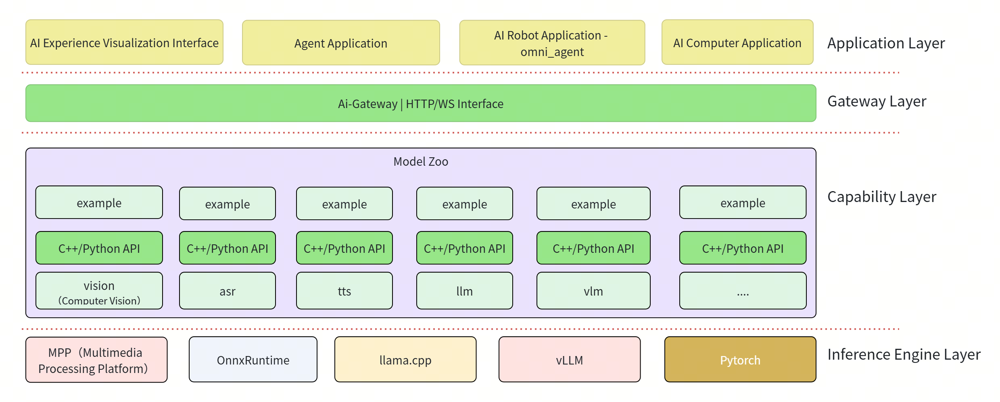

# SpacemiT AI SDK

## 1. Overview

SpacemiT AI SDK is an AI application development kit designed for SpacemiT K-series chips. Building on its existing multimodal capability components, it further extends upward to support application forms such as Agents, AI Robots, and AI Computers. The SDK provides unified capability encapsulation and interface access methods, including:

- **Computer Vision (`vision`)**: detection, classification, segmentation, tracking, face recognition, pose estimation, and related capabilities. Included examples cover `resnet`, `yolov8`, `yolov11`, `yolov8_seg`, `yolov8_pose`, `bytetrack`, `ocsort`, `yolov5-face`, `arcface`, and `emotion`.
- **Speech**: `VAD` (voice activity detection), `ASR` (automatic speech recognition), `TTS` (text-to-speech), and `Voiceprint` (speaker recognition), with runnable demos for single-module validation and integration testing.
- **Natural Language (`LLM`)**: OpenAI-compatible interface integration such as `llama-server`, with examples such as `llm_chat` for rapid evaluation and integration.
- **Vision Language Model (`VLM`)**: designed for SpacemiT K-series RISC-V platforms, supporting image captioning, visual question answering, and multi-turn image-text dialogue. It uses the `llama-server` HTTP API with TCM hardware acceleration and provides C++, Python, and HTTP integration paths, covering models such as FastVLM-MM and Qwen3.5.
- **Reinforcement Learning (`RL`)**: robotic policy inference capabilities including YAML configuration parsing, observation assembly, ONNX inference, and action mapping.
- **Unified Service Access (`gateway`)**: a unified HTTP/WS API layer built on top of ASR, TTS, VAD, Vision, LLM, and VLM capabilities, with model management and a web console.



Each AI SDK component provides a common API layer that abstracts low-level implementation complexity and keeps development focused on higher-level application integration. The SDK currently provides two primary integration models:

- **C++/Python interfaces**: intended for local integration, custom development, and embedded deployment, suitable for directly calling component SDKs to build tailored applications.
- **HTTP/WS interfaces**: exposed uniformly through the gateway layer on top of the foundational capability components, suitable for cross-language, cross-process, and distributed integration scenarios, and designed to bring underlying AI capabilities quickly into upper-layer systems.

> **Note**: This document provides navigation and quick-start guidance for SpacemiT AI SDK from a top-level application perspective. Components continue to evolve, and the documentation will be updated accordingly.

## Platform Support

| Platform & OS | Supported |
| --- | --- |
| K1 Buildroot | ✅ Yes |
| K1 OpenHarmony | ❌ No |
| K1 Bianbu LXQT/GNOME | ✅ Yes |
| K3 Buildroot | ✅ Yes |
| K3 OpenHarmony | ❌ No |
| K3 Bianbu LXQT/GNOME | ✅ Yes |

## 2. Build and Compilation

### 2.1 Get the Source Code

This repository uses Git submodules to manage component source trees. A recursive clone is recommended:

```bash
git clone --recurse-submodules https://github.com/spacemit-com/ai-sdk.git
# or SSH
# git clone --recurse-submodules git@github.com:spacemit-com/ai-sdk.git
```

If the main repository has already been cloned without submodules:

```bash
cd ai-sdk
git submodule update --init --recursive
```

### 2.2 One-Click Build

This repository aggregates all component source code using submodules.

```bash
# load environment variables
source build/envsetup.sh

# build all applications
# the first build may take longer because dependencies are installed automatically
m
```

Build artifacts are typically installed to `output/staging` within the SDK workspace.

### 2.3 Build Individual Core Components

If only a specific core capability component needs to be built within the SDK, run `mm` in the corresponding directory after `source build/envsetup.sh`:

```bash
source build/envsetup.sh

cd asr && mm
# or
cd vision && mm
cd tts && mm
cd vad && mm
cd llm && mm
cd vlm && mm
cd voiceprint && mm
cd rl && mm
```

gateway is the unified service access layer. It includes the Python service, HTTP/WS APIs, web console, and Debian packaging flow, so it should not be treated as a standalone algorithm component that can be built with a simple `mm`. For installation and startup details, see [Section 4](#4-gateway-unified-httpws-access-layer).

## 3. Core Capability Component Examples

> Note: The following examples assume the One-Click Build described above has already been completed. Example executables are installed to `output/staging`.

### 3.1 Computer Vision

**Step 1: Download models**

```bash
# Download all models used by the vision examples (under `~/.cache/models/vision/`)
bash vision/scripts/download_all_models.sh
```

**Step 2: Download assets (images and videos)**

```bash
# Download image and video assets used by the examples (under `~/.cache/assets/`)
bash vision/scripts/download_assets.sh
```

Default directories:

- Models: `~/.cache/models/vision/`
- Assets: `~/.cache/assets/`

**Run the examples**

The following commands cover all examples under `vision/examples/` (C++). After `m` completes, they can be run directly from the SDK root directory:

```bash
# Face recognition (similarity)
arcface vision/examples/arcface/config/arcface.yaml

# Face detection
yolov5-face vision/examples/yolov5-face/config/yolov5-face.yaml

# Gesture detection
yolov5_gesture vision/examples/yolov5_gesture/config/yolov5_gesture.yaml

# Object detection
yolov8 vision/examples/yolov8/config/yolov8.yaml
yolov11 vision/examples/yolov11/config/yolov11.yaml

# Pose estimation
yolov8_pose vision/examples/yolov8_pose/config/yolov8_pose.yaml

# Instance segmentation
yolov8_seg vision/examples/yolov8_seg/config/yolov8_seg.yaml

# Image classification / emotion recognition
resnet vision/examples/resnet/config/resnet50.yaml
emotion vision/examples/emotion/config/emotion.yaml

# Multi-object tracking (video/camera)
# The following two examples render real-time tracking output and require a connected display
bytetrack vision/examples/bytetrack/config/bytetrack.yaml
ocsort vision/examples/ocsort/config/ocsort.yaml
```

For optional parameters such as `--image`, `--video`, `--use-camera`, `--output`, and threshold settings, refer to the README in each example directory (`vision/examples/*/README.md`) or to the [model-zoo-vision README](https://github.com/spacemit-com/model-zoo-vision/blob/main/README.md).

### 3.2 ASR

**Step 1: Download audio assets (sample audio)**

```bash
mkdir -p ~/.cache/models/assets/audio
cd ~/.cache/models/assets/audio
wget https://archive.spacemit.com/spacemit-ai/model_zoo/assets/audio/001_zh_daily_weather.wav
```

Additional audio assets are available in the [audio asset directory](https://archive.spacemit.com/spacemit-ai/model_zoo/assets/audio).

**Step 2: Run the example**

```bash
# Recognize a WAV file (example)
asr_file_demo ~/.cache/models/assets/audio/001_zh_daily_weather.wav
```

### 3.3 TTS

**Run the examples**

```bash
# Basic synthesis (default parameters)
tts_file_demo

# Specify the input text and backend (example)
tts_file_demo -p "Hello, World" -l matcha:zh
```

### 3.4 VAD

**Run the example**

```bash
# Run the built-in simulated audio test
vad_simple_demo
```

### 3.5 LLM

**Step 1: Download a model (GGUF example)**

```bash
mkdir -p ~/.cache/models/llm
cd ~/.cache/models/llm
wget https://archive.spacemit.com/spacemit-ai/model_zoo/llm/qwen2.5-0.5b-instruct-q4_0.gguf
```

To evaluate additional models, refer to the [LLM model directory](https://archive.spacemit.com/spacemit-ai/model_zoo/llm).

**Step 2: Start an OpenAI-compatible service and run the example**

```bash
# Start the service on port 8080
llama-server -m ~/.cache/models/llm/qwen2.5-0.5b-instruct-q4_0.gguf -t 8 --port 8080 &

# Run the SDK example program
llm_chat "你好" "http://localhost:8080/v1" "qwen2.5-0.5b" "You are a helpful assistant." 256
```

When using a **cloud-hosted or remote OpenAI-compatible service** such as DeepSeek, replace the second argument with the remote `api_base` and provide the API key through an environment variable:

```bash
export OPENAI_API_KEY=your_cloud_api_key
llm_chat "你好" "https://api.deepseek.com" "deepseek-chat" "You are a helpful assistant." 256
```

### 3.6 Voiceprint

The Voiceprint component provides speaker identification, speaker verification, and embedding extraction. By default, it uses the CamP+ (3D-Speaker) model, which is downloaded automatically to `~/.cache/models/vp/campplus/` on first run.

**Voiceprint examples**

```bash
# Download sample audio
mkdir -p ~/.cache/models/assets/audio && wget -P ~/.cache/models/assets/audio https://archive.spacemit.com/spacemit-ai/model_zoo/assets/audio/002_en_daily_weather.wav

# Register a speaker
register_speaker -n manbo ~/.cache/models/assets/audio/002_en_daily_weather.wav

# Identify a speaker
identify_speaker ~/.cache/models/assets/audio/001_zh_daily_weather.wav
```

For additional parameters and C++ integration details, refer to the [model_zoo_voiceprint README](https://github.com/spacemit-com/model_zoo_voiceprint/blob/main/README.md) and the [Voiceprint API](https://github.com/spacemit-com/model_zoo_voiceprint/blob/main/API.md).

### 3.7 RL

The RL component is currently used primarily for reinforcement learning policy inference in robotic control pipelines. It handles YAML configuration parsing, observation assembly, ONNX inference, and action mapping. It is intended for robotic motion-control scenarios and is typically integrated with specific robot applications, policy models, and control frameworks.

For usage methods, runtime steps, and robot control examples, refer to the [reinforcement learning documentation](https://www.spacemit.com/community/document/info?lang=zh&nodepath=software/SDK/ros/k3/04-AI%E4%B8%8E%E7%AE%97%E6%B3%95/4.3-%E5%BC%BA%E5%8C%96%E5%AD%A6%E4%B9%A0.md).

### 3.8 VLM

The VLM (Vision Language Model) component is intended for RISC-V platforms such as K3 and provides capabilities for loading, inference, and integration of vision-language models. It supports image captioning, visual question answering, and related applications. The component uses the `llama-server` HTTP API with TCM (Tensor Compute Module) hardware acceleration, providing single-turn inference, multi-turn dialogue, and streaming output, along with C++ native interfaces, Python HTTP wrappers, and an OpenAI-compatible Gateway adaptation layer.

**Step 1: Install dependencies**

```bash
sudo apt-get update
sudo apt-get install -y build-essential cmake curl libyaml-cpp-dev nlohmann-json3-dev
sudo apt install llama.cpp-tools-spacemit
```

**Step 2: Download a model**

```bash
cd vlm

# Download the FastVLM-MM 0.5B model
bash scripts/download_model.sh fastvlm-mm-0.5b-q4_1

# Download all VLM models supported by the script
for model in fastvlm-mm-0.5b-q4_1 Qwen3.5-0.8B Qwen3.5-2B Qwen3.5-4B; do
  bash scripts/download_model.sh "$model"
done

# Use a custom cache directory
VLM_CACHE_DIR=/data/models bash scripts/download_model.sh Qwen3.5-2B
```

Models are downloaded to `~/.cache/models/vlm/<model_name>/`, where each model directory contains files such as `config.json`, the text GGUF file, and the visual ONNX file. For example, for FastVLM-MM 0.5B:

```
~/.cache/models/vlm/fastvlm-mm-0.5b-q4_1/
├── config.json
├── fastvlm-text-0.5B-Q4_1.gguf
└── fastvlm_vision.f16.onnx
```

Supported models and sizes:

| Model | Size | Description |
| --- | --- | --- |
| `fastvlm-mm-0.5b-q4_1` | 766M | Lightweight VLM and default backend |
| `Qwen3.5-0.8B` | 932M | Qwen3.5 vision-language model |
| `Qwen3.5-2B` | 2.6G | Qwen3.5 vision-language model |
| `Qwen3.5-4B` | 3.9G | Qwen3.5 vision-language model |
| `qwen30ba3b-mm-q4_1` | 17.6G | Large MoE vision-language model |

**Step 3: Build**

```bash
cd vlm
mkdir -p build && cd build
cmake .. -DCMAKE_BUILD_TYPE=Release
cmake --build . -j$(nproc)
ctest --output-on-failure
```

**Step 4: Run the examples**

C++ demos (build outputs are in the `build/` directory):

```bash
cd build

# Basic image description
./fastvlm_demo \
  --config ../examples/fastvlm/config/fastvlm.yaml \
  --image /path/to/image.jpg \
  --prompt "Describe this image in one sentence"

# Multi-turn dialogue
./chat_demo \
  --config ../examples/fastvlm/config/qwen3_5_2b.yaml \
  --image /path/to/image.jpg \
  --prompt "What is in the image?"

# Streaming output
./stream_demo \
  --config ../examples/fastvlm/config/fastvlm.yaml \
  --image /path/to/image.jpg \
  --prompt "Describe this image in detail"
```

Python demos:

```bash
cd vlm

# Basic image description
python3 examples/fastvlm/python/vlm_demo.py \
  --config examples/fastvlm/config/fastvlm.yaml \
  --image /path/to/image.jpg \
  --prompt "Describe this image"

# Multi-turn dialogue
python3 examples/fastvlm/python/chat_demo.py \
  --config examples/fastvlm/config/qwen3_5_2b.yaml \
  --image /path/to/image.jpg

# Streaming output
python3 examples/fastvlm/python/stream_demo.py \
  --config examples/fastvlm/config/fastvlm.yaml \
  --image /path/to/image.jpg
```

> **Note**: The VLM vision model currently deployed uses the SpacemiT SMT ONNX format. By default, the component uses the `server` backend. The `llama-server --vision-backend smt` command loads the vision backend and enables TCM hardware acceleration. After manually interrupting a test, you can use `pkill -f llama-server` and `spacemit-tcm-smi -c` to clean up leftover processes and release TCM resources.

VLM can also be exposed through the gateway as an OpenAI-compatible HTTP API. See [Section 4](#4-gateway-unified-httpws-access-layer) for details.

## 4. Gateway Unified HTTP/WS Access Layer

gateway is not an independent algorithm component. It is a unified service layer built on top of foundational capabilities such as ASR, TTS, VAD, Vision, LLM, Embed, and Rerank. It provides HTTP/WebSocket APIs, model management, and a frontend console, making it suitable for cross-language, cross-process, distributed deployment, and business-system integration.

### 4.1 Installation and Startup

Debian package installation is recommended for production deployment:

```bash
sudo apt update
sudo apt install spacemit-ai-gateway
```

After installation, two `systemd` services start automatically:

| Service | Port | Description |
| --- | --- | --- |
| `spacemit-ai-gateway` | 18790 | Backend HTTP/WebSocket API |
| `spacemit-ai-gateway-frontend` | 8326 | Frontend console static site |

Check service status and logs:

```bash
systemctl status spacemit-ai-gateway
journalctl -u spacemit-ai-gateway -f
```

For source-level debugging, the gateway service can also be started directly:

```bash
spacemit-ai-gateway
# or
uvicorn spacemit_ai_gateway.app.main:app --host 0.0.0.0 --port 18790
```

### 4.2 Verification

First confirm that the gateway service is running:

```bash
curl -s localhost:18790/healthz | jq .
```

Prepare test assets:

```bash
mkdir -p ~/.cache/models/assets/audio
wget -O ~/.cache/models/assets/audio/001_zh_daily_weather.wav \
  https://archive.spacemit.com/spacemit-ai/model_zoo/assets/audio/001_zh_daily_weather.wav

wget -O /tmp/vision_test.jpg \
  https://archive.spacemit.com/spacemit-ai/model_zoo/assets/image/006_test.jpg
```

ASR speech recognition:

```bash
curl -s -X POST localhost:18790/v1/asr/recognize \
  -F file=@${HOME}/.cache/models/assets/audio/001_zh_daily_weather.wav \
  -F language=zh | jq .
```

TTS synthesis:

```bash
curl -s -X POST localhost:18790/v1/tts/synthesize \
  -H 'Content-Type: application/json' \
  -d '{"text":"Hello, welcome to SpacemiT AI Gateway","response_format":"wav"}' \
  --output /tmp/gateway_tts.wav
```

LLM chat completion:

```bash
curl -s -X POST localhost:18790/v1/chat/completions \
  -H 'Content-Type: application/json' \
  -d '{
    "model":"qwen3-0.6b-q4_0",
    "messages":[{"role":"user","content":"Hello, please introduce yourself in one sentence."}],
    "stream":false
  }' | jq .
```

Vision image inference:

```bash
curl -s -X POST localhost:18790/v1/vision/models/load \
  -H 'Content-Type: application/json' \
  -d '{"model_id":"yolov8n","config_path":"configs/vision/yolov8n.yaml","lazy_load":false}' | jq .

curl -s -X POST localhost:18790/v1/vision/inference \
  -F file=@/tmp/vision_test.jpg \
  -F 'tasks=["detect"]' \
  -F model_id=yolov8n \
  -F render=true \
  -F render_mode=overlay | jq .
```

VLM visual-language model:

```bash
# List available VLM models
curl -s localhost:18790/v1/vlm/models | jq '[.[] | {id, status}]'

# Load a preset model (the first load starts a llama-server subprocess and may take a few seconds)
curl -s -X POST localhost:18790/v1/vlm/models/load \
  -H 'Content-Type: application/json' \
  -d '{"model":"fastvlm-mm-0.5b-q4_1"}' | jq .

# Confirm that the VLM service is ready
curl -s localhost:18790/v1/vlm/healthz | jq .

# Non-streaming text dialogue
curl -s -X POST localhost:18790/v1/vlm/chat/completions \
  -H 'Content-Type: application/json' \
  -d '{
    "model": "fastvlm-mm-0.5b-q4_1",
    "messages": [{"role": "user", "content": "Introduce yourself in one sentence"}],
    "max_tokens": 64,
    "stream": false
  }' | jq .choices[0].message.content

# Image-text multimodal input (base64-encoded image)
python3 - <<'PY'
import base64, json, urllib.request
img = base64.b64encode(open("/path/to/image.jpg", "rb").read()).decode()
payload = {
    "model": "fastvlm-mm-0.5b-q4_1",
    "messages": [{"role": "user", "content": [
        {"type": "image_url", "image_url": {"url": "data:image/jpeg;base64," + img}},
        {"type": "text", "text": "What is in this image?"}
    ]}],
    "max_tokens": 128,
    "stream": False
}
open("/tmp/vlm_img.json", "w").write(json.dumps(payload))
PY

curl -s -X POST localhost:18790/v1/vlm/chat/completions \
  -H 'Content-Type: application/json' \
  --data-binary @/tmp/vlm_img.json | jq .choices[0].message.content

# Streaming output (SSE)
curl -sS -X POST localhost:18790/v1/vlm/chat/completions \
  -H 'Content-Type: application/json' \
  -d '{
    "model": "fastvlm-mm-0.5b-q4_1",
    "messages": [{"role": "user", "content": "Count from one to five"}],
    "max_tokens": 32,
    "stream": true
  }'
```

VLM also supports switching and unloading models:

```bash
# Switch to another downloaded model
curl -s -X POST localhost:18790/v1/vlm/models/switch \
  -H 'Content-Type: application/json' \
  -d '{"model": "Qwen3.5-0.8B"}' | jq .

# Unload the current model (release TCM and memory)
curl -s -X POST localhost:18790/v1/vlm/models/unload \
  -H 'Content-Type: application/json' \
  -d '{"model": "Qwen3.5-0.8B"}' | jq .
```

### 4.3 API

Gateway interfaces continue to evolve with service capabilities. For current HTTP/WS routes, request parameters, and response formats, refer to:

- [ai-gateway README](https://github.com/spacemit-com/ai-gateway/blob/main/README.md)

## 5. Application Development

### 5.1 C++/Python

SpacemiT AI SDK components provide **stable C++ header-based entry points** for application integration. Most follow a PIMPL design, which simplifies integration and binary distribution, and corresponding Python bindings and examples are also provided. For application development, build artifacts should first be generated in `output/staging` within the SDK workspace, then used for integration testing and deployment.

- **vision**: `vision_service.h` (see the Application Development section of [vision/README.md](https://github.com/spacemit-com/model-zoo-vision/blob/main/README.md))
- **ASR**: `asr_service.h` (see the Application Development section of [asr/README.md](https://github.com/spacemit-com/model-zoo-asr/blob/main/README.md))
- **TTS**: `tts_service.h` (see the Application Development section of [tts/README.md](https://github.com/spacemit-com/model-zoo-tts/blob/main/README.md))
- **VAD**: `vad_service.h` (see the Application Development section of [vad/README.md](https://github.com/spacemit-com/model-zoo-vad/blob/main/README.md))
- **LLM**: `llm_service.h` (see the Application Development section of [llm/README.md](https://github.com/spacemit-com/model-zoo-llm/blob/main/README.md))
- **VLM**: `vlm_service.h` (provides `Generate()`/`Chat()` synchronous interfaces and `GenerateStream()`/`ChatStream()` streaming interfaces, supports `image_path`, `image_bytes`, and `image_url` image inputs, and includes the Python HTTP wrapper `vlm.py`; see [vlm/README.md](https://github.com/spacemit-com/model-zoo-vlm/blob/main/README.md))
- **Voiceprint**: `vp_service.h` (see the Application Development section of [voiceprint/README.md](https://github.com/spacemit-com/model_zoo_voiceprint/blob/main/README.md))
- **RL**: `rl_service.h` (see the Detailed Usage section of [rl/README.md](https://github.com/spacemit-com/model_zoo_rl/blob/main/README.md))

For conversational applications, starting with `omni_agent` is recommended: first validate `voice_chat`, then replace or refine ASR, TTS, LLM, and VLM backends as needed, or integrate MCP tools.

### 5.2 HTTP/WS Service Integration

In addition to direct integration through the C++/Python SDK, AI SDK also provides unified `HTTP/WS` interfaces through the gateway layer to expose underlying AI capabilities as services. Gateway does not replace the core capability components; instead, it provides a service-oriented encapsulation layer on top of them.

- **HTTP interfaces**: suitable for request-response scenarios, enabling business systems to integrate recognition, inference, and generation capabilities through standard REST/HTTP access.
- **WebSocket interfaces**: suitable for streaming interactions, real-time push delivery, and persistent connections, such as speech streaming, incremental results, and conversational applications.

## 6. Performance Data

For the consolidated performance summary across models, refer to [Model Zoo performance data](https://www.spacemit.com/community/document/info?lang=en&nodepath=ai/compute_stack/ai_compute_stack/modelzoo.md).
