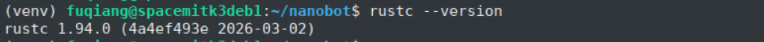

# LlamaIndex

## Platform Support

| Platform & OS | Supported |
| --- | --- |
| K1 Buildroot | ❌ No |
| K1 OpenHarmony | ❌ No |
| K1 Bianbu LXQT/GNOME | ❌ No |
| K3 Buildroot | ❌ No |
| K3 OpenHarmony | ❌ No |
| K3 Bianbu LXQT/GNOME | ✅ Yes |

## Installation

### 1.1 Install Dependencies

Install the required system dependencies:

```bash
sudo apt update
sudo apt install python3-venv python3-dev libffi-dev libssl-dev pkg-config libjpeg-dev zlib1g-dev libtiff-dev libfreetype6-dev liblcms2-dev libwebp-dev
```

Install Rust:

```bash
curl --proto '=https' --tlsv1.2 -sSf https://sh.rustup.rs | sh -s -- -y --default-toolchain stable
source ~/.cargo/env
rustc --version
```

If the following output appears, the Rust installation has completed successfully:



### 1.2 Install LlamaIndex

```bash
python3 -m venv ./llamaindex_venv
source llamaindex_venv/bin/activate
pip install llama-index
```

## Usage

```bash
source llamaindex_venv/bin/activate
python -c "from llama_index.core import VectorStoreIndex, SimpleDirectoryReader; print('llama-index imported successfully!')"
```

The following output indicates that LlamaIndex has been installed and imported successfully:


