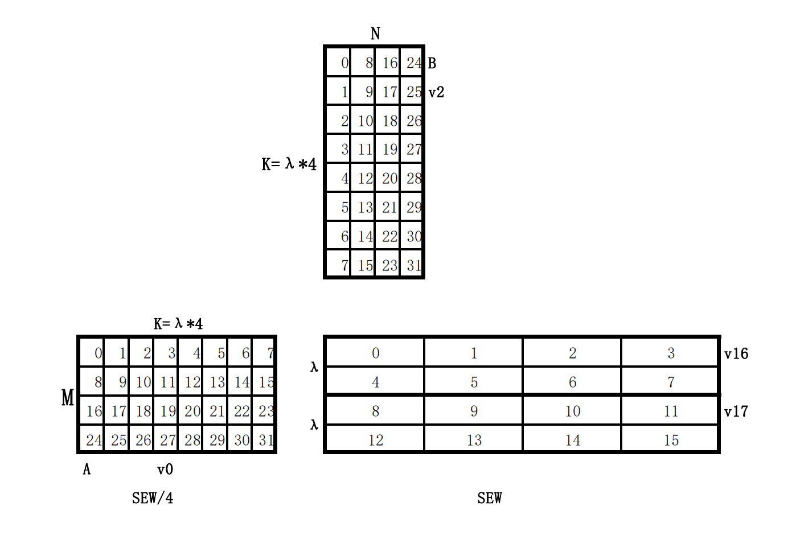
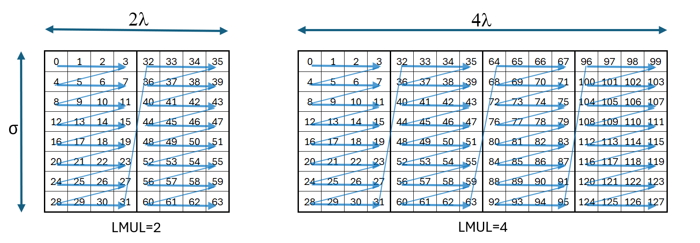
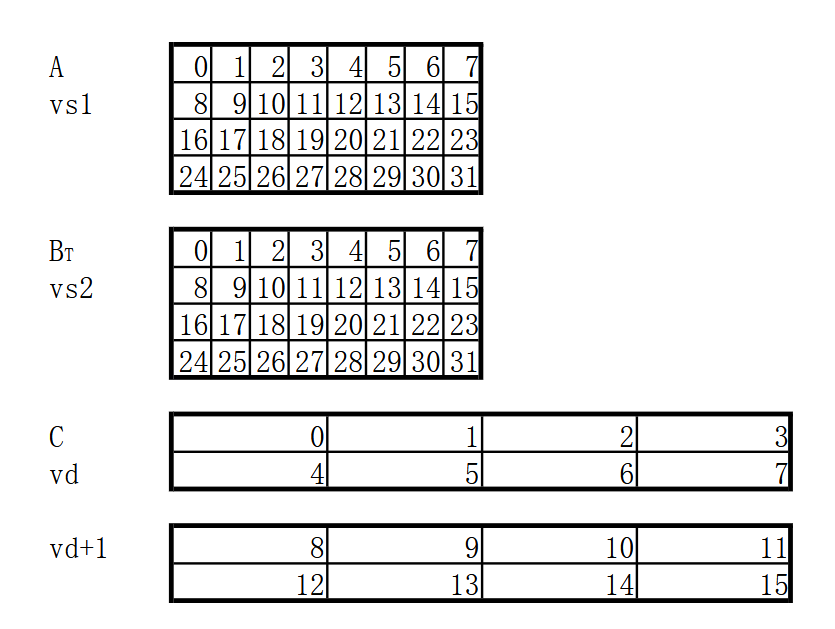
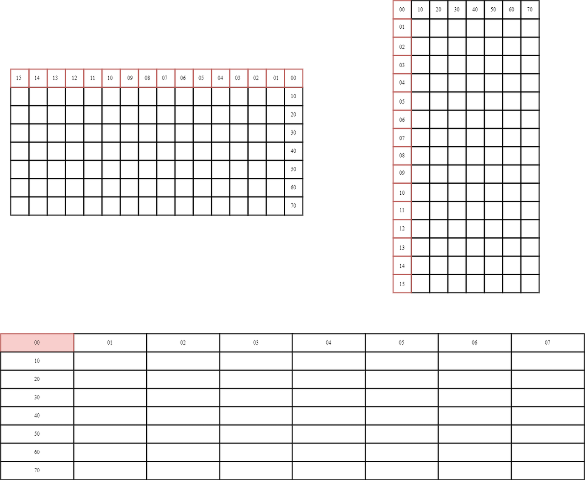
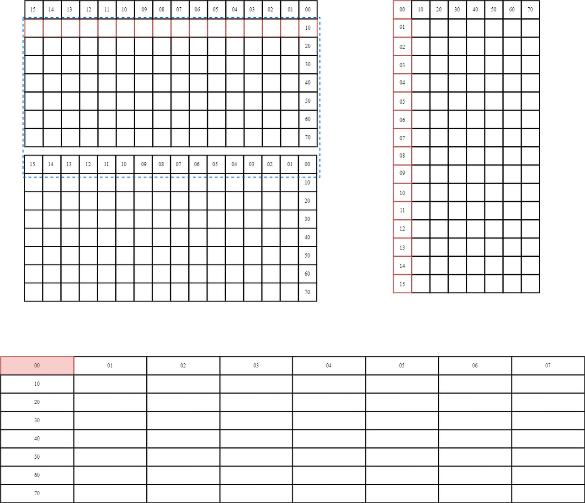
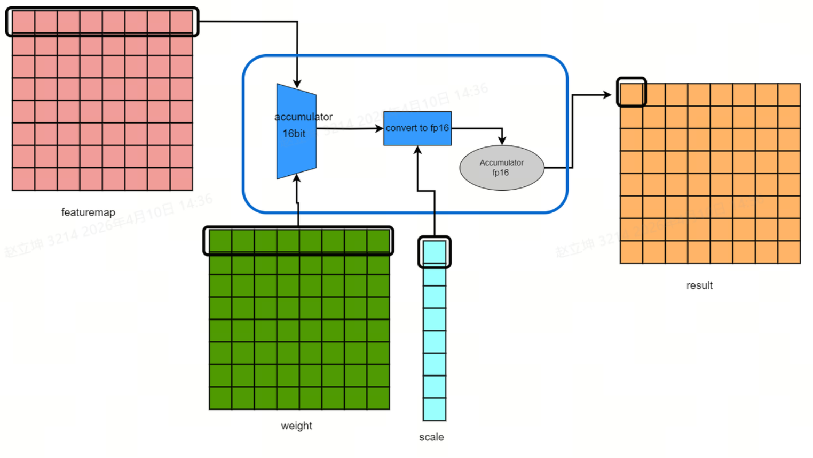
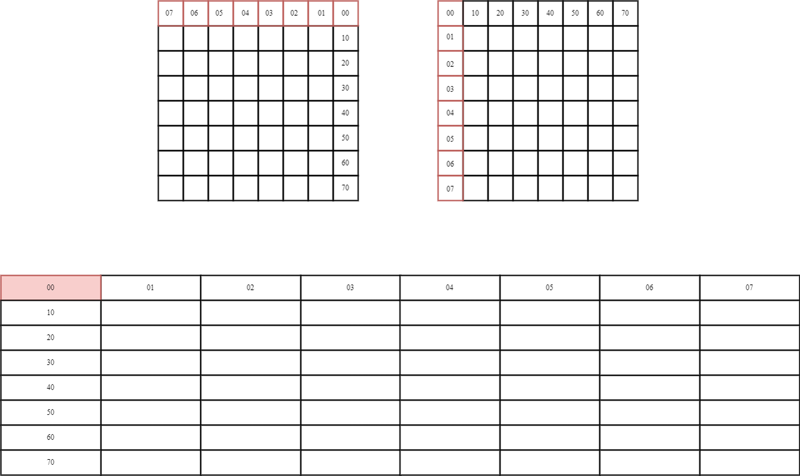
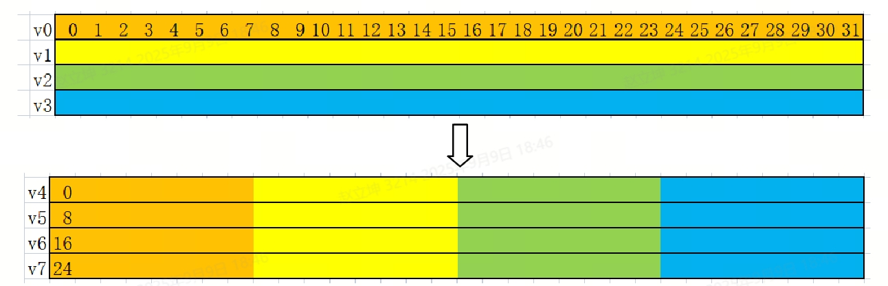

sidebar_position: 3

# SpacemiT AI Matrix Extension Instruction Set (`Zvvm_spacemit` Profile)

Version: 0.6
Status: Public Release
Last Updated: 2026.04.13

## Table of Contents

- **Chapter 1** [Overview](#chapter-1-overview)
- **Chapter 2** [SpacemiT Matrix Extension Programming Model](#chapter-2-spacemit-matrix-extension-programming-model)
- **Chapter 3** [Differences Between the SpacemiT Matrix Extension Programming Model and Community `Zvvm` / `Zvzip`](#chapter-3-differences-between-the-spacemit-matrix-extension-programming-model-and-community-zvvm--zvzip)
- **Chapter 4** [Instruction Overview, Sub-extensions, and Quick Index](#chapter-4-instruction-overview-sub-extensions-and-quick-index)
- **Chapter 5** [Integer Matrix Multiplication Instructions](#chapter-5-integer-matrix-multiplication-instructions)
- **Chapter 6** [Floating-Point Matrix Multiply Instructions](#chapter-6-floating-point-matrix-multiply-instructions)
- **Chapter 7** [Data Layout Transformation Instructions](#chapter-7-data-layout-transformation-instructions)
- **Chapter 8** [Instruction Encoding Summary](#chapter-8-instruction-encoding-summary)
- **Appendix A** [Tile and Sub-extension Quick Reference](#appendix-a-tile-and-sub-extension-quick-reference)

# Chapter 1 Overview

## 1.1 Design Features

Matrix multiplication is a fundamental workload in machine learning and AI applications. Traditional matrix acceleration designs often introduce a dedicated matrix register file to improve data throughput. However, this approach also increases architectural state, context-switch overhead, and software stack complexity.

The `Zvvm` / IME matrix extension adopts a different design philosophy. Instead of introducing new register files, it reuses the 32 vector registers defined in the RISC-V `V` extension. One-dimensional vector layouts are reinterpreted as two-dimensional matrix tiles, enabling higher computational density without expanding architectural state.

Based on this concept, SpacemiT has developed the SpacemiT AI Matrix Extension Instruction Set, which has already been implemented across two generations of compute chips.

This instruction set maintains good compatibility across RISC-V processors with different `VLEN` configurations while achieving high compute utilization. It is built on top of the RISC-V Vector programming model, reusing the vector register file and control semantics. At the same time, it introduces matrix computation capabilities with minimal disruption to the existing RVV software ecosystem.

Key design features include:

- Reuses the existing vector register file to represent 2D matrix tiles
- Provides matrix multiplication capability without introducing a dedicated matrix register file
- Native support for common AI data types such as Int4, Int8, FP16, and BF16
- Includes specialized matrix multiplication instructions for convolution, sparse computation, and block quantization
- Provides data layout transformation instructions for rearranging vector register contents
- Evolves in alignment with community extensions such as IME, `Zvvm`, and `Zvzip`, sharing similar design principles

## 1.2 Instruction Set Capabilities

The SpacemiT AI Matrix Extension instruction set can be categorized into seven classes:

1. Integer matrix multiplication instructions
2. Floating-point matrix multiplication instructions
3. Integer sliding-window matrix multiplication for convolution
4. Floating-point sliding-window matrix multiplication for convolution
5. Integer matrix multiplication for block quantization
6. 4:2 structured sparse integer matrix multiplication
7. Data layout transformation instructions

Including variations for operand `signedness` and convolution-specific variants, the instruction set defines a total of **46 custom instructions for AI workloads**.

## 1.3 Recommended Reading Order

For readers new to the SpacemiT Matrix Extension, the following reading order is recommended:

1. Chapter 2 — Understand register constraints, supported `LMUL` range, and global control fields
2. Chapter 4 — Get an overview of sub-extensions and instruction categories
3. Chapters 5–7 — Study instruction semantics by category
4. Chapter 8 — Review instruction encodings and map them to the semantics

## 1.4 Unified Matrix Semantics Notation

A typical operation in the SpacemiT AI Matrix Extension is:

$$
C \leftarrow C + A \times B^T
$$

For example, in the integer matrix multiplication instruction:

```
smt.vmadot vd, vs1, vs2, i8
```

- `vs1` holds the tile of matrix **A**
- `vs2` holds the tile of matrix **B^T**
- `vd` holds both the initial accumulator values and the final results
- `i8` specifies the operand data type used in the computation

Here, `B^T` represents the **geometric layout** of matrix elements relative to their mathematical arrangement. It does **not** require software to explicitly transpose matrix `B`.

## 1.5 Geometric Layout of Matrix Tiles

The geometric relationship between the multiplier and matrix tiles is determined by:

- The tile geometry parameter `λ` (`lambda`)
- Vector parameters `SEW` and `VLEN`

For the operation: $C \leftarrow A \times B^T + C$

the input matrices `A`, `B`, and the output matrix `C` are all stored in the RISC-V vector register file. The storage layout of these matrices is illustrated in **Figure 1**.

- **Accumulator Matrix `C`**
  - The accumulator matrix `C` is stored in a vector register group with element width `SEW`.
  - The register group multiplier `MUL_C` is determined by the tile geometry: `MUL_C = (VLEN / SEW) / λ^2`
  - In current implementations, `λ` is a fixed parameter associated with each instruction type (see later sections).
  - The `C` register group may start at any vector register index aligned to `MUL_C`.
  - Valid values: `MUL_C ∈ {1, 2, 4, 8, 16}`
  - When `MUL_C = 16`, the starting register index is restricted to `0` or `16`.

- **Input Matrices `A` and `B`**
  - Matrices `A` and `B` are each stored in a single vector register.
  - Their element widths are defined by the instruction and encoded directly.
  - In the current SpacemiT AI Matrix Extension implementation:
    - Only `LMUL = 1` is supported
    - All other `LMUL` encodings are reserved
    - Using any non-1 `LMUL` value in IME instructions must raise an illegal instruction exception

  > **Note:**
  > In the community `Zvvm` extension, two parameters are defined:
  >
  > - `LMUL`: register grouping factor for input tiles
  > - `W`: ratio between output and input element widths
  >
  > In future implementations:
  >
  > - `λ` may be encoded via `vtype.lambda[2:0]`
  > - `W` and `LMUL` may be more consistently integrated into the programming model
  >
  > In current implementations (A60, A100):
  >
  > - `LMUL = 1` only
  > - `W` is implicitly determined by instruction semantics

  

  **Figure 1.** Matrix tile geometry and element ordering under the configuration:
  32-element vector register, `λ = 2`, `W = 4`, `VLEN = 256`, `LMUL = 1`.
  Vector registers are interpreted as 2D tiles, and element indices illustrate the ordering within each tile.

- **Effective Reduction Dimension (K)**

  The reduction dimension (K), i.e., the shared accumulation dimension between `A` and ( `B^T` ), is determined by `λ` and further scaled by the instruction widening factor `W` and `LMUL`:
    $$
    K_eff = λ × W × LMUL
    $$

- **Element Widths and Signedness**

  - Elements in `A` and `B` tiles have width: `SEW ÷ W`

  - Elements in the accumulator matrix `C` have width: `SEW` (See Table 1 below)

  - Signedness is encoded directly in the instruction (See Table 2 below):
    - `s` → signed
    - `u` → unsigned

  - The accumulator matrix `C` is always interpreted as signed.

- **Tile Dimension Derivation**

   Tile dimensions are derived from the widening factor and `LMUL`:

   ```
    L_A    = LMUL × VLEN ÷ (SEW ÷ W) (total number of elements in matrix `A` (or `B`) within the LMUL register group)
    K_eff  = λ × W × LMUL
    M = N  = L_A ÷ K_eff  (The accumulator tile is square, i.e., the number of rows equals the number of columns.)
   ```

- **Accumulator Register Group Size**
  `MUL_C = VLEN ÷ (SEW × λ²)`
  Independent of both `W` and `LMUL`

- **Data Layout Characteristics**
  As shown in Figure 1:
  - Elements in vector registers are contiguous along the `λ` dimension
  - Tile `A` and tile `C` are stored in row-major order
  - Tile `B` is stored in column-major order

  

  **Figure 2.** Matrix tile layout under `LMUL = 2` (left) and `LMUL = 4` (right).
  Blue arrows indicate contiguous elements that belong to the same tile when accessed in linear vector order.

- **Effect of LMUL Scaling**
  `LMUL` scales the tile **only along the K dimension**, increasing the effective reduction depth proportionally.

  The blue arrows in Figure 2 indicate which contiguous elements form a tile when traversed in linear vector element order.

## 1.6 Sub-extensions of the SpacemiT AI Instruction Set

The following table maps SpacemiT sub-extensions to community `Zvvm` equivalents:

| SpacemiT Sub-extension | Community `Zvvm` Sub-extension | Dependency | Multiplier Type | Scale Type | Accumulator Type |
|---|---|---|---|---|---|
|Xsmti4i32mm|Zvvi4i8mm| Zve32x | [U]Int4, [U]Int4 | — | Int32 |
|Xsmti8i32mm|Zvvi8i32mm| Zve32x | [U]Int8, [U]Int8 | — | Int32 |
|Xsmti8i32mm_slide|—| Zve32x | [U]Int8, [U]Int8 | — | Int32 |
|Xsmti4i32mm_42sp|—| Zve32x | [U]Int4, [U]Int4 | — | Int32 |
|Xsmti8i32mm_42sp|—| Zve32x | [U]Int8, [U]Int8 | — | Int32 |
|Xsmti4fp16mm_scl16f|—| Zve32f | [U]Int4, [U]Int4 | IEEE binary16 / BFloat16 | IEEE binary16 |
|Xsmti4bf16mm_scl16f|—| Zve32f | [U]Int4, [U]Int4 | IEEE binary16 / BFloat16 | BFloat16 |
|Xsmti8fp16mm_scl16f|—| Zve32f | [U]Int8, [U]Int8 | IEEE binary16 / BFloat16 | IEEE binary16 |
|Xsmti8bf16mm_scl16f|—| Zve32f | [U]Int8, [U]Int8 | IEEE binary16 / BFloat16 | BFloat16 |
|Xsmtfp16fp32mm|Zvvfp16fp32mm| Zve32f | IEEE binary16, IEEE binary16 | — | IEEE binary32 |
|Xsmtbf16fp32mm|Zvvbf16fp32mm| Zve32f | BFloat16, BFloat16 | — | IEEE binary32 |
|Xsmtfp16fp32mm_slide|—| Zve32f | IEEE binary16, IEEE binary16 | — | IEEE binary32 |
|Xsmtbf16fp32mm_slide|—| Zve32f | BFloat16, BFloat16 | — | IEEE binary32 |

## 1.7 Sub-extension Support Across K-Series Chips

The A60 core in the K1 chip supports the following sub-extensions:

- `Xsmti8i32mm`
- `Xsmti8i32mm_slide`

The A100 core in the K3 chip supports the following sub-extensions:

- `Xsmti4i32mm`
- `Xsmti8i32mm`
- `Xsmti8i32mm_slide`
- `Xsmti4i32mm_42sp`
- `Xsmti8i32mm_42sp`
- `Xsmti4fp16mm_scl16f`
- `Xsmti4bf16mm_scl16f`
- `Xsmti8fp16mm_scl16f`
- `Xsmti8bf16mm_scl16f`
- `Xsmtfp16fp32mm`
- `Xsmtbf16fp32mm`
- `Xsmtfp16fp32mm_slide`
- `Xsmtbf16fp32mm_slide`

| SpacemiT AI Sub-extension | A60 Support | A100 Support |
|---|---|---|
|Xsmti4i32mm| — | √ |
|Xsmti8i32mm| √ | √ |
|Xsmti8i32mm_slide| √ | √ |
|Xsmti4i32mm_42sp| — | √ |
|Xsmti8i32mm_42sp| — | √ |
|Xsmti4fp16mm_scl16f| — | √ |
|Xsmti4bf16mm_scl16f| — | √ |
|Xsmti8fp16mm_scl16f| — | √ |
|Xsmti8bf16mm_scl16f| — | √ |
|Xsmtfp16fp32mm| — | √ |
|Xsmtbf16fp32mm| — | √ |
|Xsmtfp16fp32mm_slide| — | √ |
|Xsmtbf16fp32mm_slide| — | √ |

# Chapter 2 SpacemiT Matrix Extension Programming Model

## 2.1 Implementation Parameters

The SpacemiT Matrix Extension `Profile` defined in this document adopts the following implementation parameters: `VLEN`, `λ` (lambda), and `MUL_C`.

Their meanings are as follows:

- `VLEN`: fixed vector register length
- `λ` (lambda): fixed tile geometry parameter (not dynamically configurable via `vtype` in A60 and A100)
- `MUL_C`: number of vector registers occupied by the destination accumulator tile `C`

### 2.1.1 Implementation Parameters for A60

The following table summarizes the implementation parameters for `Xsmti8i32mm` and `Xsmti8i32mm_slide`.

| Parameter | Value    | Description                                           |
| --------- | -------- | ----------------------------------------------------- |
| `VLEN`    | 256 bits | Fixed implementation parameter                        |
| `λ (lambda)` | 2     | Fixed; not configurable via `vtype`                   |
| `MUL_C`   | 2        | The destination tile occupies `vd` and `vd+1`         |
| `SEW`     | 32 bits  | Accumulator elements are interpreted as 32-bit values |

From this, we obtain:

$$
MUL\_C = \frac{VLEN}{SEW \times \lambda^2} = \frac{256}{32 \times 4} = 2
$$

### 2.1.2 Implementation Parameters for A100

The following table summarizes the implementation parameters for:

- `Xsmti4i32mm`
- `Xsmti8i32mm`
- `Xsmti8i32mm_slide`
- `Xsmti4i32mm_42sp`
- `Xsmti8i32mm_42sp`
- `Xsmtfp16fp32mm`
- `Xsmtbf16fp32mm`
- `Xsmtfp16fp32mm_slide`
- `Xsmtbf16fp32mm_slide`

| Parameter | Value     | Description                                           |
| --------- | --------- | ----------------------------------------------------- |
| `VLEN`    | 1024 bits | Fixed implementation parameter                        |
| `λ (lambda)` | 4      | Fixed; not configurable via `vtype`                   |
| `MUL_C`   | 2         | The destination tile occupies `vd` and `vd+1`         |
| `SEW`     | 32 bits   | Accumulator elements are interpreted as 32-bit values |

From this, we obtain:
$$
MUL\_C = \frac{VLEN}{SEW \times \lambda^2} = \frac{1024}{32 \times 16} = 2
$$

The following table summarizes the implementation parameters for:

- `Xsmti4fp16mm_scl16f`
- `Xsmti4bf16mm_scl16f`
- `Xsmti8fp16mm_scl16f`
- `Xsmti8bf16mm_scl16f`

| Parameter | Value     | Description                                                 |
| --------- | --------- | ----------------------------------------------------------- |
| `VLEN`    | 1024 bits | Fixed implementation parameter                              |
| `λ (lambda)` | 8      | Fixed; not configurable via `vtype`                         |
| `MUL_C`   | 1         | The destination tile occupies a single vector register `vd` |
| `SEW`     | 16 bits   | Accumulator elements are interpreted as 16-bit values       |

From this, we obtain:
$$
MUL\_C = \frac{VLEN}{SEW \times \lambda^2} = \frac{1024}{16 \times 64} = 1
$$

## 2.2 Operand Roles

Unless otherwise specified, instructions in this extension use the following operand roles:

- `vd`: destination register group, which provides the initial accumulator values and receives the final results
- `vs1`: source matrix `A`
- `vs2`: source matrix `B`, arranged in a hardware-friendly layout
- `v0` / `v1`: used only in certain implementation-specific paths, serving as recovery masks for sparse instructions or as scale parameter registers
- `MCPM`: an implementation-specific control field that selects the 16-bit floating-point format (FP16 or BF16)

## 2.3 Common Register Constraints

Except for the data layout transformation instructions described in Chapter 7, matrix computation instructions follow the constraints below.

**When `MUL_C = 2`**

- `vd` **must** be an even-numbered vector register
- `vd` and `vd+1` together form the destination register group
- The destination register group (`vd` / `vd+1`) **must not** overlap with `vs1` or `vs2`
- The result layout within the destination register group is determined by the instruction type
- The standard RVV `vm` mask bit is **not** used as a mask control for matrix multiplication instructions

**When `MUL_C = 1`**

- `vd` may be any vector register
- `vd` **must not** overlap with `vs1` or `vs2`
- The result layout within the destination register group is determined by the instruction type
- The standard RVV `vm` mask bit is **not** used as a mask control for matrix multiplication instructions

**Additional Constraints**

- Sliding-window instructions require `vs1` to be an even-numbered register
- Sparse and scale-enabled instructions additionally use `v0` / `v1`
- For floating-point and scale-enabled instructions, the floating-point format is controlled by `MCPM.BF16`

## 2.4 `MUL_C` and the Destination Register Group

`MUL_C` denotes the size of the register group occupied by the destination matrix tile `C` in the vector register file.

In the implementations covered by this document, two primary cases exist:

- `MUL_C = 2`: the destination result occupies two vector registers, `vd` and `vd+1`
- `MUL_C = 1`: the destination result occupies a single vector register `vd`

From a software perspective, `MUL_C` directly affects:

- whether the destination register group must be aligned to an even-numbered register
- the observable tile geometry of the result during write-back
- the legality of overlap between destination and source registers

Unless otherwise specified by a given instruction, software shall interpret `MUL_C` based on the fixed `Profile` parameters defined for that instruction type. It shall not be treated as a dynamically configurable parameter in the current implementations.

## 2.5 Tile Shape Overview

**A60 Implementation (`VLEN = 256`)**

The tile shapes for the primary sub-extensions are as follows:

| Sub-extension  | Input Type | Destination Type | Tile Shape <br>(`M × K × N`) |
| --------------- | ---------- | ---------------- | ------------------------ |
| `Xsmti8i32mm` <br>(integer matrix multiplication)                                      | Int8       | Int32            | `4 × 8 × 4`              |
| `Xsmti8i32mm_slide` <br>(integer sliding-window matrix multiplication for convolution) | Int8       | Int32            | `4 × 8 × 4`              |

**A100 Implementation (`VLEN = 1024`)**

The tile shapes for the primary sub-extensions are as follows:

| Sub-extension | Input Type      | Destination Type | Tile Shape <br>(`M × K × N`) |
| ------------- | --------------- | ---------------- | ------------------------ |
| `Xsmti4i32mm` <br>(integer matrix multiplication)                                               | [U]Int4         | Int32            | `8 × 32 × 8`             |
| `Xsmti8i32mm` <br>(integer matrix multiplication)                                               | [U]Int8         | Int32            | `8 × 16 × 8`             |
| `Xsmti8i32mm_slide` <br>(integer sliding-window matrix multiplication for convolution)          | [U]Int8         | Int32            | `8 × 16 × 8`             |
| `Xsmti4i32mm_42sp` <br>(4:2 structured sparse integer matrix multiplication)                    | [U]Int4         | Int32            | `8 × 64 × 8`             |
| `Xsmti8i32mm_42sp` <br>(4:2 structured sparse integer matrix multiplication)                    | [U]Int8         | Int32            | `8 × 32 × 8`             |
| `Xsmti8*16mm_scl16f` <br>(integer matrix multiplication with block scaling)                     | [U]Int8 + scale | FP16 / BF16      | `8 × 16 × 8`             |
| `Xsmti4*16mm_scl16f` <br>(integer matrix multiplication with block scaling)                     | [U]Int4 + scale | FP16 / BF16      | `8 × 32 × 8`             |
| `Xsmt*16fp32mm` <br>(floating-point matrix multiplication)                                      | FP16 / BF16     | FP32             | `8 × 8 × 8`              |
| `Xsmt*16fp32mm_slide` <br>(floating-point sliding-window matrix multiplication for convolution) | FP16 / BF16     | FP32             | `8 × 8 × 8`              |

## 2.6 Global Controls and Auxiliary Operands

### 2.6.1 `MCPM.BF16`

`MCPM.BF16` is an implementation-specific control bit that determines the floating-point format used along relevant execution paths:

| Control         | Description                                                                    |
| --------------- | ------------------------------------------------------------------------------ |
| `MCPM.BF16 = 0` | Interpret floating-point inputs, scale values, and accumulator results as FP16 |
| `MCPM.BF16 = 1` | Interpret floating-point inputs, scale values, and accumulator results as BF16 |

**Scope of application:**

- `vfwmadot` / `vfwmadot1/2/3`
- Scale parameters and accumulator result formats in `vmadot.hp*`

### 2.6.2 `V0` / `V1`

In this instruction set, `v0` / `v1` are not used as general-purpose matrix mask registers. Instead, they serve specialized roles in the following instruction classes:

| Instruction Type | Role of `v0` / `v1`                               |
| ---------------- | ------------------------------------------------- |
| `vmadot.sp*`     | Stores recovery masks for 4:2 structured sparsity |
| `vmadot.hp*`     | Stores per-column or per-group scale parameters   |

### 2.6.3 `imm2` and `imm3`

| Field  | Applicable Instructions | Width  | Function                                            |
| ------ | ----------------------- | ------ | --------------------------------------------------- |
| `imm2` | `vmadot.sp*`            | 2 bits | Selects a segment within the mask register          |
| `imm3` | `vmadot.hp*`            | 3 bits | Selects a group within the scale parameter register |

**Additional Notes**

- For `vmadot.sp*`, the `imm2` field is split across instruction bits `[15]` and `[7]`.
  These bits are available for encoding because `vs1` and `vd` are constrained to even-numbered registers, meaning their least significant bit (`bit 0`) is always zero. As a result, only bits `[4:1]` need to be explicitly encoded for register indices, freeing encoding space for `imm2`.

- For `vmadot.hp*`, the `imm3` field occupies a dedicated instruction field `[14:12]` and does not rely on encoding space derived from register constraints.

## 2.7 Data Layout

### 2.7.1 Data Layout

For `EEW = 8` or `EEW = 16`, this instruction set follows the standard linear vector element ordering:

$$
[k \times EEW + EEW - 1 : k \times EEW]
$$

This applies to:

- Instructions with Int8 input data
- Instructions with FP16 / BF16 input data
- FP16 / BF16 scale parameters in integer quantized paths

### 2.7.2 4-bit Elements

For instructions with Int4 input data, this instruction set uses packed nibble storage:

- Element `2n` is stored in bits `[3:0]` of byte `n`
- Element `2n+1` is stored in bits `[7:4]` of byte `n`

This can be equivalently expressed as:

$$
[4k + 3 : 4k]
$$

### 2.7.3 Tile Layout Conventions

For matrix computation instructions:

- Tile `A` is stored in `vs1` in row-major order
- Tile `B` is stored in `vs2` in column-major order
- Tile `C` is stored in the `vd` register group using an implementation-defined layout

The layouts of `vs1`, `vs2`, and `vd` are illustrated in Figure 3.
Tile `A` and tile `C` follow row-major ordering, while tile `B` follows column-major ordering.


**Figure 3.** Example layout of 2D matrix tiles in `vs1`, `vs2`, and `vd` under
`VLEN = 256`, `W = 4`, and `λ = 2`.

# Chapter 3 Differences Between the SpacemiT Matrix Extension Programming Model and Community `Zvvm` / `Zvzip`

As the community `Zvvm` extension was proposed relatively late, SpacemiT developed a custom AI instruction set earlier in its design cycle.

At present, the community `Zvvm` extension has not yet reached a stable specification. However, based on publicly available drafts, the SpacemiT custom AI extension shows a high degree of similarity to `Zvvm`, particularly in terms of programming model.

The table below summarizes the key differences between the community extensions and the SpacemiT Matrix Extension.

| Community Extension | Category | Community Approach | SpacemiT Matrix Extension |
| ------------------- | ---------- | -------------- | ------- |
| `Zvvm`              | CSR                               | `vtype.lambda`                     | Not implemented in `vtype`; conceptually compatible                 |
| `Zvvm`              | CSR                               | `vtype.altfmt_A`, `vtype.altfmt_B` | Not implemented in `vtype`; functionality encoded in instructions   |
| `Zvvm`              | CSR                               | `vtype.altfmt`                     | Not implemented in `vtype`; A100 uses `MCPM`                        |
| `Zvvm`              | Data layout                       | A and C row-major, B column-major  | Same                                                                |
| `Zvvm`              | Instruction                       | `vmmacc`                           | Not supported                                                       |
| `Zvvm`              | Instruction                       | `vwmmacc`                          | Not supported                                                       |
| `Zvvm`              | Instruction                       | `vqwmmacc`                         | `vmadot*`, Int8                                                     |
| `Zvvm`              | Instruction                       | `v8wmmacc`                         | `vmadot*`, Int4                                                     |
| `Zvvm`              | Instruction                       | `vfmmacc`                          | Not supported                                                       |
| `Zvvm`              | Instruction                       | `vfwmmacc`                         | `vfwmadot`                                                          |
| `Zvvm`              | Instruction                       | `vfqwmmacc`                        | Not supported                                                       |
| `Zvvm`              | Instruction                       | `vf8wmmacc`                        | Not supported                                                       |
| `Zvvm`              | Instruction                       | `vfwimmacc`                        | `vmadot.hp*`, Int8 with FP16/BF16 scale                             |
| `Zvvm`              | Instruction                       | `vfqwimmacc` (scale type e4m3)     | `vmadot.hp*`, Int4 with FP16/BF16 scale                             |
| `Zvvm`              | Instruction                       | `vf8wimmacc` (scale type e5m2)     | Not supported                                                       |
| `Zvvm`              | Dedicated load/store              | `Zvvmtls` extension                | Not implemented; similar functionality can be achieved with `vpack` |
| `Zvvm`              | Specialized (convolution)         | Not supported                      | Provides dedicated sliding-window convolution instructions          |
| `Zvvm`              | Specialized (structured sparsity) | Not supported                      | Supports 4:2 structured sparsity                                    |
| `Zvzip`             | Instruction                       | `vzip.vv`                          | `vpack.vv` (functionally equivalent)                                |
| `Zvzip`             | Instruction                       | `vunzipe.v`                        | `vupack.vv` (functionally equivalent)                               |
| `Zvzip`             | Instruction                       | `vunzipo.v`                        | `vupack.vv` (functionally equivalent)                               |
| `Zvzip`             | Instruction                       | `vpaire.vv`                        | `vnpack.vv` (functionally equivalent)                               |
| `Zvzip`             | Instruction                       | `vpairo.vv`                        | `vnpack.vv` (functionally equivalent with `vsrl.vv`)                |

# Chapter 4 Instruction Overview, Sub-extensions, and Quick Index

## 4.1 Sub-extension Summary

| Sub-extension | Instruction Count | Representative Instructions  | Input | Output / Accumulator | Special Resources |
| ---------- | --- | ---- | ---- | --- | ----- |
| `Xsmti*i32mm` <br>(integer matrix multiplication)                                               | 8                 | `vmadot*`                                          | Int4 / Int8         | Int32                | None                             |
| `Xsmti*i32mm_slide` <br>(integer sliding-window matrix multiplication for convolution)          | 12                | `vmadot1*`, `vmadot2*`, `vmadot3*`                 | Int8                | Int32                | `vs1` must be even-numbered      |
| `Xsmti*i32mm_42sp` <br>(4:2 structured sparse integer matrix multiplication)                    | 8                 | `vmadot.sp*`                                       | Int4 / Int8         | Int32                | `v0` / `v1`, `imm2`              |
| `Xsmti**16mm_scl16f` <br>(integer matrix multiplication with block scaling)                     | 8                 | `vmadot.hp*`                                       | Int4 / Int8 + scale | FP16 / BF16          | `v0` / `v1`, `imm3`, `MCPM.BF16` |
| `Xsmt*16fp32mm` <br>(floating-point matrix multiplication)                                      | 1                 | `vfwmadot`                                         | FP16 / BF16         | FP32                 | `MCPM.BF16`                      |
| `Xsmt*16fp32mm_slide` <br>(floating-point sliding-window matrix multiplication for convolution) | 3                 | `vfwmadot1/2/3`                                    | FP16 / BF16         | FP32                 | `MCPM.BF16`                      |
| Data layout transformation instructions                                                     | 6                 | `vpack.vv`, `vupack.vv`, `vnpack.vv`, `vnpack4.vv` | Various             | Various              | `imm2`, `SEW`, `LMUL`            |

## 4.2 `signedness` Variant Conventions

Integer matrix instructions in this extension use suffixes to indicate the signedness interpretation of operands `A` and `B`:

| Suffix | `A`      | `B`      | Result / Accumulator Interpretation |
| ------ | -------- | -------- | ----------------------------------- |
| (none) | signed   | signed   | signed accumulation                 |
| `u`    | unsigned | unsigned | signed accumulation                 |
| `us`   | unsigned | signed   | signed accumulation                 |
| `su`   | signed   | unsigned | signed accumulation                 |

## 4.3 Native Mnemonic Index

### Integer Matrix Multiplication Instructions (Base Path)

- `vmadot`
- `vmadotu`
- `vmadotus`
- `vmadotsu`

### Integer Sliding-Window Matrix Multiplication (for Convolution)

- `vmadot1`
- `vmadot1u`
- `vmadot1us`
- `vmadot1su`
- `vmadot2`
- `vmadot2u`
- `vmadot2us`
- `vmadot2su`
- `vmadot3`
- `vmadot3u`
- `vmadot3us`
- `vmadot3su`

### 4:2 Structured Sparse Integer Matrix Multiplication

- `vmadot.sp`
- `vmadotu.sp`
- `vmadotus.sp`
- `vmadotsu.sp`

### Integer Matrix Multiplication with Block Scaling

- `vmadot.hp`
- `vmadotu.hp`
- `vmadotus.hp`
- `vmadotsu.hp`

### Floating-Point Matrix Multiplication Instructions

- `vfwmadot`
- `vfwmadot1`
- `vfwmadot2`
- `vfwmadot3`

### Data Layout Transformation Instructions

- `vpack.vv`
- `vupack.vv`
- `vnpack.vv`
- `vnspack.vv`
- `vnpack4.vv`
- `vnspack4.vv`

# Chapter 5 Integer Matrix Multiplication Instructions

## 5.1 Integer Matrix Multiplication (Base Path): `vmadot*`

### 5.1.1 Functional Overview

The base path performs integer dot-product operations with accumulation into 32-bit results:

$$
C \leftarrow C + A \times B^T
$$

The geometric relationship of the matrix multiplication is illustrated in Figure 4, where the left side represents matrix `A` and the right side represents matrix `B`.


**Figure 4.** Matrix computation for `vmadot` under
`VLEN = 1024`, `λ = 4`, `W = 4`, and `LMUL = 1`.
The left side shows the `A` tile, and the right side shows the `B` tile.

### 5.1.2 Instruction Variants

| Instruction | Assembly Format | Data Type Path | Tile (`M × N × K`) |
| ----------- | ---------------- | -------------- | ------- |
| `vmadot`    | `vmadot vd, vs1, vs2, i4`<br>`vmadot vd, vs1, vs2, i8`     | `Int4 × Int4 → Int32`<br>`Int8 × Int8 → Int32`     | **A60**:<br>Int8: `4 × 8 × 4`;<br>**A100**:<br>Int4: `8 × 32 × 8`;<br>Int8: `8 × 16 × 8` |
| `vmadotu`   | `vmadotu vd, vs1, vs2, i4`<br>`vmadotu vd, vs1, vs2, i8`   | `UInt4 × UInt4 → Int32`<br>`UInt8 × UInt8 → Int32` | Same as above                                                                            |
| `vmadotus`  | `vmadotus vd, vs1, vs2, i4`<br>`vmadotus vd, vs1, vs2, i8` | `UInt4 × Int4 → Int32`<br>`UInt8 × Int8 → Int32`   | Same as above                                                                            |
| `vmadotsu`  | `vmadotsu vd, vs1, vs2, i4`<br>`vmadotsu vd, vs1, vs2, i8` | `Int4 × UInt4 → Int32`<br>`Int8 × UInt8 → Int32`   | Same as above                                                                            |

### 5.1.3 Program-Visible Semantics

#### Int8 Path

```c
if (SpineCoreArchID == A064) {
    M = N = 8; K = 16;
} else if (SpineCoreArchID == A03C) {
    M = N = 4; K = 8;
} else {
    unsupported_profile();
}

for (p = 0; p < (2 * VLEN * LMUL / 32); p++) {
    i = (p / M) * K;
    j = (p % N) * K;
    for (q = 0; q < K; q++) {
        vd[p] = vd[p] + vs1[i + q] * vs2[j + q];
    }
}
```

**Note**: `0xA03C` is the `ArchID` of A60, and `0xA064` is the `ArchID` of A100.

#### Int4 Path

```c
if (SpineCoreArchID == A064) {
    M = N = 8; K = 16;
} else {
    unsupported_profile();
}

if (LMUL != 1) {
    illegal_instruction();
}

M = N = 8; K = 32;

for (p = 0; p < (2 * VLEN / 32); p++) {
    i = (p / M) * K;
    j = (p % N) * K;
    for (q = 0; q < K; q++) {
        vd[p] = vd[p] + vs1[i + q] * vs2[j + q];
    }
}
```

### 5.1.4 Illegal Conditions

- `LMUL ≠ 1` in the Int8 path
- `LMUL ≠ 1` in the Int4 path
- `vd` is not an even-numbered register
- The destination register group (`vd` / `vd+1`) overlaps with `vs1` or `vs2`

### 5.1.5 Arithmetic Semantics

- The destination accumulation elements are interpreted as 32-bit integers
- Accumulation is performed within the destination bit width; software shall interpret the final results as 32-bit values
- No additional vector mask semantics are defined for this instruction class

### 5.1.6 Usage Example

```
// A60 usage example:
// MatrixA[4, 8]          x  MatrixB[8, 4]    =   MatrixC[4, 4]
//    [0 1 2 3 4 5  6  7]       [0 1 2 11]           [140 168 196 224] 
//    [1 2 3 4 5 6  7  8]       [1 2 3  4]           [168 204 240 284] 
//    [2 3 4 5 6 7  8  9]       [2 3 4  5]           [196 240 284 344] 
//    [4 5 6 7 8 9 10 11]       [3 4 5  6]           [252 312 372 464] 
//                              [4 5 6  7]
//                              [5 6 7  8]
//                              [6 7 8  9]
//                              [7 8 9 10]

#include <stdio.h>
#include <stdint.h>

void matmul(const int8_t *A, const int8_t *B, int32_t *C) {
    __asm__ volatile(
        "vsetvli        t0, zero, e8, m1          \n\t"
        "vle8.v         v0, (%[A])                \n\t"
        "vle8.v         v1, (%[B])                \n\t"
        "vmadot         v16, v0, v1               \n\t"
        "vsetvli        t0, zero, e32, m2         \n\t"
        "vse32.v        v16, (%[C])               \n\t"
        : [ A ] "+r"(A), [ B ] "+r"(B), [ C ] "+r"(C)
        :
        : "cc");
}

int main()
{
    printf("Test Start.\n");
    // Init the matrixA, matrixB and matrixC.
    int8_t A[32] = {0, 1, 2, 3, 4, 5, 6, 7,
                    1, 2, 3, 4, 5, 6, 7, 8,
                    2, 3, 4, 5, 6, 7, 8, 9,
                    4, 5, 6, 7, 8, 9, 10, 11};
    int8_t B[32] = {0, 1, 2, 3, 4, 5, 6, 7,
                    1, 2, 3, 4, 5, 6, 7, 8,
                    2, 3, 4, 5, 6, 7, 8, 9,
                    11, 4, 5, 6, 7, 8, 9, 10};
    int32_t C[32] = {0, 0, 0, 0,
                     0, 0, 0, 0,
                     0, 0, 0, 0,
                     0, 0, 0, 0};
    
    // Call the FUNCTION
    matmul(A, B, C);
    
    // Print the OUTPUT
    for(int32_t iter_i=0; iter_i<4; iter_i++){
        for(int32_t iter_j=0; iter_j<4; iter_j++){
            printf("%d \t", C[iter_i*4 + iter_j]);
        }
        printf(" \n");
    }
    printf("Test End.\n");
    return 0;
}
```

## 5.2 Integer Sliding-Window Matrix Multiplication for Convolution: `vmadot1*` / `vmadot2*` / `vmadot3*`

### 5.2.1 Functional Overview

This sliding-window path supports **Int8 inputs only**.
Its computation is identical to the base Int8 matrix multiplication, except that operand `A` is accessed with a fixed sliding-window offset.

Figure 5 illustrates the window movement for `slide = 1 / 2 / 3`, as well as how elements are assembled when the window spans across `vs1` and `vs1+1`.


**Figure 5.** Sliding-window data access and computation for `vmadot1` (i.e., `slide = 1`) under
`VLEN = 1024`, `λ = 4`, `W = 4`, and `LMUL = 1`.

### 5.2.2 Instruction Variants

| Instruction Class | Variants | Assembly Format  | slide | Data Type Path  | Tile |
|---|---|---|---|---|---|
|`vmadot1*`|`vmadot1`,<br> `vmadot1u`,<br> `vmadot1us`,<br> `vmadot1su`|`vmadot1 vd, vs1, vs2, i8`<br>`vmadot1u vd, vs1, vs2, i8`<br>`vmadot1us vd, vs1, vs2, i8`<br>`vmadot1su vd, vs1, vs2, i8`|1|`[U]Int8 × [U]Int8 → Int32`|**A60**: `4 × 8 × 4`<br>**A100**: `8 × 16 × 8`|
|`vmadot2*`|`vmadot2`,<br> `vmadot2u`,<br> `vmadot2us`,<br> `vmadot2su`|`vmadot2 vd, vs1, vs2, i8`<br>`vmadot2u vd, vs1, vs2, i8`<br>`vmadot2us vd, vs1, vs2, i8`<br>`vmadot2su vd, vs1, vs2, i8`|2|Same as above|Same as above|
|`vmadot3*`|`vmadot3`,<br> `vmadot3u`,<br> `vmadot3us`,<br> `vmadot3su`|`vmadot3 vd, vs1, vs2, i8`<br>`vmadot3u vd, vs1, vs2, i8`<br>`vmadot3us vd, vs1, vs2, i8`<br>`vmadot3su vd, vs1, vs2, i8`|3|Same as above|Same as above|

### 5.2.3 Program-Visible Semantics

```c
if (SpineCoreArchID == A064) {
    M = N = 8; K = 16;
} else if (SpineCoreArchID == A03C) {
    M = N = 4; K = 8;
} else {
    unsupported_profile();
}

slide *= K;

for (p = 0; p < (2 * VLEN * LMUL / 32); p++) {
    i = (p / M) * K;
    j = (p % N) * K;
    for (q = 0; q < K; q++) {
        vd[p] = vd[p] + vs1[i + q + slide] * vs2[j + q];
    }
}
```

### 5.2.4 Illegal Conditions

- `LMUL != 1`
- `vd` is not an even-numbered register
- The destination register group (`vd` / `vd+1`) overlaps with source registers

### 5.2.5 Arithmetic Notes

- The destination accumulation elements are interpreted as 32-bit integers
- Accumulation is performed within the destination bit width; software shall interpret the final results as 32-bit values
- No additional vector mask semantics are defined for this instruction class
- The sliding-window offset is applied only to operand `A`

### 5.2.6 Usage Example

```
/*********************** A60 Example ************************
* MatrixA(feature)
*     [0 1 2 3  4  5  6  7]
*     [1 2 3 4  5  6  7  8]
*     [2 3 4 5  6  7  8  9]
*     [4 5 6 7  8  9 10 11]
*     [5 6 7 8  9 10 11 12] 
*     [6 7 8 9 10 11 12 13]
*
*  "vmadot     v16, v0, v8             \n\t"
*  MatrixA[4, 8]         × MatrixB[8, 4]    = MatrixC[4, 4]
*     [0 1 2 3 4 5  6  7]       [0 1 2 11]           [140 168 196 224] 
*     [1 2 3 4 5 6  7  8]       [1 2 3  4]           [168 204 240 284] 
*     [2 3 4 5 6 7  8  9]       [2 3 4  5]           [196 240 284 344] 
*     [4 5 6 7 8 9 10 11]       [3 4 5  6]           [252 312 372 464] 
*                               [4 5 6  7]
*                               [5 6 7  8]
*                               [6 7 8  9]
*                               [7 8 9 10]
*
*  "vmadot1    v16, v0, v8             \n\t"
*  MatrixA[4, 8]         × MatrixB[8, 4]  + MatrixC[4, 4] = MatrixC[4, 4]
*     [1 2 3 4 5  6  7  8]      [0 1 2 11]           [308 372 436 224] 
*     [2 3 4 5 6  7  8  9]      [1 2 3  4]           [364 444 524 628] 
*     [4 5 6 7 8  9 10 11]      [2 3 4  5]           [448 552 656 808] 
*     [5 6 7 8 9 10 11 12]      [3 4 5  6]           [532 660 788 988] 
*                               [4 5 6  7]
*                               [5 6 7  8]
*                               [6 7 8  9]
*                               [7 8 9 10]
*
*  "vmadot2     v16, v0, v8            \n\t"
* MatrixA[4, 8]         × MatrixB[8, 4]  + MatrixC[4, 4] = MatrixC[4, 4]
*     [2 3 4 5 6  7  8   9]     [0 1 2 11]           [504  612  720  852] 
*     [4 5 6 7 8  9  10 11]     [1 2 3  4]           [616  756  896 1092] 
*     [5 6 7 8 9  10 11 12]     [2 3 4  5]           [728  900 1072 1332] 
*     [6 7 8 9 10 11 12 13]     [3 4 5  6]           [840 1044 1248 1572] 
*                               [4 5 6  7]
*                               [5 6 7  8]
*                               [6 7 8  9]
*                               [7 8 9 10]
******************************************************/
#include <stdio.h>
#include <stdint.h>

void conv1d(const int8_t *feature, const int8_t *weight, int32_t *output) {
    __asm__ volatile(
        "vsetvli    t0, zero, e8, m1        \n\t"
        "vle8.v     v0, (%[A])              \n\t"
        "addi       %[A], %[A], 4*8         \n\t"
        "vle8.v     v1, (%[A])              \n\t"
        "addi       %[A], %[A], 4*8         \n\t"
        "vle8.v     v8, (%[B])              \n\t"
        "addi       %[B], %[B], 4*8         \n\t"
        "vmadot     v16, v0, v8             \n\t"
        "vmadot1    v16, v0, v8             \n\t"
        "vmadot2    v16, v0, v8             \n\t"
        "vsetvli    t0, zero, e32, m2       \n\t"
        "vse32.v    v16, (%[C])             \n\t"
        
        : [A] "+r"(feature), [ B ] "+r"(weight), [ C ] "+r"(output)
        :
        : "cc");
}

int main()
{
    printf("Test Start.\n");
    // Init the matrixA, matrixB and matrixC.
    int8_t A[64] = {0, 1, 2, 3,  4,  5,  6,  7,
                    1, 2, 3, 4,  5,  6,  7,  8,
                    2, 3, 4, 5,  6,  7,  8,  9,
                    4, 5, 6, 7,  8,  9, 10, 11,
                    5, 6, 7, 8,  9, 10, 11, 12,
                    6, 7, 8, 9, 10, 11, 12, 13,
                    0, 0, 0, 0,  0,  0,  0,  0,
                    0, 0, 0, 0,  0,  0,  0,  0};
    int8_t B[32] = {0, 1, 2, 3, 4, 5, 6, 7,
                    1, 2, 3, 4, 5, 6, 7, 8,
                    2, 3, 4, 5, 6, 7, 8, 9,
                    11, 4, 5, 6, 7, 8, 9, 10};
    int32_t C[32] = {0, 0, 0, 0,
                     0, 0, 0, 0,
                     0, 0, 0, 0,
                     0, 0, 0, 0};
    
    // Call the FUNCTION
    conv1d(A, B, C);
    
    // Print the OUTPUT
    for(int32_t iter_i=0; iter_i<4; iter_i++){
        for(int32_t iter_j=0; iter_j<4; iter_j++){
            printf("%d \t", C[iter_i*4 + iter_j]);
        }
        printf(" \n");
    }
    printf("Test End.\n");
    return 0;
}
```

## 5.3 4:2 Structured Sparse Integer Matrix Multiplication: `vmadot.sp*`

### 5.3.1 Functional Overview

This instruction set defines 4:2 structured sparse integer matrix multiplication.
In this path, for every group of four source elements from operand `A`, two valid elements are reconstructed according to a 4-bit mask. These reconstructed values are then used to perform dot-product operations with `B`, with accumulation into a 32-bit destination.

**Figure 6** illustrates the 4:2 structured sparsity reconstruction process, showing how two valid elements are selected from each group of four candidates based on the mask.


**Figure 6.** Sparse reconstruction and multiply-accumulate flow for
`vmadot.sp v16, v2, v8, v0, i8` under
`VLEN = 1024`, `λ = 4`, `W = 4`, and `LMUL = 1`.

### 5.3.2 Instruction Variants

| Instruction | Assembly Format | Data Type Path | Mask Register | Selection Field | Tile |
|---|---|---|---|---|---|
|`vmadot.sp`|`vmadot.sp vd, vs1, vs2, v0/v1, imm2, i4`<br>`vmadot.sp vd, vs1, vs2, v0/v1, imm2, i8`|`Int4 × Int4 → Int32`<br>`Int8 × Int8 → Int32`|`V0` / `V1`|`imm2`|Int4: `8 × 64 × 8`;<br>Int8: `8 × 32 × 8`|
|`vmadotu.sp`|`vmadotu.sp vd, vs1, vs2, v0/v1, imm2, i4`<br>`vmadotu.sp vd, vs1, vs2, v0/v1, imm2, i8`|`UInt4 × UInt4 → Int32`<br>`UInt8 × UInt8 → Int32`|Same as above|Same as above|Same as above|
|`vmadotus.sp`|`vmadotus.sp vd, vs1, vs2, v0/v1, imm2, i4`<br>`vmadotus.sp vd, vs1, vs2, v0/v1, imm2, i8`|`UInt4 × Int4 → Int32`<br>`UInt8 × Int8 → Int32`|Same as above|Same as above|Same as above|
|`vmadotsu.sp`|`vmadotsu.sp vd, vs1, vs2, v0/v1, imm2, i4`<br>`vmadotsu.sp vd, vs1, vs2, v0/v1, imm2, i8`|`Int4 × UInt4 → Int32`<br>`Int8 × UInt8 → Int32`|Same as above|Same as above|Same as above|

### 5.3.3 Valid Mask Values

The following 4-bit mask values are defined as valid reconstruction patterns:

- `0b'1001`
- `0b'1010`
- `0b'1100`
- `0b'0101`
- `0b'0110`
- `0b'0011`

For all mask values other than the six valid patterns listed above, `vmadot.sp*` **shall not** select any elements from the source group.
In such cases, the reconstructed values shall be treated as zero (i.e., equivalent to `vs1_tmp1 = 0` and `vs1_tmp2 = 0`).

### 5.3.4 Program-Visible Semantics

#### Int8 Path

```c
if (SpineCoreArchID != A064) {
    unsupported_profile();
}
if (LMUL != 1) {
    illegal_instruction();
}

M = N = 8; K = 32;
vmask_tmp = vmask[imm2];

for (p = 0; p < (2 * LMUL * VLEN / 32); p++) {
    i = (p / M) * (2 * K);
    j = (p % N) * K;

    for (q = 0; q < (K / 2); q++) {
        switch (vmask_tmp[j/2 + q]) {
            case 0b1001: vs1_tmp1 = vs1[i + 4*q + 0]; vs1_tmp2 = vs1[i + 4*q + 3]; break;
            case 0b1010: vs1_tmp1 = vs1[i + 4*q + 1]; vs1_tmp2 = vs1[i + 4*q + 3]; break;
            case 0b1100: vs1_tmp1 = vs1[i + 4*q + 2]; vs1_tmp2 = vs1[i + 4*q + 3]; break;
            case 0b0101: vs1_tmp1 = vs1[i + 4*q + 0]; vs1_tmp2 = vs1[i + 4*q + 2]; break;
            case 0b0110: vs1_tmp1 = vs1[i + 4*q + 1]; vs1_tmp2 = vs1[i + 4*q + 2]; break;
            case 0b0011: vs1_tmp1 = vs1[i + 4*q + 0]; vs1_tmp2 = vs1[i + 4*q + 1]; break;
            default:     vs1_tmp1 = 0;              vs1_tmp2 = 0;              break;
        }

        vd[p] = vd[p] + vs2[j + 2*q] * vs1_tmp1;
        vd[p] = vd[p] + vs2[j + 2*q + 1] * vs1_tmp2;
    }
}
```

In the Int8 pseudocode above, the `default` branch defines the normative behavior for all mask values outside the six valid patterns: no elements are selected, and the contribution is treated as zero in the subsequent multiply-accumulate operations.

#### Int4 path

The following semantics are derived from the current implementation.
If future specifications provide a more precise definition, those should take precedence.

```c
if (SpineCoreArchID != A064) {
    unsupported_profile();
}
if (LMUL != 1) {
    illegal_instruction();
}

M = N = 8; K = 64;
vmask_tmp = vmask[imm2];

for (p = 0; p < (2 * LMUL * VLEN / 32); p++) {
    i = (p / M) * (2 * K);
    j = (p % N) * K;

    for (q = 0; q < (K / 2); q++) {
        switch (vmask_tmp[j/2 + q]) {
            case 0b1001: vs1_tmp1 = vs1[i + 4*q + 0]; vs1_tmp2 = vs1[i + 4*q + 3]; break;
            case 0b1010: vs1_tmp1 = vs1[i + 4*q + 1]; vs1_tmp2 = vs1[i + 4*q + 3]; break;
            case 0b1100: vs1_tmp1 = vs1[i + 4*q + 2]; vs1_tmp2 = vs1[i + 4*q + 3]; break;
            case 0b0101: vs1_tmp1 = vs1[i + 4*q + 0]; vs1_tmp2 = vs1[i + 4*q + 2]; break;
            case 0b0110: vs1_tmp1 = vs1[i + 4*q + 1]; vs1_tmp2 = vs1[i + 4*q + 2]; break;
            case 0b0011: vs1_tmp1 = vs1[i + 4*q + 0]; vs1_tmp2 = vs1[i + 4*q + 1]; break;
            default:     vs1_tmp1 = 0;              vs1_tmp2 = 0;              break;
        }

        vd[p] = vd[p] + vs2[j + 2*q] * vs1_tmp1;
        vd[p] = vd[p] + vs2[j + 2*q + 1] * vs1_tmp2;
    }
}
```

In the Int4 pseudocode above, the `default` branch is consistent with the Int8 path and defines the same normative behavior: for any mask value outside the six valid patterns, the contribution is treated as zero.

### 5.3.5 Illegal Conditions

- `LMUL != 1`;
- `Vd` is not an even-numbered register;
- `Vd/Vd+1` overlaps with source registers;
- Invalid mask register selection;
- `imm2` selects a mask segment outside the implementation-defined range;

### 5.3.6 Arithmetic Notes

- The destination accumulation lanes are interpreted as 32-bit integers;
- Accumulation is performed within the target bit width, and software shall interpret the final results as 32-bit values;
- `V0` / `V1` are used as sparse reconstruction parameter registers;

### 5.3.7 Usage Example

```
/*********************** A100 Example ************************
* MatrixA(feature, sparse M8*K32)
* Vn:     [[ 0  1  2  3  4  5  6  7  8  9 10 11 12 13 14 15]
*          [16 17 18 19 20 21 22 23 24 25 26 27 28 29 30 31]
*          [ 1  2  3  4  5  6  7  8  9 10 11 12 13 14 15 16]
*          [17 18 19 20 21 22 23 24 25 26 27 28 29 30 31 32]
*          [ 2  3  4  5  6  7  8  9 10 11 12 13 14 15 16 17]
*          [18 19 20 21 22 23 24 25 26 27 28 29 30 31 32 33]
*          [ 3  4  5  6  7  8  9 10 11 12 13 14 15 16 17 18]
*          [18 19 20 21 22 23 24 25 26 27 28 29 30 31 32 33]]
* V(n+1): [[ 4  5  6  7  8  9 10 11 12 13 14 15 16 17 18 19]
*          [19 20 21 22 23 24 25 26 27 28 29 30 31 32 33 34]
*          [ 5  6  7  8  9 10 11 12 13 14 15 16 17 18 19 20]
*          [20 21 22 23 24 25 26 27 28 29 30 31 32 33 34 35]
*          [ 6  7  8  9 10 11 12 13 14 15 16 17 18 19 20 21]
*          [21 22 23 24 25 26 27 28 29 30 31 32 33 34 35 36]
*          [ 7  8  9 10 11 12 13 14 15 16 17 18 19 20 21 22]
*          [22 23 24 25 26 27 28 29 30 31 32 33 34 35 36 37]]
*
* MatrixB (weight, compressed M8 × K16)
*          [0  1  2  3  4  5  6  7  8  9 10 11 12 13 14 15]
*          [1  2  3  4  5  6  7  8  9 10 11 12 13 14 15 16]
*          [2  3  4  5  6  7  8  9 10 11 12 13 14 15 16 17]
*          [3  4  5  6  7  8  9 10 11 12 13 14 15 16 17 18]
*          [4  5  6  7  8  9 10 11 12 13 14 15 16 17 18 19]
*          [5  6  7  8  9 10 11 12 13 14 15 16 17 18 19 20]
*          [6  7  8  9 10 11 12 13 14 15 16 17 18 19 20 21]
*          [7  8  9 10 11 12 13 14 15 16 17 18 19 20 21 22]
*
* Sparse parameter of Matrix B(M8*K32 in binary)
* V0/V1    [0x99 0x99 0x99 0x99 0xAA 0xAA 0xAA 0xAA 0xCC 0xCC 0xCC 0xCC 0x55 0x55 0x55 0x55]
*          [0x66 0x66 0x66 0x66 0x33 0x33 0x33 0x33 0x99 0x99 0x99 0x99 0xAA 0xAA 0xAA 0xAA]
*          [...                                                                            ]
*          [...                                                                            ]
*          [...                                                                            ]
*          [...                                                                            ]
*          [...                                                                            ]
*          [...                                                                            ]
*
*  "vmadot.sp     v16, v2, v8, v0, 0, i8            \n\t"
*  MatrixA[8, 32] × Recover(compressed MatrixBt[8, 16], v0[0 : 511]) = MatrixC[8, 8]
*     [0 1 ... 30 31]        [0 0 0 1 ... 14  0  0 15]           [2544, 2856, 3184, 3200, 3528, 3576, 4032, 4322,]
*     [1 2 ... 31 32]        [1 0 2 0 ... 15  0 16  0]           [2664, 2992, 3336, 3368, 3712, 3776, 4248, 4544,]
*     [2 3 ... 32 33]        [2 3 0 0 ... 16 17  0  0]           [2784, 3128, 3488, 3536, 3896, 3976, 4464, 4766,]
*     [3 4 ... 33 34]        [0 3 0 4 ...  0 17  0 18]           [2812, 3164, 3532, 3588, 3956, 4044, 4540, 4840,]
*     [4 5 ... 34 35]        [0 4 5 0 ...  0 18 19  0]           [2932, 3300, 3684, 3756, 4140, 4244, 4756, 5062,]
*     [5 6 ... 35 36]        [0 0 5 6 ...  0  0 19 20]           [3052, 3436, 3836, 3924, 4324, 4444, 4972, 5284,]
*     [6 7 ... 36 37]        [6 0 0 7 ... 20  0  0 21]           [3172, 3572, 3988, 4092, 4508, 4644, 5188, 5506,]
*     [7 8 ... 37 38]        [7 0 8 0 ... 21  0 22  0]           [3292, 3708, 4140, 4260, 4692, 4844, 5404, 5728 ]
******************************************************/
#include <stdio.h>
#include <stdint.h>

void spgemm(const int8_t *feature, const int8_t *weight, const int8_t *sparse, int32_t *output) {
    __asm__ volatile(
        "vsetvli    t0, zero, e8, m1        \n\t"
        "vle8.v     v2, (%[A])              \n\t"
        "addi       %[A], %[A], 8*16        \n\t"
        "vle8.v     v3, (%[A])              \n\t"
        "addi       %[A], %[A], 8*16        \n\t"
        "vle8.v     v8, (%[B])              \n\t"
        "addi       %[B], %[B], 8*16        \n\t"
        "vle8.v     v0, (%[B_sp])           \n\t"
        "vmadot.sp  v16, v2, v8, v0, 0, i8  \n\t"
        "vsetvli    t0, zero, e32, m2       \n\t"
        "vse32.v    v16, (%[C])             \n\t"

        : [A] "+r"(feature), [ B ] "+r"(weight), [ B_sp ] "+r"(sparse), [ C ] "+r"(output)
        :
        : "cc");
}

int main()
{
    printf("Test Start.\n");
    // Init the matrixA, matrixB and matrixC.
    int8_t A[8*32] = { 0,  1,  2,  3,  4,  5,  6,  7,  8,  9, 10, 11, 12, 13, 14, 15,
                    16, 17, 18, 19, 20, 21, 22, 23, 24, 25, 26, 27, 28, 29, 30, 31,
                     1,  2,  3,  4,  5,  6,  7,  8,  9, 10, 11, 12, 13, 14, 15, 16,
                    17, 18, 19, 20, 21, 22, 23, 24, 25, 26, 27, 28, 29, 30, 31, 32,
                     2,  3,  4,  5,  6,  7,  8,  9, 10, 11, 12, 13, 14, 15, 16, 17,
                    18, 19, 20, 21, 22, 23, 24, 25, 26, 27, 28, 29, 30, 31, 32, 33,
                     3,  4,  5,  6,  7,  8,  9, 10, 11, 12, 13, 14, 15, 16, 17, 18,
                    18, 19, 20, 21, 22, 23, 24, 25, 26, 27, 28, 29, 30, 31, 32, 33,
                     4,  5,  6,  7,  8,  9, 10, 11, 12, 13, 14, 15, 16, 17, 18, 19,
                    19, 20, 21, 22, 23, 24, 25, 26, 27, 28, 29, 30, 31, 32, 33, 34,
                     5,  6,  7,  8,  9, 10, 11, 12, 13, 14, 15, 16, 17, 18, 19, 20,
                    20, 21, 22, 23, 24, 25, 26, 27, 28, 29, 30, 31, 32, 33, 34, 35,
                     6,  7,  8,  9, 10, 11, 12, 13, 14, 15, 16, 17, 18, 19, 20, 21,
                    21, 22, 23, 24, 25, 26, 27, 28, 29, 30, 31, 32, 33, 34, 35, 36,
                     7,  8,  9, 10, 11, 12, 13, 14, 15, 16, 17, 18, 19, 20, 21, 22,
                    22, 23, 24, 25, 26, 27, 28, 29, 30, 31, 32, 33, 34, 35, 36, 37};
    int8_t B[8*16] = {0, 1, 2, 3,  4,  5,  6,  7,  8,  9, 10, 11, 12, 13, 14, 15,
                      1, 2, 3, 4,  5,  6,  7,  8,  9, 10, 11, 12, 13, 14, 15, 16,
                      2, 3, 4, 5,  6,  7,  8,  9, 10, 11, 12, 13, 14, 15, 16, 17,
                      3, 4, 5, 6,  7,  8,  9, 10, 11, 12, 13, 14, 15, 16, 17, 18,
                      4, 5, 6, 7,  8,  9, 10, 11, 12, 13, 14, 15, 16, 17, 18, 19,
                      5, 6, 7, 8,  9, 10, 11, 12, 13, 14, 15, 16, 17, 18, 19, 20,
                      6, 7, 8, 9, 10, 11, 12, 13, 14, 15, 16, 17, 18, 19, 20, 21,
                      7, 8, 9, 0, 11, 12, 13, 14, 15, 16, 17, 18, 19, 20, 21, 22};
    int8_t B_sparse[8*4] = {0x99, 0x99, 0x99, 0x99, 0xAA, 0xAA, 0xAA, 0xAA,
                        0xCC, 0xCC, 0xCC, 0xCC, 0x55, 0x55, 0x55, 0x55,
                        0x66, 0x66, 0x66, 0x66, 0x33, 0x33, 0x33, 0x33,
                        0x99, 0x99, 0x99, 0x99, 0xAA, 0xAA, 0xAA, 0xAA};
    int32_t C[64] = {0, 0, 0, 0, 0, 0, 0, 0,
                     0, 0, 0, 0, 0, 0, 0, 0,
                     0, 0, 0, 0, 0, 0, 0, 0,
                     0, 0, 0, 0, 0, 0, 0, 0,
                     0, 0, 0, 0, 0, 0, 0, 0,
                     0, 0, 0, 0, 0, 0, 0, 0,
                     0, 0, 0, 0, 0, 0, 0, 0,
                     0, 0, 0, 0, 0, 0, 0, 0};
    
    // Call the FUNCTION
    spgemm(A, B, B_sparse, C);
    
    // Print the OUTPUT
    for(int32_t iter_i=0; iter_i<8; iter_i++){
        for(int32_t iter_j=0; iter_j<8; iter_j++){
            printf("%d \t", C[iter_i*8 + iter_j]);
        }
        printf(" \n");
    }
    printf("Test End.\n");
    return 0;
}
```

## 5.4 Integer Matrix Multiplication for Block Quantization: `vmadot.hp*`

### 5.4.1 Functional Overview

The high-precision reconstruction path first performs an integer dot product, then applies a floating-point scale factor, and finally accumulates into a floating-point destination:

$$
C \leftarrow (A \times B) \times S + C
$$

This instruction set defines a mixed-precision computation path for block quantization.
**The destination type is FP16 or BF16, not Int32.**

Figure 7 illustrates the computation flow of this path.


**Figure 7.** Computation flow of `vmadot.hp v16, v2, v8, v0, i8` under VLEN=1024, λ=8, W=2, LMUL=1.

### 5.4.2 Instruction Variants

| Instruction | Assembly Format | Data Type Path | Scale Source | Selection Field | Tile |
|---|---|---|---|---|---|
|`vmadot.hp`|`vmadot.hp vd, vs1, vs2, v0/v1, imm3, i4`<br>`vmadot.hp vd, vs1, vs2, v0/v1, imm3, i8`|`(Int4 × Int4) * FP16 → FP16`<br>`(Int4 × Int4) * BF16 → BF16`<br>`(Int8 × Int8) * FP16 → FP16`<br>`(Int8 × Int8) * BF16 → BF16`|`V0` / `V1`|`imm3`|Int4: `8 × 32 × 8`;<br>Int8: `8 × 16 × 8`|
|`vmadotu.hp`|`vmadotu.hp vd, vs1, vs2, v0/v1, imm3, i4`<br>`vmadotu.hp vd, vs1, vs2, v0/v1, imm3, i8`|`(UInt4 × UInt4) * FP16 → FP16`<br>`(UInt4 × UInt4) * BF16 → BF16`<br>`(UInt8 × UInt8) * FP16 → FP16`<br>`(UInt8 × UInt8) * BF16 → BF16`|Same as above |Same as above |Same as above |
|`vmadotus.hp`|`vmadotus.hp vd, vs1, vs2, v0/v1, imm3, i4`<br>`vmadotus.hp vd, vs1, vs2, v0/v1, imm3, i8`|`(UInt4 × Int4) * FP16 → FP16`<br>`(UInt4 × Int4) * BF16 → BF16`<br>`(UInt8 × Int8) * FP16 → FP16`<br>`(UInt8 × Int8) * BF16 → BF16`|Same as above |Same as above |Same as above |
|`vmadotsu.hp`|`vmadotsu.hp vd, vs1, vs2, v0/v1, imm3, i4`<br>`vmadotsu.hp vd, vs1, vs2, v0/v1, imm3, i8`|`(Int4 × UInt4) * FP16 → FP16`<br>`(Int4 × UInt4) * BF16 → BF16`<br>`(Int8 × UInt8) * FP16 → FP16`<br>`(Int8 × UInt8) * BF16 → BF16`|Same as above |Same as above |Same as above |

### 5.4.3 Program-Visible Semantics

#### Int8 Path

```c
if (LMUL != 1) {
    illegal_instruction();
}

M = N = 8; K = 16;

for (p = 0; p < (VLEN / 16); p++) {
    i = (p / M) * K;
    j = (p % N) * K;
    fp16_or_bf16 scale = vscale[imm3 * N + (p % N)];
    Int32 tmp = 0;

    for (q = 0; q < K; q++) {
        tmp = tmp + vs1[i + q] * vs2[j + q];
    }

    vd[p] += (fp16_or_bf16)tmp * scale;
}
```

#### Int4 Path

The following semantics are derived from the current implementation.
If future specifications provide a more precise definition, those should take precedence.

```c
if (LMUL != 1) {
    illegal_instruction();
}

M = N = 8; K = 32;

for (p = 0; p < (VLEN / 16); p++) {
    i = (p / M) * K;
    j = (p % N) * K;
    fp16_or_bf16 scale = vscale[imm3 * N + (p % N)];
    Int32 tmp = 0;

    for (q = 0; q < K; q++) {
        tmp = tmp + vs1[i + q] * vs2[j + q];
    }

    vd[p] += (fp16_or_bf16)tmp * scale;
}
```

### 5.4.4 Scale and Format Interpretation

- The scale parameters are sourced from `V0` or `V1`;
- `imm3` selects one of eight scale groups;
- When `MCPM.BF16 = 0`, both the scale and destination are interpreted as FP16;
- When `MCPM.BF16 = 1`, both the scale and destination are interpreted as BF16.

In the pseudocode above, `fp16_or_bf16` denotes a 16-bit floating-point format determined by `MCPM.BF16`.

### 5.4.5 Illegal Conditions

- `LMUL != 1`;
- `Vd` overlaps with `Vs1` or `Vs2`;
- Invalid scale register selection;
- `imm3` selects a scale group outside the implementation-defined range;

### 5.4.6 Arithmetic Notes

- The destination accumulation type is FP16 or BF16, not Int32;
- Accumulation is performed within the destination precision, and software shall interpret the final result as a 16-bit floating-point value;
- `V0` / `V1` serve as scale parameter registers for the block-quantized path;
- This is a mixed-precision path (“integer inputs + floating-point reconstruction”), not a standard integer accumulation path.

### 5.4.7 Usage Example

```
/*********************** A100 Example ************************
* MatrixA(feature, sparse M8*K16)
*          [0  1  2  3  4  5  6  7  8  9 10 11 12 13 14 15]
*          [1  2  3  4  5  6  7  8  9 10 11 12 13 14 15 16]
*          [2  3  4  5  6  7  8  9 10 11 12 13 14 15 16 17]
*          [3  4  5  6  7  8  9 10 11 12 13 14 15 16 17 18]
*          [4  5  6  7  8  9 10 11 12 13 14 15 16 17 18 19]
*          [5  6  7  8  9 10 11 12 13 14 15 16 17 18 19 20]
*          [6  7  8  9 10 11 12 13 14 15 16 17 18 19 20 21]
*          [7  8  9 10 11 12 13 14 15 16 17 18 19 20 21 22]
*
* MatrixB (weight, dense M8 × K16)
*          [0  1  2  3  4  5  6  7  8  9 10 11 12 13 14 15]
*          [1  2  3  4  5  6  7  8  9 10 11 12 13 14 15 16]
*          [2  3  4  5  6  7  8  9 10 11 12 13 14 15 16 17]
*          [3  4  5  6  7  8  9 10 11 12 13 14 15 16 17 18]
*          [4  5  6  7  8  9 10 11 12 13 14 15 16 17 18 19]
*          [5  6  7  8  9 10 11 12 13 14 15 16 17 18 19 20]
*          [6  7  8  9 10 11 12 13 14 15 16 17 18 19 20 21]
*          [7  8  9 10 11 12 13 14 15 16 17 18 19 20 21 22]
*
* Scale parameters of Matrix B (N = 8, FP16)
* V0/V1    [1.0, 2.0, 3.0, 4.0, 5.0, 6.0, 7.0, 8.0]
*          [...                                   ]
*          [...                                   ]
*          [...                                   ]
*          [...                                   ]
*          [...                                   ]
*          [...                                   ]
*          [...                                   ]
*
*  "vmadot.hp     v16, v2, v8, v0, 0, i8            \n\t"
*  (MatrixA[8, 16] × MatrixBt[8, 16]) * v0[0 : 128] = MatrixC[8, 8]
*     [0 1 ... 30 31]      [0 1 ... 30 31]   [1.0 ... 8.0]      [1240.0 2720.0 4440.0  6400.0  8600.0 11040.0 13720.0 16640.0]
*     [1 2 ... 31 32]      [1 2 ... 31 32]                      [1360.0 2992.0 4896.0  7072.0  9520.0 12240.0 15232.0 18496.0]
*     [2 3 ... 32 33]      [2 3 ... 32 33]                      [1480.0 3264.0 5352.0  7744.0 10440.0 13440.0 16736.0 20352.0]
*     [3 4 ... 33 34]      [3 4 ... 33 34]                      [1600.0 3536.0 5808.0  8416.0 11360.0 14640.0 18256.0 22208.0]
*     [4 5 ... 34 35]      [4 5 ... 34 35]                      [1720.0 3808.0 6264.0  9088.0 12280.0 15840.0 19776.0 24064.0]
*     [5 6 ... 35 36]      [5 6 ... 35 36]                      [1840.0 4080.0 6720.0  9760.0 13200.0 17040.0 21280.0 25920.0]
*     [6 7 ... 36 37]      [6 7 ... 36 37]                      [1960.0 4352.0 7176.0 10432.0 14120.0 18240.0 22784.0 27776.0]
*     [7 8 ... 37 38]      [7 8 ... 37 38]                      [2080.0 4624.0 7632.0 11104.0 15040.0 19440.0 24304.0 29632.0]
******************************************************/
#include <stdio.h>
#include <stdint.h>

void gemm(const int8_t *feature, const int8_t *weight, const _Float16 *scale, _Float16 *output) {
    __asm__ volatile(
        "vsetvli    t0, zero, e8, m1        \n\t"
        "vmv.v.i    v16, 0                  \n\t"
        "vle8.v     v2, (%[A])              \n\t"
        "vle8.v     v8, (%[B])              \n\t"
        "vsetvli    t0, zero, e16, m1       \n\t"
        "vle16.v    v0, (%[BSCL])           \n\t"
        "vmadot.hp  v16, v2, v8, v0, 0, i8  \n\t"
        "vse16.v    v16, (%[C])             \n\t"

        :
        : [A] "r"(feature), [ B ] "r"(weight), [ BSCL ] "r"(scale), [ C ] "r"(output)
        : "cc", "memory", "t0");
}

int main()
{
    printf("Test Start.\n");
    // Init the matrixA, matrixB and matrixC.
    int8_t A[8*16] = {0, 1, 2,  3,  4,  5,  6,  7,  8,  9, 10, 11, 12, 13, 14, 15,
                      1, 2, 3,  4,  5,  6,  7,  8,  9, 10, 11, 12, 13, 14, 15, 16,
                      2, 3, 4,  5,  6,  7,  8,  9, 10, 11, 12, 13, 14, 15, 16, 17,
                      3, 4, 5,  6,  7,  8,  9, 10, 11, 12, 13, 14, 15, 16, 17, 18,
                      4, 5, 6,  7,  8,  9, 10, 11, 12, 13, 14, 15, 16, 17, 18, 19,
                      5, 6, 7,  8,  9, 10, 11, 12, 13, 14, 15, 16, 17, 18, 19, 20,
                      6, 7, 8,  9, 10, 11, 12, 13, 14, 15, 16, 17, 18, 19, 20, 21,
                      7, 8, 9, 10, 11, 12, 13, 14, 15, 16, 17, 18, 19, 20, 21, 22};
    int8_t B[8*16] = {0, 1, 2,  3,  4,  5,  6,  7,  8,  9, 10, 11, 12, 13, 14, 15,
                      1, 2, 3,  4,  5,  6,  7,  8,  9, 10, 11, 12, 13, 14, 15, 16,
                      2, 3, 4,  5,  6,  7,  8,  9, 10, 11, 12, 13, 14, 15, 16, 17,
                      3, 4, 5,  6,  7,  8,  9, 10, 11, 12, 13, 14, 15, 16, 17, 18,
                      4, 5, 6,  7,  8,  9, 10, 11, 12, 13, 14, 15, 16, 17, 18, 19,
                      5, 6, 7,  8,  9, 10, 11, 12, 13, 14, 15, 16, 17, 18, 19, 20,
                      6, 7, 8,  9, 10, 11, 12, 13, 14, 15, 16, 17, 18, 19, 20, 21,
                      7, 8, 9, 10, 11, 12, 13, 14, 15, 16, 17, 18, 19, 20, 21, 22};
    _Float16 B_scale[64] = {1.0, 2.0, 3.0, 4.0, 5.0, 6.0, 7.0, 8.0};
    _Float16 C[64] = {0, 0, 0, 0, 0, 0, 0, 0,
                      0, 0, 0, 0, 0, 0, 0, 0,
                      0, 0, 0, 0, 0, 0, 0, 0,
                      0, 0, 0, 0, 0, 0, 0, 0,
                      0, 0, 0, 0, 0, 0, 0, 0,
                      0, 0, 0, 0, 0, 0, 0, 0,
                      0, 0, 0, 0, 0, 0, 0, 0,
                      0, 0, 0, 0, 0, 0, 0, 0};

    // Call the FUNCTION
    gemm(A, B, B_scale, C);

    // Print the OUTPUT
    for(int32_t iter_i=0; iter_i<8; iter_i++){
        for(int32_t iter_j=0; iter_j<8; iter_j++){
            printf("%f \t", (float)C[iter_i*8 + iter_j]);
        }
        printf(" \n");
    }
    printf("Test End.\n");
    return 0;
}
```

# Chapter 6 Floating-Point Matrix Multiply Instructions

## 6.1 Floating-Point Matrix Multiply (Base Path): `vfwmadot`

### 6.1.1 Functional Overview

`vfwmadot` performs floating-point matrix multiplication with FP16 / BF16 inputs and FP32 accumulation:

$$
C \leftarrow C + A \times B^T
$$

**Figure 8** illustrates the computation flow of this path.


**Figure 8.** Computation flow of `vfwmadot v16, v2, v8` under VLEN=1024, λ=8, W=2, LMUL=1.

### 6.1.2 Instruction Variants

| Instruction | Assembly Format | Data Type Path | Tile | Control|
|---|---|---|---|---|
|`vfwmadot`|`vfwmadot vd, vs1, vs2`|`FP16 × FP16 → FP32`<br>`BF16 × BF16 → FP32`|`8 × 8 × 8`|`MCPM.BF16`|

### 6.1.3 Input Format Interpretation

| `MCPM.BF16` | Input `A` | Input `B` | Destination / Accumulation |
|---|---|---|---|
|0|FP16|FP16|FP32|
|1|BF16|BF16|FP32|

This instruction set **does not define** mixed-format input semantics where `A` and `B` use different floating-point formats within the same instruction.

### 6.1.4 Program-Visible Semantics

```c
if (LMUL != 1) {
    illegal_instruction();
}

M = N = 8; K = 8;

for (p = 0; p < (2 * VLEN / 32); p++) {
    i = (p / M) * K;
    j = (p % N) * K;
    for (q = 0; q < K; q++) {
        vd[p] = vd[p] + (fp32)vs1[i + q] * (fp32)vs2[j + q];
    }
}
```

### 6.1.5 Illegal Conditions

- `LMUL != 1`;
- `Vd` is not an even-numbered register;
- `Vd/Vd+1` overlaps with `Vs1` or `Vs2`;
- The floating-point input format does not match the `MCPM.BF16` setting;

### 6.1.6 Arithmetic Notes

- The destination accumulation type is FP32;
- Accumulation is performed in FP32 precision, and software shall interpret the final results as 32-bit floating-point values;

### 6.1.7 Usage Example

```
/*********************** A100 Example ************************
* MatrixA(feature, M8*K8)
*          [0.0  1.0  2.0  3.0  4.0  5.0  6.0  7.0]
*          [1.0  2.0  3.0  4.0  5.0  6.0  7.0  8.0]
*          [2.0  3.0  4.0  5.0  6.0  7.0  8.0  9.0]
*          [3.0  4.0  5.0  6.0  7.0  8.0  9.0 10.0]
*          [4.0  5.0  6.0  7.0  8.0  9.0 10.0 11.0]
*          [5.0  6.0  7.0  8.0  9.0 10.0 11.0 12.0]
*          [6.0  7.0  8.0  9.0 10.0 11.0 12.0 13.0]
*          [7.0  8.0  9.0 10.0 11.0 12.0 13.0 14.0]
*
* MatrixB(weight, M8*K8)
*          [0.0  1.0  2.0  3.0  4.0  5.0  6.0  7.0]
*          [1.0  2.0  3.0  4.0  5.0  6.0  7.0  8.0]
*          [2.0  3.0  4.0  5.0  6.0  7.0  8.0  9.0]
*          [3.0  4.0  5.0  6.0  7.0  8.0  9.0 10.0]
*          [4.0  5.0  6.0  7.0  8.0  9.0 10.0 11.0]
*          [5.0  6.0  7.0  8.0  9.0 10.0 11.0 12.0]
*          [6.0  7.0  8.0  9.0 10.0 11.0 12.0 13.0]
*          [7.0  8.0  9.0 10.0 11.0 12.0 13.0 14.0]
*
*  "vfwmadot     v16, v2, v8           \n\t"
*   MatrixA[8, 8]   ×  MatrixBt[8, 8]   =   MatrixC[8, 8]
*     [0.0 ...  7.0]      [0.0 ...  7.0]   =   [140.0 168.0 196.0 224.0 252.0 280.0 308.0 336.0]
*     [1.0 ...  8.0]      [1.0 ...  8.0]       [168.0 204.0 240.0 276.0 312.0 348.0 384.0 420.0]
*     [2.0 ...  9.0]      [2.0 ...  9.0]       [196.0 240.0 284.0 328.0 372.0 416.0 460.0 504.0]
*     [3.0 ... 10.0]      [3.0 ... 10.0]       [224.0 276.0 328.0 380.0 432.0 484.0 536.0 588.0]
*     [4.0 ... 11.0]      [4.0 ... 11.0]       [252.0 312.0 372.0 432.0 492.0 552.0 612.0 672.0]
*     [5.0 ... 12.0]      [5.0 ... 12.0]       [280.0 348.0 416.0 484.0 552.0 620.0 688.0 756.0]
*     [6.0 ... 13.0]      [6.0 ... 13.0]       [308.0 384.0 460.0 536.0 612.0 688.0 764.0 840.0]
*     [7.0 ... 14.0]      [7.0 ... 14.0]       [336.0 420.0 504.0 588.0 672.0 756.0 840.0 924.0]
******************************************************/
#include <stdio.h>
#include <stdint.h>

void gemm(const _Float16 *feature, const _Float16 *weight, float *output) {
    __asm__ volatile(
        "vsetvli    t0, zero, e16, m1        \n\t"
        "vmv.v.i    v16, 0                   \n\t"
        "vle16.v    v2, (%[A])               \n\t"
        "vle16.v    v8, (%[B])               \n\t"
        "vfwmadot   v16, v2, v8              \n\t"
        "vsetvli    t0, zero, e32, m2        \n\t"
        "vse32.v    v16, (%[C])              \n\t"

        :
        : [A] "r"(feature), [ B ] "r"(weight), [ C ] "r"(output)
        : "cc", "memory", "t0");
}

int main()
{
    printf("Test Start.\n");
    // Init the matrixA, matrixB and matrixC.
    _Float16 A[8*16] = {0.0, 1.0, 2.0,  3.0,  4.0,  5.0,  6.0,  7.0,
                        1.0, 2.0, 3.0,  4.0,  5.0,  6.0,  7.0,  8.0,
                        2.0, 3.0, 4.0,  5.0,  6.0,  7.0,  8.0,  9.0,
                        3.0, 4.0, 5.0,  6.0,  7.0,  8.0,  9.0, 10.0,
                        4.0, 5.0, 6.0,  7.0,  8.0,  9.0, 10.0, 11.0,
                        5.0, 6.0, 7.0,  8.0,  9.0, 10.0, 11.0, 12.0,
                        6.0, 7.0, 8.0,  9.0, 10.0, 11.0, 12.0, 13.0,
                        7.0, 8.0, 9.0, 10.0, 11.0, 12.0, 13.0, 14.0};
    _Float16 B[8*16] = {0.0, 1.0, 2.0,  3.0,  4.0,  5.0,  6.0,  7.0,
                        1.0, 2.0, 3.0,  4.0,  5.0,  6.0,  7.0,  8.0,
                        2.0, 3.0, 4.0,  5.0,  6.0,  7.0,  8.0,  9.0,
                        3.0, 4.0, 5.0,  6.0,  7.0,  8.0,  9.0, 10.0,
                        4.0, 5.0, 6.0,  7.0,  8.0,  9.0, 10.0, 11.0,
                        5.0, 6.0, 7.0,  8.0,  9.0, 10.0, 11.0, 12.0,
                        6.0, 7.0, 8.0,  9.0, 10.0, 11.0, 12.0, 13.0,
                        7.0, 8.0, 9.0, 10.0, 11.0, 12.0, 13.0, 14.0};
    float C[64] = {0, 0, 0, 0, 0, 0, 0, 0,
                   0, 0, 0, 0, 0, 0, 0, 0,
                   0, 0, 0, 0, 0, 0, 0, 0,
                   0, 0, 0, 0, 0, 0, 0, 0,
                   0, 0, 0, 0, 0, 0, 0, 0,
                   0, 0, 0, 0, 0, 0, 0, 0,
                   0, 0, 0, 0, 0, 0, 0, 0,
                   0, 0, 0, 0, 0, 0, 0, 0};

    // Call the FUNCTION
    gemm(A, B, C);

    // Print the OUTPUT
    for(int32_t iter_i=0; iter_i<8; iter_i++){
        for(int32_t iter_j=0; iter_j<8; iter_j++){
            printf("%f \t", C[iter_i*8 + iter_j]);
        }
        printf(" \n");
    }
    printf("Test End.\n");
    return 0;
}

```

## 6.2 Floating-Point Sliding-Window Matrix Multiply for Convolution: `vfwmadot1/2/3`

### 6.2.1 Functional Overview

`vfwmadot1`, `vfwmadot2`, and `vfwmadot3` have the same computation type as `vfwmadot`, but introduce a fixed sliding-window offset on the operand `A` during load.


**Figure 9** illustrates the sliding-window computation of `vfwmadot1` under `VLEN=1024`, `λ=8`, `W=2`, `LMUL=1`.

### 6.2.2 Instruction Variants

| Instruction | Assembly Format | slide | Data Path | tile  | Control |
|---|---|---|---|---|---|
|`vfwmadot1`|`vfwmadot1 vd, vs1, vs2`|1|`FP16 × FP16 → FP32`<br>`BF16 × BF16 → FP32`|`8 × 8 × 8`|`MCPM.BF16`|
|`vfwmadot2`|`vfwmadot2 vd, vs1, vs2`|2|`FP16 × FP16 → FP32`<br>`BF16 × BF16 → FP32`|`8 × 8 × 8`|`MCPM.BF16`|
|`vfwmadot3`|`vfwmadot3 vd, vs1, vs2`|3|`FP16 × FP16 → FP32`<br>`BF16 × BF16 → FP32`|`8 × 8 × 8`|`MCPM.BF16`|

### 6.2.3 Program-Visible Semantics

```c
if (LMUL != 1) {
    illegal_instruction();
}

M = N = 8; K = 8;
slide *= K;

for (p = 0; p < (2 * VLEN * LMUL / 32); p++) {
    i = (p / M) * K;
    j = (p % N) * K;
    for (q = 0; q < K; q++) {
        vd[p] = vd[p] + (fp32)vs1[i + q + slide] * (fp32)vs2[j + q];
    }
}
```

### 6.2.4 Illegal Conditions

- `LMUL != 1`;
- `Vd` is not an even-numbered register;
- `Vd/Vd+1` overlaps with `Vs1` or `Vs2`;
- Input format is inconsistent with `MCPM.BF16`.

### 6.2.5 Arithmetic Notes

- The accumulation data type is FP32;
- The sliding distance of matrix `A` is determined by the suffix `N` in the instruction name (`vfwmadotN`), indicating a shift of `N` rows.

### 6.2.6 Differences from `vfwmadot`

- Same computation type;
- Same tile shape;
- The only difference is a fixed sliding offset applied when reading operand `A`.

### 6.2.7 Usage Example

```
/*********************** A100 Example ************************
* MatrixA(feature, M8*K8)
*          [ 0.0  1.0  2.0  3.0  4.0  5.0  6.0  7.0]
*          [ 1.0  2.0  3.0  4.0  5.0  6.0  7.0  8.0]
*          [ 2.0  3.0  4.0  5.0  6.0  7.0  8.0  9.0]
*          [ 3.0  4.0  5.0  6.0  7.0  8.0  9.0 10.0]
*          [ 4.0  5.0  6.0  7.0  8.0  9.0 10.0 11.0]
*          [ 5.0  6.0  7.0  8.0  9.0 10.0 11.0 12.0]
*          [ 6.0  7.0  8.0  9.0 10.0 11.0 12.0 13.0]
*          [ 7.0  8.0  9.0 10.0 11.0 12.0 13.0 14.0]
*          [ 8.0  9.0 10.0 11.0 12.0 13.0 14.0 15.0]
*          [ 9.0 10.0 11.0 12.0 13.0 14.0 15.0 16.0]
*          [10.0 11.0 12.0 13.0 14.0 15.0 16.0 17.0]
*          [11.0 12.0 13.0 14.0 15.0 16.0 17.0 18.0]
*          [12.0 13.0 14.0 15.0 16.0 17.0 18.0 19.0]
*          [13.0 14.0 15.0 16.0 17.0 18.0 19.0 20.0]
*          [14.0 15.0 16.0 17.0 18.0 19.0 20.0 21.0]
*          [15.0 16.0 17.0 18.0 19.0 20.0 21.0 22.0]
*
* MatrixB(weight, M8*K8)
*          [0.0  1.0  2.0  3.0  4.0  5.0  6.0  7.0]
*          [1.0  2.0  3.0  4.0  5.0  6.0  7.0  8.0]
*          [2.0  3.0  4.0  5.0  6.0  7.0  8.0  9.0]
*          [3.0  4.0  5.0  6.0  7.0  8.0  9.0 10.0]
*          [4.0  5.0  6.0  7.0  8.0  9.0 10.0 11.0]
*          [5.0  6.0  7.0  8.0  9.0 10.0 11.0 12.0]
*          [6.0  7.0  8.0  9.0 10.0 11.0 12.0 13.0]
*          [7.0  8.0  9.0 10.0 11.0 12.0 13.0 14.0]
*
*  "vfwmadot     v16, v2, v8           \n\t"
*   MatrixA[8, 8]   *  MatrixBt[8, 8]   =   MatrixC[8, 8]
*     [0.0 ...  7.0]      [0.0 ...  7.0]   =   [140.0 168.0 196.0 224.0 252.0 280.0 308.0 336.0]
*     [1.0 ...  8.0]      [1.0 ...  8.0]       [168.0 204.0 240.0 276.0 312.0 348.0 384.0 420.0]
*     [2.0 ...  9.0]      [2.0 ...  9.0]       [196.0 240.0 284.0 328.0 372.0 416.0 460.0 504.0]
*     [3.0 ... 10.0]      [3.0 ... 10.0]       [224.0 276.0 328.0 380.0 432.0 484.0 536.0 588.0]
*     [4.0 ... 11.0]      [4.0 ... 11.0]       [252.0 312.0 372.0 432.0 492.0 552.0 612.0 672.0]
*     [5.0 ... 12.0]      [5.0 ... 12.0]       [280.0 348.0 416.0 484.0 552.0 620.0 688.0 756.0]
*     [6.0 ... 13.0]      [6.0 ... 13.0]       [308.0 384.0 460.0 536.0 612.0 688.0 764.0 840.0]
*     [7.0 ... 14.0]      [7.0 ... 14.0]       [336.0 420.0 504.0 588.0 672.0 756.0 840.0 924.0]
*
*  "vfwmadot1    v16, v0, v8             \n\t"
*  MatrixA[8, 8]   *  MatrixB[8, 8]  + MatrixC[8, 8]  =  MatrixC[8, 8]
*     [1.0 ...  8.0]      [0.0 ...  7.0]   =   [308.0 372.0  436.0  500.0  564.0  628.0  692.0  756.0]
*     [2.0 ...  9.0]      [1.0 ...  8.0]       [364.0 444.0  524.0  604.0  684.0  764.0  844.0  924.0]
*     [3.0 ... 10.0]      [2.0 ...  9.0]       [420.0 516.0  612.0  708.0  804.0  900.0  996.0 1092.0]
*     [4.0 ... 11.0]      [3.0 ... 10.0]       [476.0 588.0  700.0  812.0  924.0 1036.0 1148.0 1260.0]
*     [5.0 ... 12.0]      [4.0 ... 11.0]       [532.0 660.0  788.0  916.0 1044.0 1172.0 1300.0 1428.0]
*     [6.0 ... 13.0]      [5.0 ... 12.0]       [588.0 732.0  876.0 1020.0 1164.0 1308.0 1452.0 1596.0]
*     [7.0 ... 14.0]      [6.0 ... 13.0]       [644.0 804.0  964.0 1124.0 1284.0 1444.0 1604.0 1764.0]
*     [8.0 ... 15.0]      [7.0 ... 14.0]       [700.0 876.0 1052.0 1228.0 1404.0 1580.0 1756.0 1932.0]
*
*  "vfwmadot2     v16, v0, v8            \n\t"
* MatrixA[8, 8]    *  MatrixB[8, 8]  + MatrixC[8, 8]   =   MatrixC[8, 8]
*     [2.0 ...  9.0]      [0.0 ...  7.0]   =   [ 504.0      612.0      720.0      828.0    936.0  1044.0  1152.0  1260.0]
*     [3.0 ... 10.0]      [1.0 ...  8.0]       [ 588.0      720.0      852.0      984.0   1116.0  1248.0  1380.0  1512.0]
*     [4.0 ... 11.0]      [2.0 ...  9.0]       [ 672.0      828.0      984.0     1140.0   1296.0  1452.0  1608.0  1764.0]
*     [5.0 ... 12.0]      [3.0 ... 10.0]       [ 756.0      936.0     1116.0     1296.0   1476.0  1656.0  1836.0  2016.0]
*     [6.0 ... 13.0]      [4.0 ... 11.0]       [ 840.0     1044.0     1248.0     1452.0   1656.0  1860.0  2064.0  2268.0]
*     [7.0 ... 14.0]      [5.0 ... 12.0]       [ 924.0     1152.0     1380.0     1608.0   1836.0  2064.0  2292.0  2520.0]
*     [8.0 ... 15.0]      [6.0 ... 13.0]       [1008.0     1260.0     1512.0     1764.0   2016.0  2268.0  2520.0  2772.0]
*     [9.0 ... 16.0]      [7.0 ... 14.0]       [1092.0     1368.0     1644.0     1920.0   2196.0  2472.0  2748.0  3024.0]
******************************************************/
#include <stdio.h>
#include <stdint.h>

void conv1d(const _Float16 *feature, const _Float16 *weight, float *output) {
    __asm__ volatile(
        "vsetvli    t0, zero, e16, m1        \n\t"
        "vle16.v     v0, (%[A])              \n\t"
        "addi       %[A], %[A], 8*16         \n\t"
        "vle16.v     v1, (%[A])              \n\t"
        "addi       %[A], %[A], 8*16         \n\t"
        "vle16.v     v8, (%[B])              \n\t"
        "vfwmadot     v16, v0, v8            \n\t"
        "vfwmadot1    v16, v0, v8            \n\t"
        "vfwmadot2    v16, v0, v8            \n\t"
        "vsetvli    t0, zero, e32, m2        \n\t"
        "vse32.v    v16, (%[C])              \n\t"
        
        : [A] "+r"(feature), [ B ] "+r"(weight), [ C ] "+r"(output)
        :
        : "cc");
}

int main()
{
    printf("Test Start.\n");
    // Init the matrixA, matrixB and matrixC.
    _Float16 A[16*8] = { 0.0,  1.0,  2.0,  3.0,  4.0,  5.0,  6.0,  7.0,
                         1.0,  2.0,  3.0,  4.0,  5.0,  6.0,  7.0,  8.0,
                         2.0,  3.0,  4.0,  5.0,  6.0,  7.0,  8.0,  9.0,
                         3.0,  4.0,  5.0,  6.0,  7.0,  8.0,  9.0, 10.0,
                         4.0,  5.0,  6.0,  7.0,  8.0,  9.0, 10.0, 11.0,
                         5.0,  6.0,  7.0,  8.0,  9.0, 10.0, 11.0, 12.0,
                         6.0,  7.0,  8.0,  9.0, 10.0, 11.0, 12.0, 13.0,
                         7.0,  8.0,  9.0, 10.0, 11.0, 12.0, 13.0, 14.0,
                         8.0,  9.0, 10.0, 11.0, 12.0, 13.0, 14.0, 15.0,
                         9.0, 10.0, 11.0, 12.0, 13.0, 14.0, 15.0, 16.0,
                        10.0, 11.0, 12.0, 13.0, 14.0, 15.0, 16.0, 17.0,
                        11.0, 12.0, 13.0, 14.0, 15.0, 16.0, 17.0, 18.0,
                        12.0, 13.0, 14.0, 15.0, 16.0, 17.0, 18.0, 19.0,
                        13.0, 14.0, 15.0, 16.0, 17.0, 18.0, 19.0, 20.0,
                        14.0, 15.0, 16.0, 17.0, 18.0, 19.0, 20.0, 21.0,
                        15.0, 16.0, 17.0, 18.0, 19.0, 20.0, 21.0, 22.0};
    _Float16 B[8*8] = {0.0, 1.0, 2.0,  3.0,  4.0,  5.0,  6.0,  7.0,
                       1.0, 2.0, 3.0,  4.0,  5.0,  6.0,  7.0,  8.0,
                       2.0, 3.0, 4.0,  5.0,  6.0,  7.0,  8.0,  9.0,
                       3.0, 4.0, 5.0,  6.0,  7.0,  8.0,  9.0, 10.0,
                       4.0, 5.0, 6.0,  7.0,  8.0,  9.0, 10.0, 11.0,
                       5.0, 6.0, 7.0,  8.0,  9.0, 10.0, 11.0, 12.0,
                       6.0, 7.0, 8.0,  9.0, 10.0, 11.0, 12.0, 13.0,
                       7.0, 8.0, 9.0, 10.0, 11.0, 12.0, 13.0, 14.0};
    float C[8*8] = {0, 0, 0, 0, 0, 0, 0, 0,
                     0, 0, 0, 0, 0, 0, 0, 0,
                     0, 0, 0, 0, 0, 0, 0, 0,
                     0, 0, 0, 0, 0, 0, 0, 0,
                     0, 0, 0, 0, 0, 0, 0, 0,
                     0, 0, 0, 0, 0, 0, 0, 0,
                     0, 0, 0, 0, 0, 0, 0, 0,
                     0, 0, 0, 0, 0, 0, 0, 0};
    
    // Call the FUNCTION
    conv1d(A, B, C);
    
    // Print the OUTPUT
    for(int32_t iter_i=0; iter_i<8; iter_i++){
        for(int32_t iter_j=0; iter_j<8; iter_j++){
            printf("%f \t", C[iter_i*8 + iter_j]);
        }
        printf(" \n");
    }
    printf("Test End.\n");
    return 0;
}
```

# Chapter 7 Data Layout Transformation Instructions

## 7.1 Design Purpose

In addition to matrix multiplication instructions, this instruction set defines a set of data layout transformation instructions intended for AI data preparation. Their primary purposes include:

- Interleaving two source streams into the 2D tile layout required by the matrix extension;
- De-interleaving interleaved streams back into separated layouts;
- Narrowing wider input elements and interleaving them;
- Preparing nibble-level packed formats for low-bitwidth data types such as Int4.

These instructions are functionally similar to those defined in the community `Zvzip` extension.

The behavior of `pack` and `unpack` instructions is illustrated in Figure 10.


**Figure 10** shows the interleaving and de-interleaving behavior of `pack` and `unpack` instructions.

## 7.2 Instruction Summary

| Instruction   | Assembly Format                  | Description                            |
| ------------- | -------------------------------- | -------------------------------------- |
| `vpack.vv`    | `vpack.vv vd, vs1, vs2, imm2`    | Interleave two source streams          |
| `vupack.vv`   | `vupack.vv vd, vs1, vs2, imm2`   | De-interleave an interleaved stream    |
| `vnpack.vv`   | `vnpack.vv vd, vs1, vs2, imm2`   | Narrow and interleave                  |
| `vnspack.vv`  | `vnspack.vv vd, vs1, vs2, imm2`  | Saturating narrow and interleave       |
| `vnpack4.vv`  | `vnpack4.vv vd, vs1, vs2, imm2`  | 4-bit narrowing and packing            |
| `vnspack4.vv` | `vnspack4.vv vd, vs1, vs2, imm2` | 4-bit saturating narrowing and packing |

## 7.2.1 `imm2` and `pack_len` Mapping

For data layout transformation instructions, the `imm2` field selects the interleaving or packing granularity. The interpretation of `imm2` varies across instruction groups.

### `vpack.vv` / `vupack.vv`

| `imm2` | `pack_len` | Description                                   |
| ------ | ---------- | --------------------------------------------- |
| `00`   | `SEW`      | Interleave/de-interleave at the element width |
| `01`   | 128-bit    | Interleave/de-interleave in 128-bit blocks    |
| `10`   | 256-bit    | Interleave/de-interleave in 256-bit blocks    |
| `11`   | 512-bit    | Interleave/de-interleave in 512-bit blocks    |

### `vnpack.vv` / `vnspack.vv` / `vnpack4.vv` / `vnspack4.vv`

| `imm2` | `pack_len` | Description                                  |
| ------ | ---------- | -------------------------------------------- |
| `00`   | 32-bit     | Narrow and interleave/pack in 32-bit blocks  |
| `01`   | 64-bit     | Narrow and interleave/pack in 64-bit blocks  |
| `10`   | 128-bit    | Narrow and interleave/pack in 128-bit blocks |
| `11`   | 256-bit    | Narrow and interleave/pack in 256-bit blocks |

For all data layout transformation instructions, if `pack_len > VLEN × LMUL`, the instruction **shall raise an illegal instruction exception**.

## 7.2.2 Common Auxiliary Definitions

To describe narrowing operations, the following auxiliary functions are defined.

### `CLIP(x)`

`CLIP(x)` denotes **truncation** to the target element width, retaining only the least significant bits:

```c
CLIP_EEW(x) = x & ((1 << EEW) - 1)
```

where `EEW` is the target element width.

Examples:

- For `vnpack.vv` / `vnspack.vv`, the target width is half of the original input width;
- For `vnpack4.vv` / `vnspack4.vv`, the target width is fixed at 4 bits.

### `SCLIP(x)`

`SCLIP(x)` denotes **saturating truncation** to the target element width. If `x` exceeds the representable range of the target width, it shall be clamped to the minimum or maximum representable value.

For a signed target width `EEW`:

```c
SCLIP_EEW(x) =
    (x >  2^(EEW-1)-1) ?  2^(EEW-1)-1 :
    (x < -2^(EEW-1))   ? -2^(EEW-1)   :
                             x
```

If the implementation interprets source elements as unsigned values, unsigned saturation rules shall be applied accordingly.

In this specification, `SCLIP()` is used to express the semantic behavior of “saturate first, then narrow.”

## 7.3 `vpack.vv`

`vpack.vv` interleaves elements from `vs1` and `vs2` into the destination register `vd` according to the specified `pack_len`.

```c
if (pack_len > VLEN * LMUL) {
    illegal_instruction();
}

switch (imm2) {
    case 0: pack_len = SEW;     break;
    case 1: pack_len = 128;     break;
    case 2: pack_len = 256;     break;
    case 3: pack_len = 512;     break;
}

for (p = 0; p < (VLEN * LMUL / pack_len); p++) {
    q = p * pack_len;

    for (i = 0; i < pack_len / SEW; i++) {
        vd[2 * p * pack_len / SEW + i] = vs1[q + i];
    }

    for (i = 0; i < pack_len / SEW; i++) {
        vd[2 * p * pack_len / SEW + pack_len / SEW + i] = vs2[q + i];
    }
}
```

### 7.3.1 Usage Example


**Figure 11**. The `vpack` instruction sequence shown below rearranges the input data into the illustrated layout.

```
vsetvli  t0, x0, e8, m1, tu, mu
vle8.v  v0, (a0)
add     a0, a0, matrix_row_stride
vle8.v  v1, (a0)
add     a0, a0, matrix_row_stride
vle8.v  v2, (a0)
add     a0, a0, matrix_row_stride
vle8.v  v3, (a0)
add     a0, a0, matrix_row_stride
vsetvli  t0, x0, e64, m1, tu, mu
vpack.vv v8, v0, v1, 0             // abab
vpack.vv v10, v2, v3, 0            // cdcd
vpack.vv v4, v8, v10, 0            // abcd
vpack.vv v6, v9, v11, 0            // abcd
```

## 7.4 `vupack.vv`

`vupack.vv` performs the inverse transformation of an interleaved layout, splitting the stream back into an expanded destination layout.

```c
if (pack_len > VLEN * LMUL) {
    illegal_instruction();
}

switch (imm2) {
    case 0: pack_len = SEW;     break;
    case 1: pack_len = 128;     break;
    case 2: pack_len = 256;     break;
    case 3: pack_len = 512;     break;
}

for (p = 0; p < (VLEN * LMUL / (pack_len * 2)); p++) {
    q = 2 * p * pack_len;

    for (i = 0; i < pack_len / SEW; i++) {
        vd[p * pack_len + i] = vs1[q / SEW + i];
        vd+1[p * pack_len + i] = vs1[q / SEW + pack_len / SEW + i];
        vd[(VLEN/SEW)/2 + p * pack_len + i] = vs2[q / SEW + i];
        vd+1[(VLEN/SEW)/2 + p * pack_len + i] = vs2[q / SEW + pack_len / SEW + i];
    }
}
```

## 7.5 `vnpack.vv` and `vnspack.vv`

Both instructions narrow the input elements to half of the original element width, and then interleave the results into the destination according to `pack_len`.

### 7.5.1 `vnpack.vv`

`vnpack.vv` truncates the lower half of each input element and then performs interleaving:

```c
if (pack_len > VLEN * LMUL) {
    illegal_instruction();
}

switch (imm2) {
    case 0: pack_len = 32;      break;
    case 1: pack_len = 64;      break;
    case 2: pack_len = 128;     break;
    case 3: pack_len = 256;     break;
}

SEW = 2 * SEW;

for (p = 0; p < (VLEN * LMUL / pack_len); p++) {
    q = p * pack_len;
    for (i = 0; i < pack_len / SEW; i++) {
        vd[p * pack_len / (SEW/2) + i] = CLIP(vs1[q + i]);
    }
    for (i = 0; i < pack_len / SEW; i++) {
        vd[p * pack_len / (SEW/2) + pack_len / SEW + i] = CLIP(vs2[q + i]);
    }
}
```

### 7.5.2 `vnspack.vv`

`vnspack.vv` performs saturating narrowing prior to interleaving:

```c
if (pack_len > VLEN * LMUL) {
    illegal_instruction();
}

switch (imm2) {
    case 0: pack_len = 32;      break;
    case 1: pack_len = 64;      break;
    case 2: pack_len = 128;     break;
    case 3: pack_len = 256;     break;
}

SEW = 2 * SEW;

for (p = 0; p < (VLEN * LMUL / pack_len); p++) {
    q = p * pack_len;
    for (i = 0; i < pack_len / SEW; i++) {
        vd[p * pack_len / (SEW/2) + i] = SCLIP(vs1[q + i]);
    }
    for (i = 0; i < pack_len / SEW; i++) {
        vd[p * pack_len / (SEW/2) + pack_len / SEW + i] = SCLIP(vs2[q + i]);
    }
}
```

## 7.6 `vnpack4.vv` and `vnspack4.vv`

- `vnpack4.vv`: nibble-level packing for 4-bit outputs;
- `vnspack4.vv`: nibble-level saturating packing for 4-bit outputs.

These instructions can be viewed as the half-byte (nibble) counterparts of `vnpack.vv` / `vnspack.vv`, intended for preparing low-bitwidth data such as Int4.

### 7.6.1 `vnpack4.vv`

`vnpack4.vv` shall first truncate each source element to 4 bits, then interleave at granularity `pack_len`, and pack every two 4-bit values into one byte in the destination.

```c
if (pack_len > VLEN * LMUL) {
    illegal_instruction();
}

switch (imm2) {
    case 0: pack_len = 32;      break;
    case 1: pack_len = 64;      break;
    case 2: pack_len = 128;     break;
    case 3: pack_len = 256;     break;
}

for (p = 0; p < (VLEN * LMUL / pack_len); p++) {
    q = p * pack_len;
    out = 0;

    for (i = 0; i < pack_len / 8; i++) {
        lo = CLIP_4(vs1[q / SEW + 2*i + 0]);
        hi = CLIP_4(vs1[q / SEW + 2*i + 1]);
        vd[out++] = lo | (hi << 4);
    }

    for (i = 0; i < pack_len / 8; i++) {
        lo = CLIP_4(vs2[q / SEW + 2*i + 0]);
        hi = CLIP_4(vs2[q / SEW + 2*i + 1]);
        vd[out++] = lo | (hi << 4);
    }
}
```

### 7.6.2 `vnspack4.vv`

`vnspack4.vv` follows the same procedure as `vnpack4.vv`, except that each source element shall be saturated to 4 bits prior to packing.

```c
if (pack_len > VLEN * LMUL) {
    illegal_instruction();
}

switch (imm2) {
    case 0: pack_len = 32;      break;
    case 1: pack_len = 64;      break;
    case 2: pack_len = 128;     break;
    case 3: pack_len = 256;     break;
}

for (p = 0; p < (VLEN * LMUL / pack_len); p++) {
    q = p * pack_len;
    out = 0;

    for (i = 0; i < pack_len / 8; i++) {
        lo = SCLIP_4(vs1[q / SEW + 2*i + 0]);
        hi = SCLIP_4(vs1[q / SEW + 2*i + 1]);
        vd[out++] = lo | (hi << 4);
    }

    for (i = 0; i < pack_len / 8; i++) {
        lo = SCLIP_4(vs2[q / SEW + 2*i + 0]);
        hi = SCLIP_4(vs2[q / SEW + 2*i + 1]);
        vd[out++] = lo | (hi << 4);
    }
}
```

### 7.6.3 Additional Notes

- `CLIP_4()` and `SCLIP_4()` denote truncation and saturating truncation to a 4-bit destination width, respectively.
- The nibble ordering and intra-byte layout in `vnpack4.vv` / `vnspack4.vv` are based on current implementation references; if an implementation defines a fixed convention, that definition shall take precedence.
- If the implementation specifies a different nibble ordering within a byte, the implementation-defined behavior shall prevail.

## 7.7 Usage Positioning of Data Layout Transformation Instructions

Although these instructions do not directly perform matrix multiplication, they play an important role in the matrix extension software pipeline, as they are commonly used to:

- Prepare a dot-product-friendly layout for `Vs2`;
- Compress wide-bit intermediate results back into lower-bit representations;
- Construct compact packed formats required for Int4 and sparse inputs.

# Chapter 8 Instruction Encoding Summary

This chapter reorganizes the encoding information from the SpacemiT implementation documentation for easier reference. If any bit-level detail conflicts with the original specification, the original implementation definition shall prevail.

## 8.1 Integer Matrix Multiplication Instructions (Base Path): `vmadot*`

Register Constraints

- `Vs1`, `Vs2`: any vector register in the range `0–31`;
- `Vd`: even-numbered vector register in the range `0–30`.

- `funct3[14:12]` selects signedness:
  - `000`: `vmadotu`
  - `001`: `vmadotus`
  - `010`: `vmadotsu`
  - `011`: `vmadot`
- `DT[30:29]` selects data type:
  - `10`: Int4
  - `11`: Int8

All other encodings are reserved.

Formal Encoding

|Mnemonic|`[31]`|`[30:29]`|`[28:26]`|`[25]`|`[24:20]`|`[19:15]`|`[14:12]`|`[11:7]`|`[6:0]`|
|---|---|---|---|---|---|---|---|---|---|
|`vmadotu`|`1`|`DT`|`000`|`1`|`vs2`|`vs1`|`000`|`vd`|`0101011`|
|`vmadotus`|`1`|`DT`|`000`|`1`|`vs2`|`vs1`|`001`|`vd`|`0101011`|
|`vmadotsu`|`1`|`DT`|`000`|`1`|`vs2`|`vs1`|`010`|`vd`|`0101011`|
|`vmadot`|`1`|`DT`|`000`|`1`|`vs2`|`vs1`|`011`|`vd`|`0101011`|

Where,

- `DT[30:29] = 10/11` correspond to Int4 / Int8 respectively;
- `Vs1` and `Vd` are both encoded using the standard register fields in this instruction class, without exploiting any implicit encoding compression from the even-register constraint.

## 8.2 Integer Sliding-Window Matrix Multiplication for Convolution: `vmadot1/2/3*`

Register Constraints

- `Vs1`: vector register `0–30`, even-numbered only
- `Vs2`: vector register `0–31`
- `Vd`: vector register `0–30`, even-numbered only

- `funct2[13:12]` selects signedness:
  - `00`: U × U
  - `01`: U × S
  - `10`: S × U
  - `11`: S × S
- `slide[15:14]` selects sliding window offset:
  - `00`: slide 1
  - `01`: slide 2
  - `10`: slide 3
  - `11`: reserved

- `DT[30:29]` selects data type (implementation-defined field; referred to here as “data type field”):

  - `11`: Int8
  - others: reserved

Formal Encoding

|Mnemonic|`[31]`|`[30:29]`|`[28:26]`|`[25]`|`[24:20]`|`[19:16]`|`[15]`|`[14:12]`|`[11:7]`|`[6:0]`|
|---|---|---|---|---|---|---|---|---|---|---|
|`vmadot1u`|`1`|`DT`|`001`|`1`|`vs2`|`vs1`|`0`|`000`|`{vd[4:1],0}`|`0101011`|
|`vmadot1us`|`1`|`DT`|`001`|`1`|`vs2`|`vs1`|`0`|`001`|`{vd[4:1],0}`|`0101011`|
|`vmadot1su`|`1`|`DT`|`001`|`1`|`vs2`|`vs1`|`0`|`010`|`{vd[4:1],0}`|`0101011`|
|`vmadot1`|`1`|`DT`|`001`|`1`|`vs2`|`vs1`|`0`|`011`|`{vd[4:1],0}`|`0101011`|
|`vmadot2u`|`1`|`DT`|`001`|`1`|`vs2`|`vs1`|`0`|`100`|`{vd[4:1],0}`|`0101011`|
|`vmadot2us`|`1`|`DT`|`001`|`1`|`vs2`|`vs1`|`0`|`101`|`{vd[4:1],0}`|`0101011`|
|`vmadot2su`|`1`|`DT`|`001`|`1`|`vs2`|`vs1`|`0`|`110`|`{vd[4:1],0}`|`0101011`|
|`vmadot2`|`1`|`DT`|`001`|`1`|`vs2`|`vs1`|`0`|`111`|`{vd[4:1],0}`|`0101011`|
|`vmadot3u`|`1`|`DT`|`001`|`1`|`vs2`|`vs1`|`1`|`000`|`{vd[4:1],0}`|`0101011`|
|`vmadot3us`|`1`|`DT`|`001`|`1`|`vs2`|`vs1`|`1`|`001`|`{vd[4:1],0}`|`0101011`|
|`vmadot3su`|`1`|`DT`|`001`|`1`|`vs2`|`vs1`|`1`|`010`|`{vd[4:1],0}`|`0101011`|
|`vmadot3`|`1`|`DT`|`001`|`1`|`vs2`|`vs1`|`1`|`011`|`{vd[4:1],0}`|`0101011`|

where,

- `DT[30:29]` is currently defined only as `11` (Int8).
- `slide[15:14]` is jointly encoded by bit `[15]` and the upper bit of `[14:12]`, where `[15]` reuses the least-significant bit freed by the even-register constraint on `Vs1`.
- Since `Vs1` and `Vd` are constrained to even-numbered registers, their LSB is always `0`, and are therefore represented in the table as `{vs1[4:1],0}` and `{vd[4:1],0}` respectively.

## 8.3 4:2 Structured Sparse Integer Matrix Multiplication: `vmadot.sp*`

Register Constraints

- `Vs1`: vector register `0–30`, even-numbered only
- `Vs2`: vector register `0–31`
- `Vd`: vector register `0–30`, even-numbered only

- `imm2` (bits `[15]` and `[7]`) selects mask segment
- `funct3[14:12]` selects signedness
- `vmask[25]` selects `V0` or `V1`
- `DT[30:29]` selects Int4 / Int8

Mask Segment Mapping (`imm2`)

- Int4:
  - `00` : `[511:0]`
  - `01` : `[1023:512]`
- Int8:
  - `00`: `[255:0]`
  - `01`: `[511:256]`
  - `10`: `[767:512]`
  - `11`: `[1023:768]`

All other encodings are reserved.

Formal Encoding

|Mnemonic|`[31]`|`[30:29]`|`[28:26]`|`[25]`|`[24:20]`|`[19:16]`|`[15]`|`[14:12]`|`[11:8]`|`[7]`|`[6:0]`|
|---|---|---|---|---|---|---|---|---|---|---|---|
|`vmadotu.sp`|`1`|`DT`|`010`|`v`|`vs2`|`vs1[4:1]`|`imm2[1]`|`000`|`vd[4:1]`|`imm2[0]`|`0101011`|
|`vmadotus.sp`|`1`|`DT`|`010`|`v`|`vs2`|`vs1[4:1]`|`imm2[1]`|`001`|`vd[4:1]`|`imm2[0]`|`0101011`|
|`vmadotsu.sp`|`1`|`DT`|`010`|`v`|`vs2`|`vs1[4:1]`|`imm2[1]`|`010`|`vd[4:1]`|`imm2[0]`|`0101011`|
|`vmadot.sp`|`1`|`DT`|`010`|`v`|`vs2`|`vs1[4:1]`|`imm2[1]`|`011`|`vd[4:1]`|`imm2[0]`|`0101011`|

Where,

- `v` represents `vmask[25]`, selecting `V0` or `V1`.
- `DT[30:29] = 10 / 11` correspond to Int4 / Int8.
- `imm2` is formed from bits `[15]` and `[7]`, both of which reuse the least-significant bits freed by the even-register constraint on `Vs1` and `Vd`.
- Since `Vs1` and `Vd` are constrained to even-numbered registers, their `bit 0` is always `0`, hence encoded as `{vs1[4:1],0}` and `{vd[4:1],0}` respectively.

## 8.4 Block-Quantization-Oriented Integer Matrix Multiplication: `vmadot.hp*`

Register Constraints

- `Vs1`, `Vs2`, `Vd`: vector registers `0–31`

- `imm3[14:12]` selects scale parameter group
- `vscale[25]` selects `V0` or `V1`
- `funct3[28:26]` selects signedness / instruction variant
- `DT[30:29]` selects Int4 / Int8

`imm3` Group Definition

- `000`: `[127:0]`, group-0
- `001`: `[255:128]`, group-1
- `010`: `[383:256]`, group-2
- `011`: `[511:384]`, group-3
- `100`: `[639:512]`, group-4
- `101`: `[767:640]`, group-5
- `110`: `[895:768]`, group-6
- `111`: `[1023:896]`, group-7

Related `funct3[28:26]`:

- `011`: `vmadotu.hp`
- `110`: `vmadotus.hp`
- `101`: `vmadotsu.hp`
- `100`: `vmadot.hp`
- others: reserved

Formal Encoding

|Mnemonic|`[31]`|`[30:29]`|`[28:26]`|`[25]`|`[24:20]`|`[19:15]`|`[14:12]`|`[11:7]`|`[6:0]`|
|---|---|---|---|---|---|---|---|---|---|
|`vmadotu.hp`|`1`|`DT`|`011`|`vscale`|`vs2`|`vs1`|`imm3`|`vd`|`0101011`|
|`vmadotus.hp`|`1`|`DT`|`110`|`vscale`|`vs2`|`vs1`|`imm3`|`vd`|`0101011`|
|`vmadotsu.hp`|`1`|`DT`|`101`|`vscale`|`vs2`|`vs1`|`imm3`|`vd`|`0101011`|
|`vmadot.hp`|`1`|`DT`|`100`|`vscale`|`vs2`|`vs1`|`imm3`|`vd`|`0101011`|

Where,

- `vscale[25] = 0/1` selects `V0` / `V1`.
- `DT[30:29] = 10 / 11` correspond to Int4 / Int8.
- `imm3` is directly encoded in field `[14:12]` and does not reuse any implicit encoding space from register alignment constraints.

## 8.5 Floating-Point Instructions

- `vfwmadot`: `Vs1` and `Vs2` may use any vector register `0–31`, while `Vd` is restricted to even-numbered vector registers `0–30`.
- `vfwmadot1/2/3`: `Vs1` and `Vs2` may use any vector register `0–31`, while `Vd` is restricted to even-numbered vector registers `0–30`.
- The variants `vfwmadot1/2/3` are distinguished directly via `funct3[14:12]`:
  - `101` → `vfwmadot1`
  - `110` → `vfwmadot2`
  - `111` → `vfwmadot3`
- The FP16 / BF16 format selection for both `vfwmadot` and `vfwmadot1/2/3` is controlled by `MCPM.BF16`.
- Mixed FP16/BF16 encoding within a single floating-point matrix instruction is not defined.

### 8.5.1 `vfwmadot`

|Mnemonic|`[31:25]`|`[24:20]`|`[19:15]`|`[14:12]`|`[11:7]`|`[6:0]`|
|---|---|---|---|---|---|---|
|`vfwmadot`|`1001111`|`vs2`|`vs1`|`100`|`{vd[4:1],0}`|`0101011`|

Where,

- `[14:12] = 100` identifies `vfwmadot`.
- Due to the even-register constraint on `Vd`, its `bit 0` is always `0`, hence encoded as `{vd[4:1],0}`.

### 8.5.2 `vfwmadot1/2/3`

|Mnemonic|`[31:25]`|`[24:20]`|`[19:15]`|`[14:12]`|`[11:7]`|`[6:0]`|
|---|---|---|---|---|---|---|
|`vfwmadot1`|`1001111`|`vs2`|`vs1`|`101`|`{vd[4:1],0}`|`0101011`|
|`vfwmadot2`|`1001111`|`vs2`|`vs1`|`110`|`{vd[4:1],0}`|`0101011`|
|`vfwmadot3`|`1001111`|`vs2`|`vs1`|`111`|`{vd[4:1],0}`|`0101011`|

where,

- The low function field `[14:12]` encodes slide selection:
  - `101` → slide 1
  - `110` → slide 2
  - `111` → slide 3
- Due to the even-register constraint on `Vd`, its `bit 0` is always `0`, hence encoded as `{vd[4:1],0}`.

## 8.6 Data Layout Transformation Instruction Encoding

### 8.6.1 `vpack.vv` / `vupack.vv`

Register Constraints

- `Vs1`, `Vs2`: vector registers `0–31`
- `Vd`: even-numbered vector registers `0–30`

`imm2[13:12]` selects interleave granularity:

- `00`: SEW granularity
- `01`: 128-bit granularity
- `10`: 256-bit granularity
- `11`: 512-bit granularity

Formal Encoding

|Mnemonic|`[31:26]`|`[25]`|`[24:20]`|`[19:15]`|`[14]`|`[13:12]`|`[11:7]`|`[6:0]`|
|---|---|---|---|---|---|---|---|---|
|`vpack.vv`|`011001`|`1`|`vs2`|`vs1`|`0`|`imm2`|`{vd[4:1],0}`|`0101011`|
|`vupack.vv`|`011001`|`1`|`vs2`|`vs1`|`1`|`imm2`|`{vd[4:1],0}`|`0101011`|

Where,

- `[14]` distinguishes `vpack.vv` and `vupack.vv`.
- `[13:12]` is the data interleaving granularity selection field.
- `imm2` is directly encoded in `[13:12]`, without reusing any encoding space freed by the even-register constraint.
- Due to the even-register constraint on `Vd`, its `bit 0` is always `0`, and is therefore represented in the table as `{vd[4:1],0}`.

### 8.6.2 `vnpack.vv` / `vnspack.vv` / `vnpack4.vv` / `vnspack4.vv`

Register Constraints

- `Vs1`, `Vs2`, `Vd`: vector registers `0–31`

`imm2[13:12]` selects interleave granularity:

- `00`: 32-bit granularity
- `01`: 64-bit granularity
- `10`: 128-bit granularity
- `11`: 256-bit granularity

Formal Encoding

|Mnemonic|`[31:26]`|`[25]`|`[24:20]`|`[19:15]`|`[14]`|`[13:12]`|`[11:7]`|`[6:0]`|
|---|---|---|---|---|---|---|---|---|
|`vnpack.vv`|`011000`|`1`|`vs2`|`vs1`|`0`|`imm2`|`vd`|`0101011`|
|`vnspack.vv`|`011000`|`1`|`vs2`|`vs1`|`1`|`imm2`|`vd`|`0101011`|
|`vnpack4.vv`|`010000`|`1`|`vs2`|`vs1`|`0`|`imm2`|`vd`|`0101011`|
|`vnspack4.vv`|`010000`|`1`|`vs2`|`vs1`|`1`|`imm2`|`vd`|`0101011`|

where,

- `[14]` distinguishes normal narrowing and saturating narrowing paths.
- `[13:12]` is the data interleaving granularity selection field.
- `imm2` is directly encoded in `[13:12]`, and all register fields in this instruction class use standard encoding, without exploiting any implicit encoding space from even-register constraints.

# Appendix A. Tile and Sub-extension Quick Reference

## A.1 Tile Quick Reference

| Implementation | Sub-extension | Input | Output | `LMUL=1` tile |
| -------------- | ---- | ------------ | ----------- | ------------- |
| A60            | `Xsmti8i32mm`: <br>integer matrix multiplication  | Int8         | Int32       | `4 × 8 × 4`   |
| A60            | `Xsmti8i32mm_slide`: <br>convolution-oriented sliding-window integer matrix multiplication   | Int8         | Int32       | `4 × 8 × 4`   |
| A100           | `Xsmti8i32mm`: <br>integer matrix multiplication   | Int8         | Int32       | `8 × 16 × 8`  |
| A100           | `Xsmti4i32mm`: <br>integer matrix multiplication  | Int4         | Int32       | `8 × 32 × 8`  |
| A100           | `Xsmti8i32mm_slide`: <br>convolution-oriented sliding-window integer matrix multiplication          | Int8         | Int32       | `8 × 16 × 8`  |
| A100           | `Xsmti8i32mm_42sp`: <br>4:2 structured sparse integer matrix multiplication                         | Int8         | Int32       | `8 × 32 × 8`  |
| A100           | `Xsmti4i32mm_42sp`: <br>4:2 structured sparse integer matrix multiplication                         | Int4         | Int32       | `8 × 64 × 8`  |
| A100           | `Xsmti8*16mm_scl16f`: <br>block-quantized integer matrix multiplication                             | Int8 + scale | FP16 / BF16 | `8 × 16 × 8`  |
| A100           | `Xsmti4*16mm_scl16f`: <br>block-quantized integer matrix multiplication                             | Int4 + scale | FP16 / BF16 | `8 × 32 × 8`  |
| A100           | `Xsmt*16fp32mm`: <br>floating-point matrix multiplication                                           | FP16 / BF16  | FP32        | `8 × 8 × 8`   |
| A100           | `Xsmt*16fp32mm_slide`: <br>convolution-oriented floating-point sliding-window matrix multiplication | FP16 / BF16  | FP32        | `8 × 8 × 8`   |
