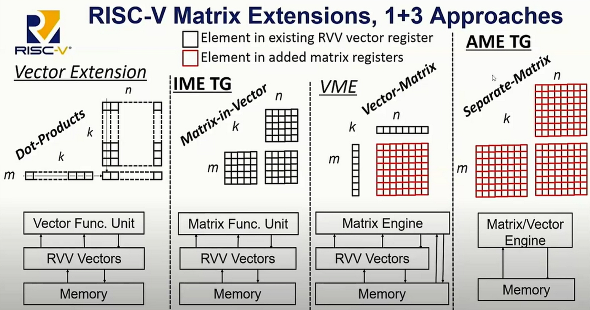

sidebar_position: 2

# 4.2 Matrix Extension Instruction Set

## 4.2.1 Instruction Set Overview

The RISC-V Matrix Extension is designed to accelerate one of the most critical operations in AI workloads: matrix multiplication. The canonical form of this operation is:

C+ = A x B

where:
- **C** is the output matrix,
- **A** and **B** are input matrices.

Depending on how input and output operands are mapped to architectural registers, the RISC-V community has proposed three distinct approaches for matrix extensions, as illustrated in the following diagram:

- **IME (Integrated Matrix Extension)**: Both input and output matrices use standard vector registers. For more details, see the [IME subgroup](https://lists.riscv.org/g/tech-integrated-matrix-extension).
- **VME (Vector-Matrix Extension)**: Input matrices reuse vector registers, while the output matrix uses dedicated extended registers. For more details, see the [VME subgroup](https://lists.riscv.org/g/tech-vme).
- **AME (Attached Matrix Extension)**: Both input and output matrices use dedicated registers. For more details, see the [AME subgroup](https://lists.riscv.org/g/tech-attached-matrix-extension).

## 4.2.2 SpacemiT Instruction Set

SpacemiT's custom matrix extension instruction set is based on the IME proposal. [See the full specification here](https://github.com/spacemit-com/riscv-ime-extension-spec).  

In the K1 core (with `vlen=256`), the matrix compute unit has a native tile shape of:  

4 x 8 x 4

Thus, the computational throughput per unit is:  

2 x 4 x 8 x 4 x 2Ghz = 0.5TOPS

## 4.2.3 Basic Usage

SpacemiT's extended instruction set, based on the IME standard, largely follows the programming model of the standard RISC-V vector instruction set.  

For reference on standard vector instruction usage, see [the relevant documentation]().  

For examples of IME instruction usage, refer to the [sample code repository](https://github.com/spacemit-com/riscv-ime-extension-spec/tree/master/example).
