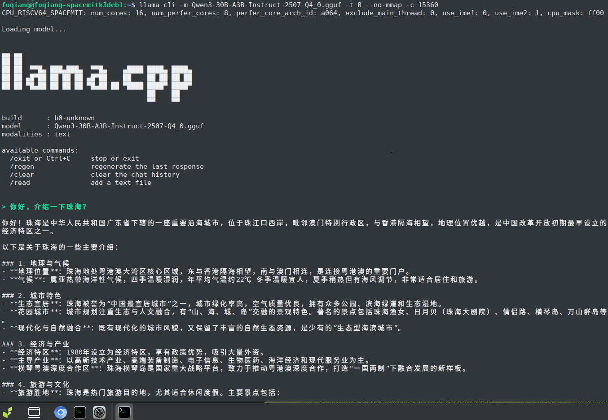
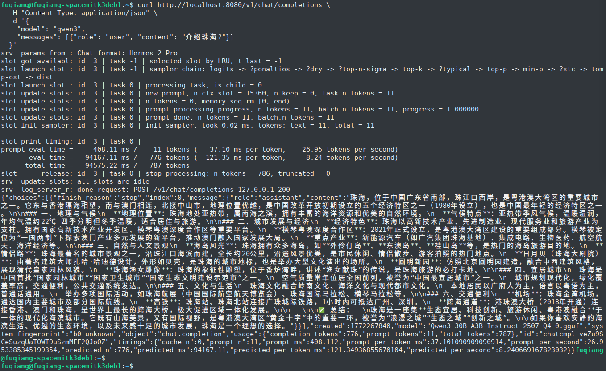
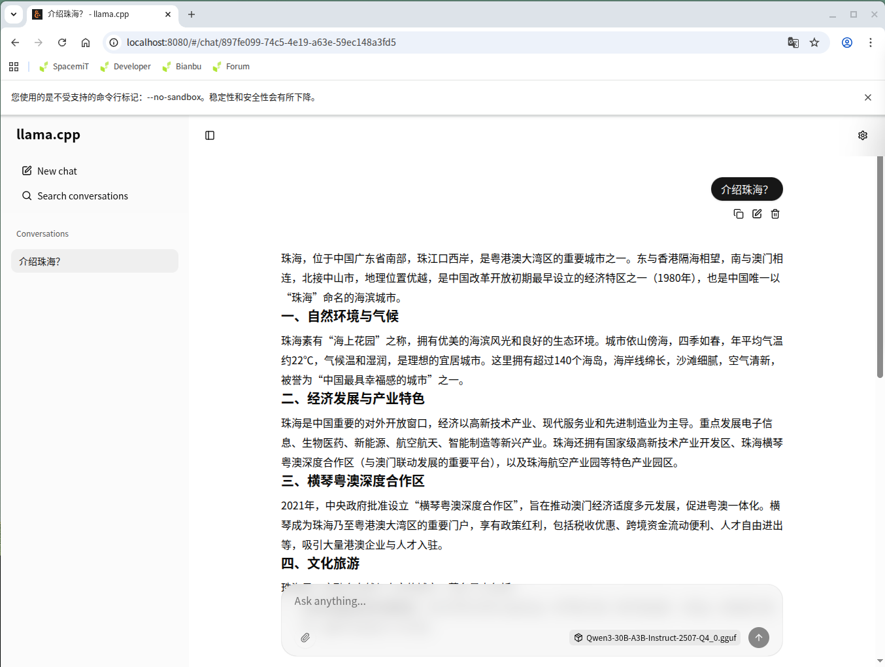
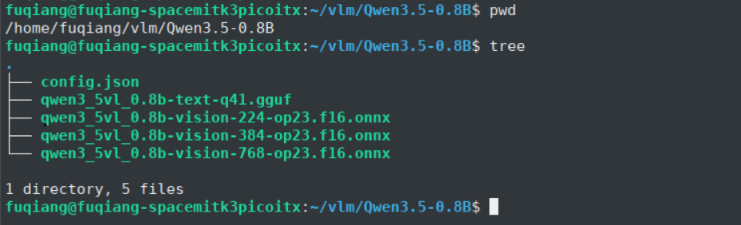
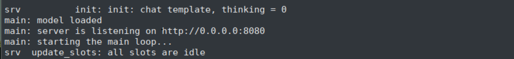
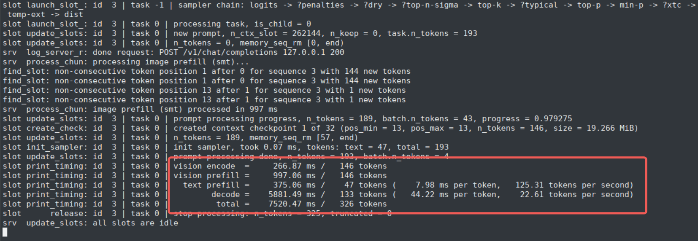
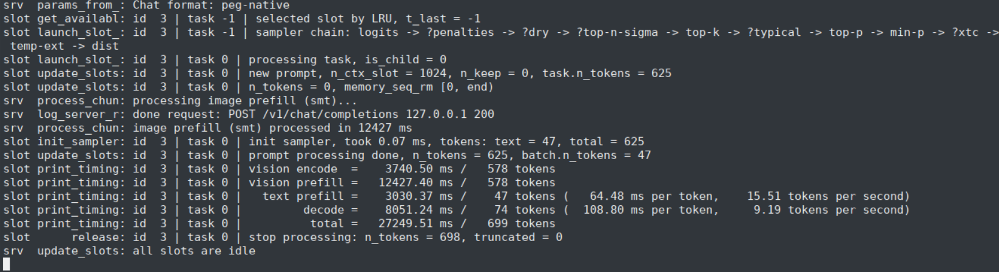
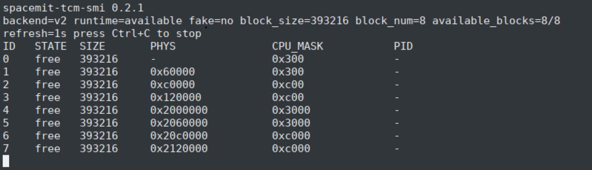

# Llama.cpp


> **llama.cpp** is a lightweight large-model inference framework designed primarily for local GGUF/GGML model inference. On the SpacemiT RISC-V platform, the CPU inference path can be optimized through hardware capabilities such as RVV and IME, with optional SMT vision extension integration for multimodal workloads. ([https://github.com/ggml-org/llama.cpp](https://github.com/ggml-org/llama.cpp))

llama.cpp is primarily used to run large language models and multimodal models on edge devices, with the following key capabilities:

- Native support for the GGUF model format, making it well suited for deployment of quantized LLMs.
- Fast validation of model usability and throughput through multi-threaded CPU inference.
- Support for RVV and SpacemiT-specific optimization switches on the SpacemiT RISC-V platform for improved performance.
- Support for multimodal pipelines such as visual encoding when the SMT extension is enabled together with the SpacemiT ONNX Runtime component.

You can download the latest release packages from [spacemit-llama.cpp](https://github.com/spacemit-com/llama.cpp/releases), subscribe to release notifications, or install the package directly from the Bianbu system.

---

## 1. Platform Support

| Platform & OS | Supported |
| --- | --- |
| K1 Buildroot | ✅ Supported |
| K1 OpenHarmony 5.0 | ❌ Not supported |
| K3 Bianbu LXQT/GNOME | ✅ Supported |
| K3 Buildroot | ✅ Supported |
| K3 OpenHarmony 5.0 | ❌ Not supported |
| K3 Bianbu LXQT/GNOME | ✅ Supported |

## 2. Usage Guide (Using Bianbu LXQT/GNOME as an Example)

### 2.1 Installation

Open a terminal and run the following command to install llama.cpp:

```bash
sudo apt update
sudo apt install llama.cpp-tools-spacemit
```

**Note**: Some legacy platforms or older firmware versions may not provide the `llama.cpp-tools-spacemit` package. In that case, try:

```bash
sudo apt update
sudo apt install llama-server
```

### 2.2 Download Models

Acceleration is currently supported for models in five quantization formats. When downloading GGUF models, select one of the following quantization types:

- Q4_K_M
- Q4_0
- Q4_1
- Q2_K
- Q3_K

Select an appropriate model size based on the compute capability of your target chip. For the K1 platform, Qwen3-0.6B is recommended:

```bash
wget https://www.modelscope.cn/models/unsloth/Qwen3-0.6B-GGUF/resolve/master/Qwen3-0.6B-Q4_0.gguf -P ~/
```

For the K3 platform, Qwen3-30B-A3B is recommended:

```bash
wget https://www.modelscope.cn/models/unsloth/Qwen3-30B-A3B-Instruct-2507-GGUF/resolve/master/Qwen3-30B-A3B-Instruct-2507-Q4_0.gguf -P ~/
```

### 2.3 Usage

Three common usage methods are available:

- llama-bench **(primarily for performance benchmarking)**
- llama-cli
- llama-server

The following examples use the K3 platform.

#### 2.3.1 llama-bench (Primarily for Performance Benchmarking)

```bash
llama-bench -m Qwen3-30B-A3B-Instruct-2507-Q4_0.gguf -t 8 -p 64 -n 64 -mmp 0 -fa 1
```

Parameters:

- **`-t`**: Number of threads used for the benchmark (`K3: <=8`, `K1: <=4`; for parallel inference, see Section 3)
- `-p`: Prompt length, in tokens
- `-n`: Output generation length
- `-mmp`: Whether to enable multimodal prompt support
- `-fa`: Whether to enable Flash Attention

Example output:


#### 2.3.2 llama-cli

```bash
llama-cli -m Qwen3-30B-A3B-Instruct-2507-Q4_0.gguf -t 8 --no-mmap -c 15360
```

Parameters:

- `-m`: Path to the `.gguf` model file
- **`-t`**: Number of threads used for the benchmark (`K3: <=8`, `K1: <=4`; for parallel inference, see Section 3)
- `--no-mmap`: Disable memory mapping
- `-c`: Context size

Example output:



#### 2.3.3 llama-server

Start the llama-server service in the background:

```bash
llama-server -m Qwen3-30B-A3B-Instruct-2507-Q4_0.gguf -t 8 --host 127.0.0.1 --port 8080 --ctx-size 15360 --n-gpu-layers 0 --batch-size 512 --metrics --no-mmap &
```

Parameters:

- `-m`: Path to the `.gguf` model file
- **`-t`**: Number of threads used for the benchmark (`K3: <=8`, `K1: <=4`; for parallel inference, see Section 3)
- `--host`: IP address on which the server listens
- `--port`: Server listening port; the default is `8080`
- `--ctx-size`: Model context length in tokens, which affects long-text processing capability
- `--n-gpu-layers`: Number of model layers to offload to the GPU to improve inference speed
- `--batch-size`: Number of tokens processed per batch, affecting throughput and memory usage
- `--metrics`: Enable the Prometheus-format `/metrics` endpoint for system monitoring and performance analysis
- `--no-mmap`: Disable memory mapping
- `-c`: Context size

##### Local API Request

```bash
curl -X POST http://127.0.0.1:8080/v1/chat/completions \
  -H "Content-Type: application/json" \
  -d '{
    "model": "Qwen3-30B",
    "messages": [
      { "role": "user", "content": "Introduce Zhuhai." }
    ]
  }'
```

Example output:



##### Browser Access

Open `http://localhost:8080` in your browser to access the llama server and use llama.cpp directly in the browser.



### 2.4 Downloading and Running Multimodal Models

Because multimodal model usage differs from standard LLM usage, it is described separately in this section.

#### 2.4.1 Model Download

Multimodal models must be split before they can run in llama.cpp. The split model packages are available at [https://archive.spacemit.com/spacemit-ai/model_zoo/vlm/](https://archive.spacemit.com/spacemit-ai/model_zoo/vlm/). Popular models currently include:

- `Qwen3.5-0.8B`
- `Qwen3.5-2B`
- `Qwen3.5-4B`
- `Qwen3-VL-30B-A3B`
- `fastvlm-0.5B`

The following sections use several of these models as examples.

#### 2.4.2 Model Preparation

Download the models above and copy them to the K3 device. Prepare several test images in resolutions such as `224x224`, `384x384`, `512x512`, and `768x768`. Both `.png` and `.jpg` formats are supported.


Extract the model files. Using `Qwen3.5-0.8B` as an example, the extracted contents are as follows:



Directory structure:

- **`config.json`**: Model configuration file, described in detail below
- **`qwen3_5vl_0.8b-text-q41.gguf`**: The language model portion separated from the VLM model
- **`qwen3_5vl_0.8b-vision-224-op23.fp16.onnx`**: Vision model portion for `224x224` input
- **`qwen3_5vl_0.8b-vision-384-op23.fp16.onnx`**: Vision model portion for `384x384` input
- **`qwen3_5vl_0.8b-vision-768-op23.fp16.onnx`**: Vision model portion for `768x768` input

`config.json` example:

```json
{
  "architectures": [
    "Qwen3_5ForConditionalGeneration"
  ],
  "vision_model": {
    "model_path": "./qwen3_5vl_0.8b-vision-384-op23.f16.onnx", // Specify the vision model path based on image resolution
    "input_size": 384, // Specify the model input size corresponding to the vision model above
    "spacemit_ep_intra_thread_num": 4, // Number of parallel inference threads
    "spacemit_ep_inter_thread_num": 1 // Number of parallel sessions; usually 1
  },
  "text_model": {
    "model_path": "./qwen3_5vl_0.8b-text-q41.gguf", // Specify the large language model path
    "hidden_size": 1024
  }
}
```

#### 2.4.3 Model Usage (Non-Qwen3-VL-30B-A3B)

Start the service from the Qwen3.5-0.8B directory with llama-server:

```bash
llama-server -m qwen3_5vl_0.8b-text-q41.gguf --media-backend smt --smt-config-dir ./ -t 8 --host 0.0.0.0 --port 8080 --reasoning-budget 0 --reasoning off
```

Parameters:

- `-m`: Path to the `.gguf` model file
- `--media-backend`: Vision backend; default is `smt`
- `--smt-config-dir`: Vision configuration path
- **`-t`**: Number of threads used for the benchmark (`K3: <=8`, `K1: <=4`; for parallel inference, see Section 3)
- `--host`: IP address on which the server listens
- `--port`: Server listening port; the default is `8080`
- `--reasoning-budget`: Parameter controlling reasoning behavior
- `--reasoning`: Enable or disable reasoning

Model loading may take some time, especially for larger models. When the following message appears, the `llama-server` service has started successfully.



Open `127.0.0.1:8080` in the browser to start the conversation:


The llama-server terminal prints performance metrics as shown below:



#### 2.4.4 Model Usage (Qwen3-VL-30B-A3B)

Set `export SPACEMIT_EP_DENSE_ACCURACY_LEVEL=1` to accelerate ONNX model inference.

Start the service from the qwen30ba3b-mm-q4_1 directory with llama-server:

```bash
llama-server -m qwen3vl-30b-text-q4_1.gguf --media-backend smt --smt-config-dir ./ -ctk f16 -ctv f16 -t 8 -tb 8 -c 1024 --host 0.0.0.0 --port 8080 --reasoning-budget 0 --reasoning off
```

Parameters:

- `-m`: Path to the `.gguf` model file
- `--media-backend`: Vision backend; default is `smt`
- `--smt-config-dir`: Vision configuration path
- `-ctk`: Quantization format for the K cache
- `-ctv`: Quantization format for the V cache
- **`-t`**: Number of threads used for the benchmark (`K3: <=8`, `K1: <=4`; for parallel inference, see Section 3)
- `-tb`: Number of CPU threads used for batch processing
- `-c`: Context size
- `--host`: IP address on which the server listens
- `--port`: Server listening port; the default is `8080`
- `--reasoning-budget`: Parameter controlling reasoning behavior
- `--reasoning`: Enable or disable reasoning

Open `127.0.0.1:8080` in the browser to start the conversation:


The llama-server terminal prints performance metrics as shown below:



## 3. Parallel Inference (Important)

This section uses the K3 platform as an example to explain how to use and manage parallel inference. It also introduces spacemit-tcm-smi, a utility for monitoring inference resources.

### 3.1 spacemit-tcm-smi

spacemit-tcm-smi is a tool for real-time monitoring and cleanup of inference resources.

#### 3.1.1 Installation

```bash
sudo apt update
sudo apt install spacemit-tcm
```

#### 3.1.2 Usage

- `spacemit-tcm-smi -h`: Display help
- `spacemit-tcm-smi -i`: Monitor TCM status in real time
- `spacemit-tcm-smi -c`: Clear TCM state. **If a previous inference process exited abnormally, subsequent inference may also fail. In this case, first inspect the TCM state with `spacemit-tcm-smi -i`, then clear it with this command.**

K3 provides 8 AI cores and supports up to 8-thread inference concurrently, provided that thread resources are assigned correctly. The following sections explain several common scenarios.

### 3.2 Single Inference

For single inference, simply use `-t 8` to occupy all available resources. During inference, run `spacemit-tcm-smi -h` to inspect resource usage as shown below:


At this point, no additional inference task can be started concurrently. If a second inference task is forced to run, both tasks may fail, as shown below:


Wait until the current inference completes and all TCM states return to `free`, as shown below, before starting another task.



Alternatively, you can forcefully stop the running inference or use `spacemit-tcm-smi -c` to clear the TCM state and reset it to `free` before starting a new task.

### 3.3 Dual Inference

#### 3.3.1 llama + llama

To run two concurrent llama inference tasks, explicitly assign AI cores (8-15) to each task, as shown below.

In one terminal:

```bash
export SPACEMIT_PERFER_CORE_ID="8,9,10,11" && llama-cli ...
```

The TCM status then shows four AI cores in use.


In another terminal:

```bash
export SPACEMIT_PERFER_CORE_ID="12,13,14,15" && llama-cli ...
```

At this point, all eight AI cores are active.

This example uses a `4+4` allocation for two inference tasks. Other combinations are also possible depending on workload requirements, such as `2+6` or `1+7`.

#### 3.3.2 `llama + onnxruntime`

Similar to `llama + llama`, ONNX Runtime also supports core binding. Correct core binding avoids conflicts. Example ONNX Runtime affinity configuration:

```cpp
std::unordered_map<std::string, std::string> provider_options;
provider_options["SPACEMIT_EP_INTRA_THREAD_NUM"] = "4";
// Bind specific cores
provider_options["SPACEMIT_EP_INTRA_THREAD_AFFINITY"] = "8;9;10;11";
```

#### 3.3.3 llama + llama Multimodal Extension

In addition to the AI-core binding used in llama + llama, the `config.json` file must also define ONNX Runtime core affinity, as shown below:

```json
# Method 1: Same approach as above, for example by adding the following to the vision_model field
"vision_model": {
  "model_path": "./xxx.onnx",
  "spacemit_ep_intra_thread_num": 4,
  "spacemit_ep_inter_thread_num": 1,
  "spacemit_ep_intra_thread_affinity": "8;9;10;11"
}

# Method 2 (recommended): Add an ep_config field using the same configuration format as EP
"ep_config": {
  "SPACEMIT_EP_INTRA_THREAD_NUM": "4",
  "SPACEMIT_EP_INTER_THREAD_NUM": "1",
  "SPACEMIT_EP_INTRA_THREAD_AFFINITY": "8;9;10;11"
}
```

### 3.4 Multi-Instance Inference

Multi-instance inference follows the same principles as dual inference and must satisfy the following requirements:

- Each inference task must run on different cores.
- The total number of concurrent inference threads must not exceed the number of AI cores (8).

Many combinations are possible, for example: 2+2+4, 2+2+2+2, or 1+1+1+1+1+1+1+1 ...

## 4. Native Build on K3

### 4.1 Install Dependencies

```bash
sudo apt install cmake
```

### 4.2 Download the Source Code

```bash
git clone https://github.com/spacemit-com/llama.cpp.git
```

### 4.3 Build and Install

#### 4.3.1 Base Version

When building on the SpacemiT RISC-V platform, it is recommended to enable `GGML_CPU_RISCV64_SPACEMIT` to activate platform-specific optimizations.

```bash
cd llama.cpp

cmake -B build \
  -DCMAKE_BUILD_TYPE=Release \
  -DGGML_CPU_RISCV64_SPACEMIT=ON \
  -DGGML_CPU_REPACK=OFF \
  -DLLAMA_OPENSSL=OFF \
  -DGGML_RVV=ON \
  -DGGML_RV_ZVFH=ON \
  -DGGML_RV_ZFH=ON \
  -DGGML_RV_ZICBOP=ON \
  -DGGML_RV_ZIHINTPAUSE=ON \
  -DGGML_RV_ZBA=ON \
  -DCMAKE_TOOLCHAIN_FILE=${PWD}/cmake/riscv64-spacemit-linux-gnu-gcc.cmake \
  -DCMAKE_INSTALL_PREFIX=build/installed

cmake --build build --parallel $(nproc) --config Release

cd build
make install
```

#### 4.3.2 Multimodal Extension Version

If you need to enable the SpacemiT SMT multimodal extension in `llama-server` or `llama-mtmd-cli`, the build depends on ONNX Runtime. Prepare an additional `SPACEMIT_ORT_DIR` directory containing a built ONNX Runtime package. The latest built ONNX Runtime package can be downloaded and extracted from [https://archive.spacemit.com/spacemit-ai/onnxruntime/](https://archive.spacemit.com/spacemit-ai/onnxruntime/).

Add the following definitions during the build:

```bash
export SPACEMIT_ORT_DIR=/path/to/spacemit-ort
export LD_LIBRARY_PATH=${SPACEMIT_ORT_DIR}/lib:${LD_LIBRARY_PATH}

cd llama.cpp

cmake -B build \
  -DCMAKE_BUILD_TYPE=Release \
  -DGGML_CPU_RISCV64_SPACEMIT=ON \
  -DGGML_CPU_REPACK=ON \
  -DLLAMA_OPENSSL=OFF \
  -DGGML_RVV=ON \
  -DGGML_RV_ZVFH=ON \
  -DGGML_RV_ZFH=ON \
  -DGGML_RV_ZICBOP=ON \
  -DGGML_RV_ZIHINTPAUSE=ON \
  -DGGML_RV_ZBA=ON \
  -DCMAKE_TOOLCHAIN_FILE=${PWD}/cmake/riscv64-spacemit-linux-gnu-gcc.cmake \
  -DCMAKE_INSTALL_PREFIX=build/installed \
  -DLLAMA_SERVER_SMT_VISION=ON \
  -DSPACEMIT_ORT_DIR=${SPACEMIT_ORT_DIR}

cmake --build build --parallel $(nproc) --config Release

cd build
make install
```

## 6. [Model Performance Data](./modelzoo.md)

> Obtained using llama-bench
