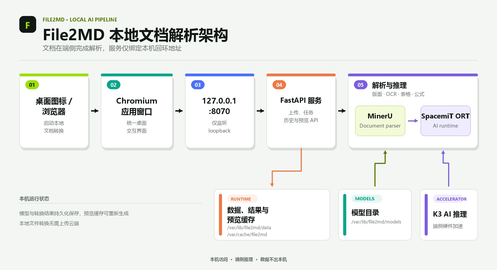
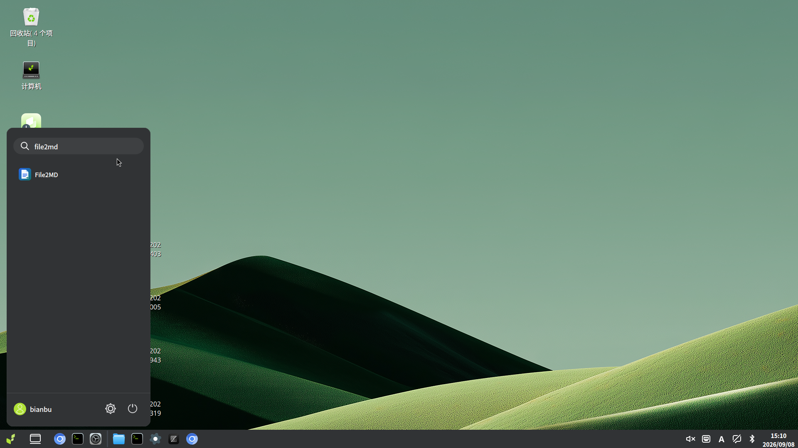
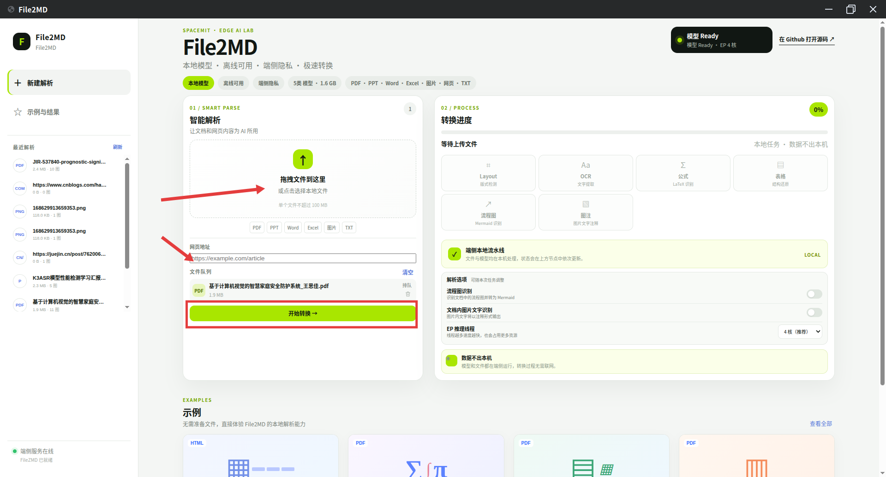
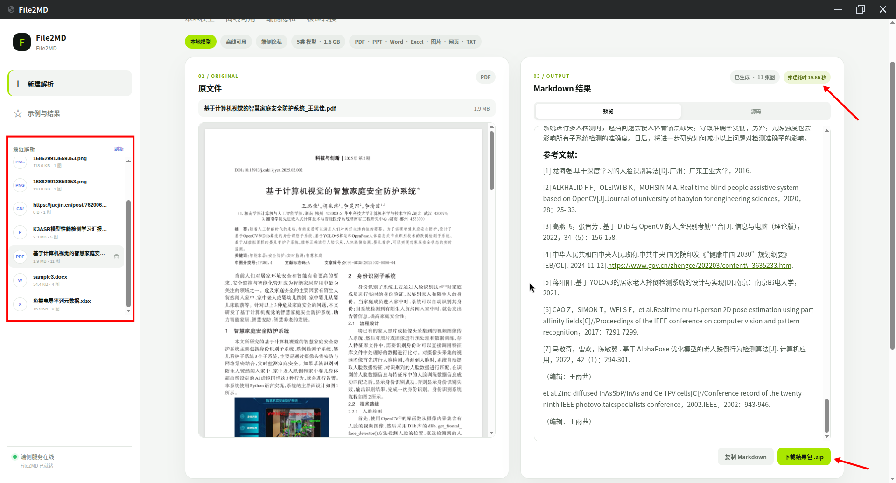
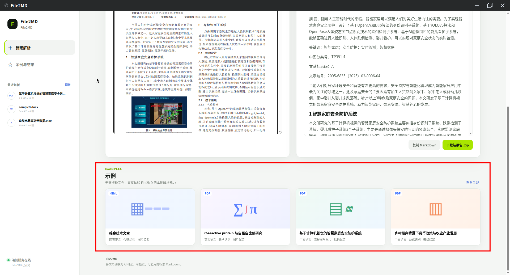

# File2MD

**File2MD** is a local document-to-Markdown desktop application for the SpacemiT K3 Bianbu platform. It parses PDFs, Office documents, images, plain text files, and web page URLs, converting layouts, body text, tables, formulas, flowcharts, and images into clean, readable, and re-editable Markdown.

File2MD's interface is built with web technologies but behaves like a regular desktop application: clicking the File2MD icon opens a standalone Chromium app window that connects to a local-only `127.0.0.1:8070` service. All document parsing and model inference run on-device — no documents are uploaded to the cloud.

## Key Capabilities

- **Multiple input types**: Supports PDF, PPT/PPTX, DOC/DOCX, XLS/XLSX, TXT, and common image formats
- **Web page conversion**: Paste a URL to extract and convert web content to Markdown
- **Batch processing**: Drag-and-drop files, multi-file selection, and a conversion queue
- **Visible progress**: Shows model readiness and processing stages including layout analysis, OCR, formulas, tables, flowcharts, and image captions
- **Side-by-side comparison**: View the original file alongside the generated Markdown on the result page
- **Rich rendering**: Supports KaTeX formulas, Mermaid diagrams, tables, and images
- **Flexible result export**: Switch between preview and source views, copy Markdown, and download a ZIP containing the `.md` file and an `images/` directory
- **History**: Saves conversion tasks; local file tasks can be reopened to view both the original and the result, URL tasks can be reopened to view the result

## Platform Support

| Platform & OS | Supported |
| --- | --- |
| K1 Buildroot | ❌ Not supported |
| K1 OpenHarmony | ❌ Not supported |
| K1 Bianbu LXQT/GNOME | ❌ Not supported |
| K3 Buildroot | ❌ Not supported |
| K3 OpenHarmony | ❌ Not supported |
| K3 Bianbu LXQT/GNOME | ✅ Supported |

## Technical Architecture

### Technology Stack

- **Desktop entry**: System application icon and `file2md-launcher`
- **User interface**: Static HTML, CSS, and JavaScript rendered in a Chromium app window
- **Backend service**: Python 3.14, FastAPI, and Uvicorn, listening on `127.0.0.1:8070` by default
- **Document parsing**: MinerU 0.1.0
- **AI inference runtime**: `python3-spacemit-ort >= 2.0.6`, leveraging K3 on-device AI capabilities for model inference
- **Office preview**: LibreOffice headless
- **PDF preview**: PDFium
- **Markdown rendering**: Marked, DOMPurify, KaTeX, and Mermaid

### System Architecture



### Processing Pipeline

1. **Submit task**: Create a conversion task via file selection, drag-and-drop, or a web page URL.
2. **Input preprocessing**: PDFs and images go directly into the parsing pipeline; Office documents are converted by LibreOffice headless into an intermediate format for parsing and preview.
3. **Content recognition**: MinerU calls on-device models for layout analysis, OCR, formula recognition, and table extraction; when the relevant options are enabled, flowchart recognition and image caption generation are also performed.
4. **Result generation**: The backend assembles the Markdown, image assets, original file preview, and task status.
5. **View and export**: The frontend displays the original and Markdown side by side; users can copy the source or download the ZIP result package.

## Installation

On a K3 Bianbu LXQT/GNOME system, run:

```bash
sudo apt update
sudo apt install file2md
```

`apt` will resolve File2MD's system dependencies, including the AI inference runtime which requires `python3-spacemit-ort` version 2.0.6 or later. The first installation also downloads and verifies a model package of approximately 1.6 GB — ensure a stable network connection and sufficient disk space.

## Quick Start

### 1. Launch the Application

Open the system application menu, type **file2md** in the search box, and click the **File2MD** icon in the results. Once the window opens, it automatically connects to the local service and checks the model status.



### 2. Add Files or a Web Page

The left side of the home screen is the input area. There are two ways to create a task:

- **Local files**: Drag files into the "Drop files here" area, or click it to open a file picker. Multiple files can be added at once.
- **Web page URL**: Paste a URL into the "Web address" input field.

Added items appear in the file queue. Once the queue looks correct, click **Start Conversion** to begin processing.



URL conversion requires the device to reach the target website; local document conversion does not require an external network connection.

> URL tasks do not save the original HTML of the web page. The conversion result is preserved in history, but reopening a URL task does not restore the original page preview.

### 3. Monitor Processing Stages and Set Parsing Options

The six status boxes above the "Conversion Progress" area on the right correspond to the processing stages a task may go through:

1. **Layout**: Detects headings, body text, images, tables, and their reading order on the page.
2. **OCR**: Extracts text from pages or images.
3. **Formula (LaTeX recognition)**: Recognizes mathematical formulas and produces LaTeX content renderable in Markdown.
4. **Table (structure restoration)**: Recognizes row and column relationships in tables and restores their structure.
5. **Flowchart (Mermaid recognition)**: When flowchart recognition is enabled, converts detected flowcharts to Mermaid notation.
6. **Caption (image text annotation)**: When image text recognition is enabled, extracts text from images and writes it into the result as annotations.

The status boxes and top progress bar show the current processing stage while a task runs.

Below the six stages are the parsing options for the current task:

- **Flowchart recognition**: Controls whether flowcharts in the document are recognized and converted to Mermaid.
- **Image text recognition**: Controls whether text within images is recognized and written into the result as annotations.
- **EP inference threads**: Sets the number of threads used for model inference. More threads generally consume more CPU and memory; adjust based on device load and document size. The **6 cores** shown in the screenshot is an example setting for that task, not a fixed requirement.

These options can be adjusted per task before starting conversion.


## Supported Input Formats

| Type | Supported Formats |
| --- | --- |
| PDF | `.pdf` |
| Presentations | `.ppt`, `.pptx` |
| Word documents | `.doc`, `.docx`, `.txt` |
| Spreadsheets | `.xls`, `.xlsx` |
| Images | `.png`, `.jpg`, `.jpeg`, `.jp2`, `.webp`, `.gif`, `.bmp`, `.tiff` |
| Web content | Web page URL |

## Viewing and Managing Results

After conversion, the result page shows the original and Markdown side by side. PDFs, images, and preprocessed Office documents can be viewed in the original area; the Markdown area renders headings, lists, tables, images, KaTeX formulas, and Mermaid diagrams.

The sections of the result page:

- **Left history list**: Shows recent conversion tasks. Click an entry to reopen its Markdown and export result; local file tasks also allow the original to be viewed again.
- **Original file area**: Used for comparing content against the source document.
- **Markdown result area**: Use the "Preview" and "Source" tabs to switch between the rendered result and the raw Markdown text.
- **Inference time (top right)**: Shows the model inference time for the current task, giving a sense of the processing cost.
- **Copy Markdown**: The button in the bottom right copies the full Markdown to the clipboard for pasting into other editors.
- **Download result package `.zip`**: The green button in the bottom right downloads the result package, which contains the `.md` file and an `images/` directory when the task produced image assets.



## Using Built-in Examples

The bottom of the page provides built-in examples so you can try File2MD without preparing or uploading your own files. The examples cover web content, formula recognition, table and image handling, and document structure preservation. Click an example card to see its output; click **View All** in the top right of the examples section to browse all built-in examples.



## Runtime Directories

File2MD separates its program files, configuration, models, task data, and cache:

| Path | Purpose |
| --- | --- |
| `/opt/file2md/frontend/` | Frontend static assets |
| `/opt/file2md/backend-venv/` | File2MD isolated Python backend environment |
| `/etc/file2md/` | System-level configuration |
| `/var/lib/file2md/models/` | Model files |
| `/var/lib/file2md/data/jobs/` | Conversion task metadata |
| `/var/lib/file2md/data/originals/` | Task original files and preview content |
| `/var/lib/file2md/data/outputs/` | Markdown, images, and exported results |
| `/var/cache/file2md/` | Regenerable runtime cache |

These directories are created as needed by the installation process and the service. The application source and runtime dependencies do not share virtual environments with other projects, and conversion data is not written into the source directory.

## Service Status and Troubleshooting

File2MD is managed by `file2md.service`. If the application fails to open, a task makes no progress, or a preview fails, check the service status, logs, and listening port in sequence:

```bash
systemctl status file2md.service
journalctl -u file2md.service -f
ss -ltn | grep 8070
```

Under normal conditions, the port check should show the service listening only on `127.0.0.1:8070`. This address is accessible only from the desktop window or browser on the current device and is not exposed to the local network by default.

### Common Issues

- **Long wait on first launch**: Confirm that the model download and verification have completed, and wait for the model status to show as ready in the interface.
- **Web page URL conversion fails**: Confirm the device can reach the target website; check the service logs for network errors if needed.
- **Office file preview unavailable**: Check the `file2md.service` logs for LibreOffice conversion errors.
- **Task conversion fails**: Preserve the input file and logs, then use `journalctl -u file2md.service` to identify the specific failing stage.
