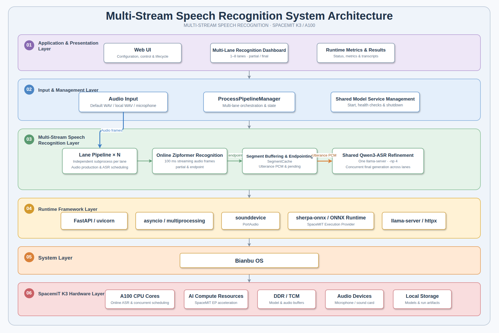
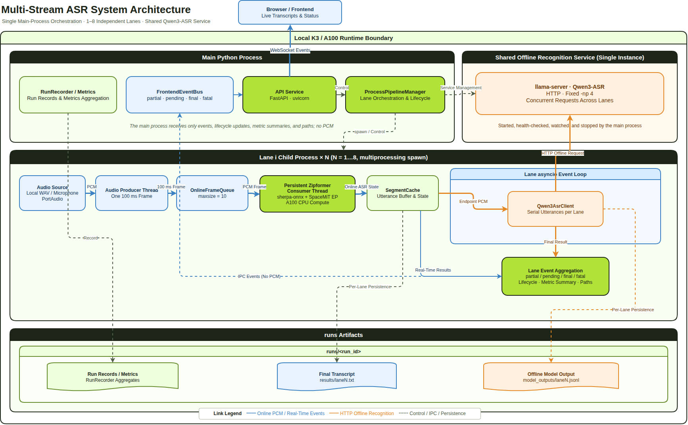
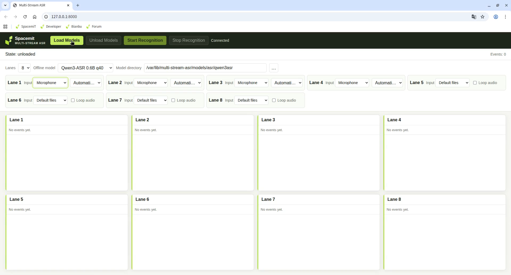

# Multi-Stream ASR

**Multi-Stream ASR** is a local real-time speech recognition application for the SpacemiT K3/A100 RISC-V platform. It can process 1 to 8 audio streams simultaneously using a two-stage recognition pipeline: a streaming Zipformer for low-latency interim text and offline Qwen3-ASR for the final transcription of each utterance. All audio processing and inference run locally on the device, making the application suitable for concurrent multi-stream speech scenarios such as intelligent customer service, meeting transcription, and speech quality inspection.

## Key Features

- **1 to 8 concurrent streams**: Supports any integer from 1 to 8 streams. Each stream is called a lane and reads audio and performs recognition independently
- **Two-stage recognition**: The streaming Zipformer outputs interim text in real time, while offline Qwen3-ASR performs refinement and produces the final transcription for each utterance
- **Process-level isolation**: Each lane runs in a separate child process, so a failure in one lane does not affect the others
- **Shared offline service**: All lanes share a single `llama-server` that provides continuous batching for Qwen3-ASR
- **Multiple input types**: Supports bundled sample WAV files, local WAV files, and microphone capture; file input can be looped
- **Two operating modes**: Provides both a Web UI and a Headless command-line mode
- **Persistent results**: Transcriptions, per-utterance model output, and runtime metrics are saved under the `runs/` directory
- **Local operation**: Models and recognition results do not need to be uploaded to the cloud

## Platform Support

| Platform / OS | Supported |
| --- | --- |
| K1 Buildroot | ❌ No |
| K1 OpenHarmony | ❌ No |
| K1 Bianbu LXQt/GNOME | ❌ No |
| K3 Buildroot | ❌ No |
| K3 OpenHarmony | ❌ No |
| K3 Bianbu LXQt/GNOME | ✅ Yes |

## Technical Architecture

### Core Technology Stack

- **Online recognition**
  - sherpa-onnx streaming Zipformer (bilingual Chinese and English, `sherpa-onnx-streaming-zipformer-bilingual-zh-en-2023-02-20`)
  - Accelerated by the SpaceMiT Execution Provider
  - Produces `partial` text in real time and performs `endpoint` detection to segment utterances
- **Offline recognition**
  - Qwen3-ASR 0.6B (q40) or 1.7B (q4km)
  - Served over HTTP with continuous batching by the system-installed `llama-server`
- **Web service**
  - FastAPI + uvicorn
  - WebSocket broadcasts events such as `partial`, `pending`, and `final` to the frontend in real time
- **Audio input**
  - sounddevice / PortAudio captures microphone audio as 16 kHz mono float32 data, split into 100 ms frames
  - Local WAV files and microphones use a unified per-lane audio producer thread
- **Concurrency and processes**
  - `multiprocessing` with the spawn context creates lane child processes
  - An asyncio event loop handles asynchronous scheduling for the controller and all lanes

### Main Frameworks

| Framework / Component | Purpose |
| --- | --- |
| sherpa-onnx | Wraps online streaming Zipformer recognition and is accelerated by the SpaceMiT EP |
| Zipformer (streaming) | Online recognition model that produces `partial` text and detects the `endpoint` of each utterance |
| Qwen3-ASR (0.6B / 1.7B) | Offline final transcription model that produces `final` text for each utterance |
| llama-server (llama.cpp) | Provides the shared continuous-batching HTTP service for Qwen3-ASR |
| FastAPI + uvicorn | Provides the Web service, REST APIs, and WebSocket event broadcasting |
| asyncio + multiprocessing | Provides concurrent scheduling for the controller and lanes, together with process isolation |
| sounddevice / PortAudio | Discovers microphone devices and captures audio |
| httpx / pydantic / numpy | Provides the HTTP client, data validation, and numerical audio processing |

### System Architecture Diagram



The system consists of one controller process, N lane child processes, and one shared `llama-server` process. The controller is responsible only for model loading, lifecycle coordination, event aggregation, and WebSocket broadcasting. Audio reading, online Zipformer recognition, offline Qwen requests, and result persistence all remain within each lane. As a result, the speed at which the controller handles control events does not block the 100 ms audio production cycle in any lane.

### Workflow



Audio in each lane moves through the following sequence:

1. The audio source writes one 100 ms frame at a time to the lane's queue
2. The Zipformer consumes frames and produces online interim text as `partial` events in real time
3. When the Zipformer detects the end of an utterance (`endpoint`), it retrieves the utterance PCM from the buffer
4. The utterance PCM is submitted to the shared `llama-server` running Qwen3-ASR
5. The service returns the `final` text, which is written to `results/lane<N>.txt`

Key terms used during recognition:

| Term | Meaning |
| --- | --- |
| `partial` | Online interim text produced by the Zipformer for speech currently being received |
| `endpoint` | The point at which the Zipformer determines that an utterance has ended, triggering offline transcription |
| `pending` | An utterance has been segmented and is being submitted, or is ready to be submitted, to Qwen, but no final text has been returned yet |
| `final` | The final text returned by Qwen3-ASR and the recognition result delivered for that utterance |

> 💡 **Tip**: Online text provides rapid feedback, while final text is generated by Qwen3-ASR; they are separate results. While an utterance is still in progress, it is normal to keep receiving `partial` events without a `final` event.

### Process and Thread Model

For `N` recognition lanes (`1 <= N <= 8`, with `N = 4` by default):

- One main Python process runs the main event loop and `ProcessPipelineManager`
- `N` lane child processes are created with the `multiprocessing` spawn context
- One shared `llama-server` process is started, monitored, and stopped by the main process
- Each lane has one audio producer thread and one Zipformer consumer thread

The shared service uses a fixed `-np 4` concurrency slot count, two encoder threads with affinity `8;9`, and six decoder threads on cores `10,11,12,13,14,15`. A Zipformer loading failure in any lane triggers a global stop. During unloading, the main process stops the lanes first and stops the shared service only after confirming that every lane has exited.

## Installation

### Method 1: Install the Bianbu DEB (Recommended)

On a K3 Bianbu 4.0 LXQt/GNOME system, install the application from the package repository:

```bash
sudo apt update
sudo apt install multi-stream-asr
```

If you have already downloaded a local DEB file, install it from the directory containing the file:

```bash
sudo apt install ./multi-stream-asr_*.deb
```

The DEB performs the following deployment steps:

- Installs the application and its isolated Python 3.13 runtime under `/opt/multi-stream-asr/multi-stream-asr`
- Installs system dependencies including `spacemit-onnxruntime`, `llama.cpp-tools-spacemit`, `sm-sdk`, and PortAudio
- Downloads the Qwen3-ASR 0.6B and 1.7B models with the batched encoder frontend to `/var/lib/multi-stream-asr/models/asr`
- Uses `sm-sdk` to install the online Zipformer model under `/var/lib/sm-sdk/models/asr`
- Registers the `multi-stream-asr.service` systemd service and a desktop launcher icon

The installation downloads models, so the time required depends on network and storage performance. If model download, verification, or extraction is interrupted, check the network connection and available disk space, then reinstall:

```bash
sudo apt install --reinstall multi-stream-asr
```

On desktop systems, the installation script configures the service to run as the detected desktop user so the application can access that user's PipeWire/PulseAudio session and microphone devices. If no desktop user is detected, the dedicated `multi-stream-asr` system user is used.

### Method 2: One-Step Setup from Source

Run the following command from the repository root:

```bash
scripts/setup.sh
```

The script performs the following steps in sequence:

- Installs Python 3.13, Python venv, PortAudio, and basic tools through apt
- Creates the `.venv313` virtual environment and installs the project dependencies and sherpa-onnx
- Downloads and verifies the Zipformer, Qwen3-ASR 0.6B, and Qwen3-ASR 1.7B model sets under `models/asr`

Downloads use the Python standard library and do not depend on curl. Verified archives are retained under `models/.downloads`. If the network connection is interrupted, rerunning the script skips completed downloads and retrieves only missing or damaged content.

Common options:

| Option | Description |
| --- | --- |
| `--skip-apt` | Skip the apt step if system packages are already installed |
| `--skip-python` | Install or verify only the models and skip the Python environment |
| `--models-dir PATH` | Specify the model installation directory |

> ⚠️ **The source installation has two prerequisites**:
>
> 1. The batched encoder frontend (`*.dynq.batched.onnx`) required at runtime is **not** provided by `scripts/setup.sh`. The script downloads only the static `*.dynq.onnx` frontend. The batched frontend is a local, git-ignored prerequisite that must be placed manually in the corresponding model directory.
> 2. The K3/RISC-V host must have the continuous-batching `llama-server` installed system-wide. The executable must be resolvable through `PATH`, and its dependent libraries must be resolvable by the system dynamic linker. The project does not bundle the runtime or modify `LD_LIBRARY_PATH`.

The Bianbu DEB and its dependencies deploy these files and the runtime automatically. When using the DEB, you do not need to run `scripts/setup.sh` or create a source virtual environment.

### Method 3: Manual Source Installation (Remote / Developers)

```bash
python3.13 -m venv .venv313
. .venv313/bin/activate
export PIP_INDEX_URL="${PIP_INDEX_URL:-https://mirrors.aliyun.com/pypi/simple/}"
export PIP_EXTRA_INDEX_URL="${PIP_EXTRA_INDEX_URL:-}"
export SPACEMIT_PIP_INDEX_URL="${SPACEMIT_PIP_INDEX_URL:-https://git.spacemit.com/api/v4/projects/81/packages/pypi/simple}"
python -m pip install -U pip
python -m pip install -e ".[dev]"
python -m pip install sounddevice
python -m pip install --no-cache-dir --only-binary=:all: --no-deps sherpa-onnx \
  --index-url "$SPACEMIT_PIP_INDEX_URL"
```

## Quick Start

### Start the Bianbu DEB

Double-click **Multi-Stream ASR** on the desktop or in the application menu. The launcher ensures that the systemd service is running, waits for the page to become ready, and opens `http://127.0.0.1:8000/`.

You can also manage the service from a terminal:

```bash
sudo systemctl start multi-stream-asr
systemctl status multi-stream-asr --no-pager
```

Then open `http://127.0.0.1:8000/` on the device, or open `http://<K3-device-IP>:8000/` from another device on the same local network. View service logs with:

```bash
journalctl -u multi-stream-asr -f
```

### Start the Web Service from Source

```bash
. .venv313/bin/activate
python -m multi_stream_asr.main --host 0.0.0.0 --port 8000
```

Open `http://<device-IP>:8000/` in a browser. Before first use, you can open `docs/web-ui-tutorial.html` from the repository offline. It requires no backend and simulates the complete configuration → loading → recognition → unloading workflow in the page.

### Headless Validation from Source

After entering the virtual environment, use fake mode to verify the processes and pipeline first, then run in real mode:

```bash
. .venv313/bin/activate
pytest -v
python -m multi_stream_asr.main --headless --fake --lanes 1
python -m multi_stream_asr.main --headless --fake --lanes 4
python -m multi_stream_asr.main --headless --lanes 4
```

`--fake` mode does not load real models or start the shared service. It is intended for quick validation of the multi-stream pipeline. The default is four lanes, and Headless mode accepts any integer from 1 to 8.

The default input consists of the sample WAV files bundled under `src/multi_stream_asr/assets/wav16k`. Use `--input-dir PATH` to specify another directory containing 16 kHz mono WAV files.

## Using the Application

The DEB and source installation use the same Web UI and operating workflow. The DEB automatically prepares the models and system `llama-server`. Before running from source, prepare the corresponding files and runtime as described above. The following sections describe the page from top to bottom.

### 1. Select the Number of Lanes

Before loading a model, select any integer from 1 to 8 as the number of recognition lanes.

> 💡 The number of lanes and model selection remain fixed after the model is loaded. To change them, unload the model first.

### 2. Select a Model and Set the Model Directory

Select one of the two offline models:

| Model ID | Required files | Default DEB directory | Default source directory |
| --- | --- | --- | --- |
| `qwen3-asr-0.6b-q40` | `Qwen3-ASR-0.6B-text-q40.gguf`, `Qwen3-ASR-0.6B-encoder-frontend.dynq.batched.onnx`, `Qwen3-ASR-0.6B-encoder-backend.dynq.onnx` | `/var/lib/multi-stream-asr/models/asr/qwen3asr` | `models/asr/qwen3asr` |
| `qwen3-asr-1.7b-q4km` | `Qwen3-ASR-1.7B-text-q4km.gguf`, `Qwen3-ASR-1.7B-encoder-frontend.dynq.batched.onnx`, `Qwen3-ASR-1.7B-encoder-backend.dynq.onnx` | `/var/lib/multi-stream-asr/models/asr/qwen3asr-1.7b` | `models/asr/qwen3asr-1.7b` |

Select the model directory from paths readable by the service host. The page verifies all required files before sending the load request, and the server verifies them again. If files are missing, the service remains unloaded and displays the missing paths in the configuration error area.

### 3. Configure Input for Each Lane

Input can be configured independently for each lane while recognition is stopped. Three input types are available:

- **Default WAV**: Loops through the bundled sample files
- **Local WAV**: Uses a local path; the file must be a 16 kHz, mono, PCM WAV file
- **Microphone**: Selects a discovered device or retains automatic assignment; audio is captured as 16 kHz mono float32 data and emitted in 100 ms frames

Looping can be enabled for file input with `loop_audio`. When you select **Start**, the manager atomically submits the configurations for all lanes and resolves and validates each default or explicit WAV file before creating the run. If any validation fails, the entire request is rejected and no partial set of run results is created.

### 4. Load the Model

Select **Load Models**. The controller first starts the shared `llama-server` and waits for its health check to pass. It then creates all lanes in parallel and uses a fixed WAV file to warm up each lane's Zipformer in parallel. During this process, the Web status displays `Warming up Zipformer...`.

> ⚠️ The service does not enter the loaded state or start any audio producer until every lane has completed warmup.

### 5. Start Recognition

After you select **Start Recognition**, each lane begins reading audio and producing `partial` events. At the end of each utterance, it submits the audio for offline transcription and returns a `final` event.



### 6. View Results, Stop, and Unload

The recognition results area displays each lane's `partial` interim text and `final` transcription in real time. After recognition is complete:

- Select **Stop Recognition** to end the current run
- Select **Unload Models** to release the models and shared service


## Command-Line Usage

The command entry point in the DEB is `/opt/multi-stream-asr/multi-stream-asr/bin/multi-stream-asr`; the source installation entry point is `python -m multi_stream_asr.main`. Both accept the same options and enter Web mode by default when `--headless` is omitted:

```bash
# Bianbu DEB
/opt/multi-stream-asr/multi-stream-asr/bin/multi-stream-asr --host 0.0.0.0 --port 8000

# Source
python -m multi_stream_asr.main --host 0.0.0.0 --port 8000
```

| Option | Description |
| --- | --- |
| `--headless` | Enter Headless mode, then exit after loading, recognition, and unloading |
| `--lanes <num>` | Number of recognition lanes; the default is 4 and the range is 1 to 8 |
| `--input-dir <path>` | Specify a directory containing 16 kHz mono WAV input files |
| `--host <ip>` | Web service listen address; the default is `127.0.0.1` |
| `--port <num>` | Web service port; the default is `8000` |
| `--fake` | Fake mode; does not load real models or start the shared service and can be used only with `--headless` |
| `--verbose` | Write detailed per-record metrics to disk |

## Advanced Settings

### Model Directory Environment Variables

The DEB systemd service sets the following environment variables to the system model directories. When running from source, you can also set them to override the default paths in the source tree:

| Environment variable | Purpose |
| --- | --- |
| `MULTI_STREAM_ASR_ONLINE_MODEL_DIR` | Online Zipformer model directory |
| `MULTI_STREAM_ASR_OFFLINE_MODEL_DIR` | 0.6B offline model directory |
| `MULTI_STREAM_ASR_OFFLINE_MODEL_DIR_1_7B` | 1.7B offline model directory |

The DEB online model directory is `/var/lib/sm-sdk/models/asr/sherpa-onnx-streaming-zipformer-bilingual-zh-en-2023-02-20`; the offline model directories are shown in the table above. If the environment variables are not set, the default directories in the source tree are `models/asr/sherpa-onnx-streaming-zipformer-bilingual-zh-en-2023-02-20`, `models/asr/qwen3asr`, and `models/asr/qwen3asr-1.7b`, respectively.

### Utterance Segmentation Parameters (`EndpointConfig`)

| Parameter | Default | Description |
| --- | --- | --- |
| `rule1_min_trailing_silence` | 1.0 | Minimum trailing silence for rule 1, in seconds |
| `rule2_min_trailing_silence` | 0.5 | Minimum trailing silence for rule 2, in seconds |
| `rule3_min_utterance_length` | 10.0 | Maximum utterance length for rule 3, in seconds |
| `cut_margin_seconds` | 0.1 | Utterance cutback margin, in seconds |

### Shared Service Parameters (`SharedQwenConfig`)

The shared `llama-server` uses fixed key parameters independent of the configured lane count `N`:

- `-np 4` provides four concurrent slots and processes up to four offline requests at once; excess requests wait in the service queue
- The encoder uses two threads with affinity `8;9`; the decoder uses cores `10,11,12,13,14,15` and six threads
- `-c 8192`, `-b 2048`, `-ub 512`, `-t 6`, `-tb 6`, `--threads-http 24`
- `--warmup --no-jinja --chat-template chatml`

The shared service health endpoint is `http://127.0.0.1:8090/health`, and the default port is 8090. The PID is written to `/tmp/multi-stream-asr/shared-qwen/llama-server.pid`, and logs are written to `/tmp/multi-stream-asr/shared-qwen/llama-server.log`.

### Input Format Requirements

Local WAV input must be 16 kHz, mono, and PCM. You can validate a file before starting the model:

```bash
python - <<'PY'
from pathlib import Path
from multi_stream_asr.audio.local_file import validate_wav_16k_mono_pcm

print(validate_wav_16k_mono_pcm(Path('/absolute/path/to/input.wav')))
PY
```

## Runtime Outputs and Performance Metrics

Each run writes to a separate directory: `runs/headless-*` for Headless mode and `runs/web-*` for runs started through the Web UI. For the DEB service, `runs/` is located at `/var/lib/multi-stream-asr/runs`; when running from source, it is located under the current working directory.

| File | Description |
| --- | --- |
| `results/lane<N>.txt` | Complete final recognition result for each lane |
| `model_outputs/lane<N>.jsonl` | Per-utterance model output with six fields: model, audio duration, RTF, lane ID, utterance ID, and result |
| `config.json` | Configuration for the current run |
| `metrics.json` | Summary of global and per-lane metrics |

When `--verbose` is enabled and the lane is not looping its input, detailed per-record metrics are also written to `metrics_detail/{frame_latency,event_loop_lag,rtf,shared_timing}/lane<N>.jsonl`.

Target metrics: `online_frame_latency.average_ms` is approximately 50 ms; `offline_rtf.average` is ≤ 0.4.

## Troubleshooting

### The Shared Service Is Not Ready After Startup, or Loading Never Completes

First confirm that Python 3.13 is available, the system `llama-server` is executable and resolvable through `PATH`, and the selected model's GGUF, frontend ONNX, and backend ONNX files all exist. Then check the health endpoint:

```bash
command -v llama-server
test -x "$(command -v llama-server)"
ldd "$(command -v llama-server)"
curl --fail http://127.0.0.1:8090/health
```

If the health check fails, inspect the end of the shared service log:

```bash
tail -n 80 /tmp/multi-stream-asr/shared-qwen/llama-server.log
```

The `ldd` output must not contain `not found`. If dependencies are missing, fix the system installation and dynamic linker configuration first. Do not bypass the issue through the project directory or by setting `LD_LIBRARY_PATH` manually.

### One Lane Produces No Results While the Others Work

Confirm that the lane count is an integer from 1 to 8, that the input configuration covers the lane, and that the lane completed model loading and warmup. If no lane enters recognition, return to troubleshooting the shared service and global loading stage.

### Online Text Appears, but Final Text Never Arrives

Qwen receives an utterance only after an `endpoint` is reached or after end-of-file or stop processing flushes the remaining audio. If continuous speech has not reached an `endpoint`, the temporary lack of a `final` event is normal. Stop the input or let the utterance end to observe the flush.

### An Utterance Has Clearly Ended, but There Is Still No `final` Event

Check the shared service `/health` endpoint again, confirm that the utterance PCM is not empty, and confirm that the lane's Qwen request was not rejected because the service was unavailable, the HTTP request failed, or the response was invalid.

### Stopping Takes a Long Time

Each lane must finish flushing any outstanding offline request for that lane before it can stop. If all lanes are blocked, check shared service availability first. If only one lane is blocked, inspect that lane's `endpoint` and Qwen request path.

### Validate Only the Shared Qwen Service

Use the script to start the shared service, check its health, send one request, and stop the service directly:

```bash
python scripts/smoke_shared_qwen.py /path/to/16k-mono.wav --seconds 10 --model-id qwen3-asr-0.6b-q40
python scripts/smoke_shared_qwen.py /path/to/16k-mono.wav --seconds 10 --model-id qwen3-asr-1.7b-q4km
```
