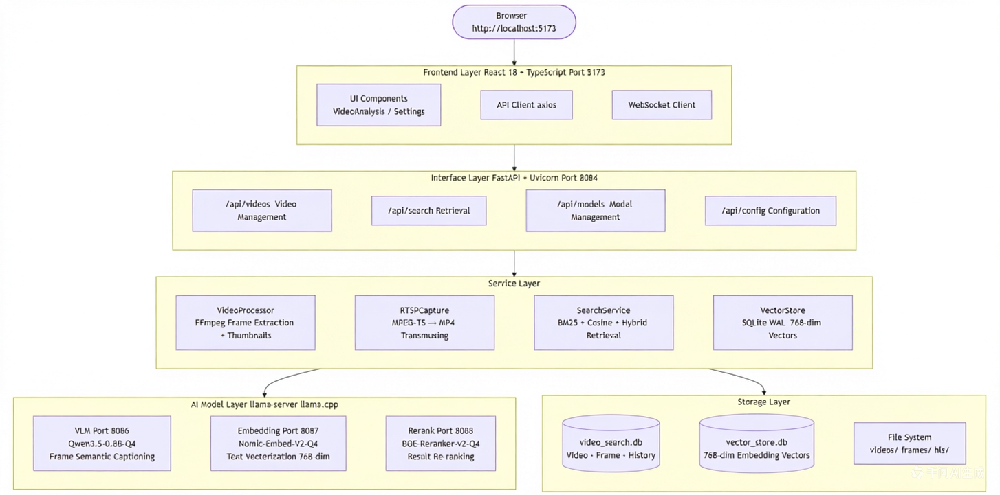
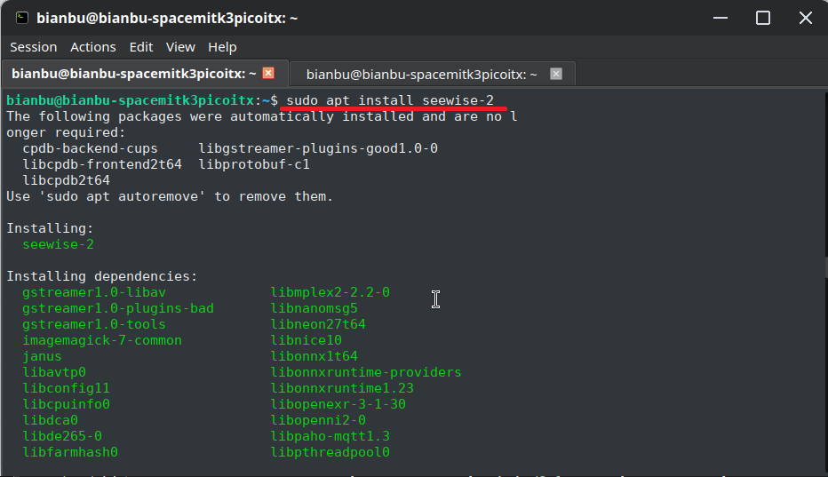
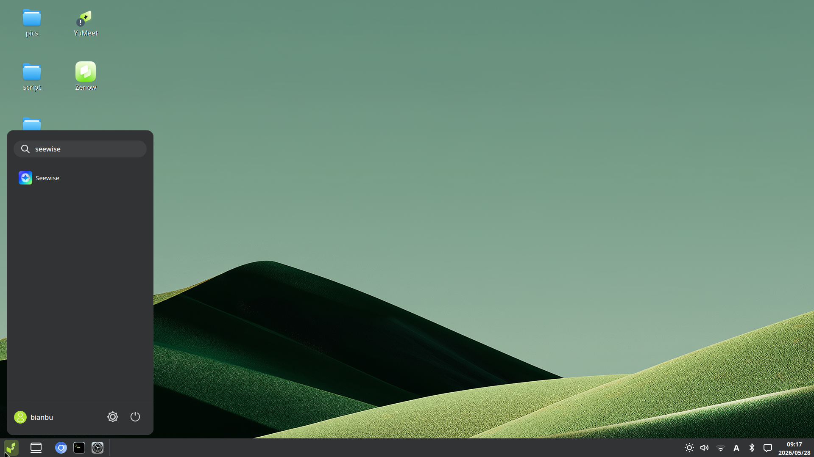
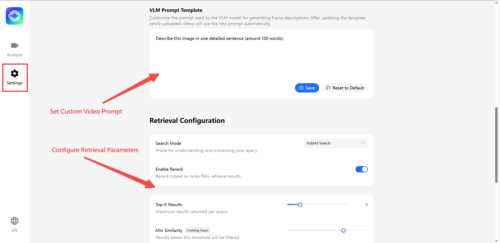
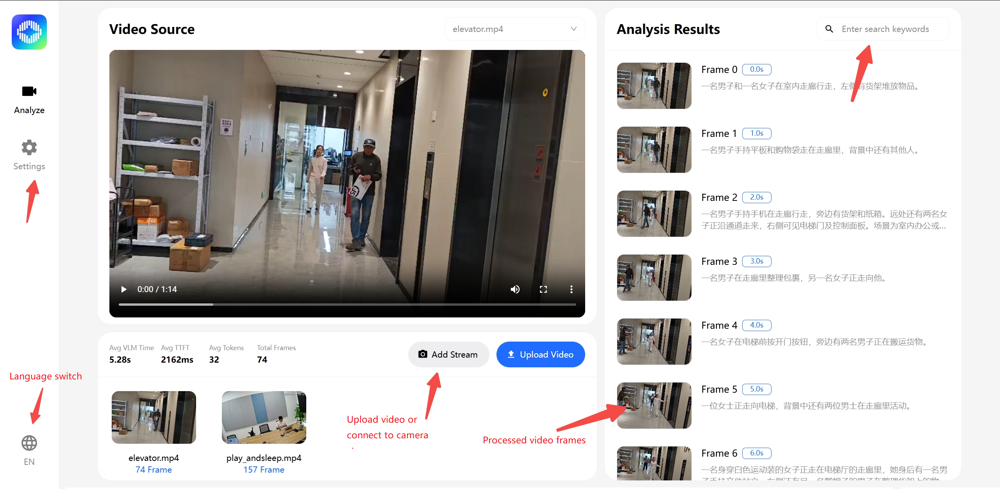
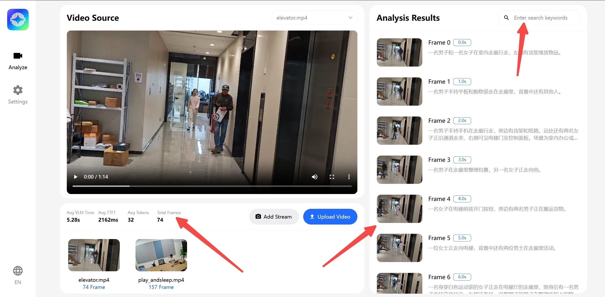

# Seewise

**Seewise** is an intelligent video search engine that supports both local video uploads and RTSP camera streams. It automatically analyzes video content and enables users to quickly locate specific clips through natural-language search.

## Key Features

- **Intelligent Video Understanding**: Automatically analyzes video frames and generates natural-language descriptions for each frame.
- **Multiple Search Modes**: Supports semantic search, keyword search, and hybrid search.
- **Flexible Video Sources**: Works with both uploaded local videos and live RTSP streams.
- **Real-Time Processing Feedback**: Displays processing progress directly in the user interface.
- **Bilingual Support**: Provides both Chinese and English interfaces, with multilingual search prompts.

## Platform Support

| Platform & OS              | Supported          |
|----------------------------|--------------------|
| K1 Buildroot               | ❌ Not supported   |
| K1 OpenHarmony             | ❌ Not supported   |
| K1 Bianbu LXQT/GNOME       | ❌ Not supported   |
| K3 Buildroot               | ❌ Not supported   |
| K3 OpenHarmony             | ❌ Not supported   |
| K3 Bianbu LXQT/GNOME       | ✅ Supported       |

## Technical Architecture

Seewise uses a client-server architecture with three layers:

- **Frontend Layer**: A modern web interface for video upload, search, and real-time processing updates.
- **Application Service Layer**: Handles business logic for video processing, search, and data management.
- **AI Model Layer**: Performs image analysis, text vectorization, and search result reranking.

### System Architecture Diagram



## Installation and Deployment

### Install the Debian Package

For production deployments, installing the local package with `apt` is recommended:

```bash
sudo apt update
sudo apt install seewise-2
```

If dependency issues occur, run the following command:

```bash
sudo apt-get install -f
```



After installation, `seewise-2.service` is created and enabled automatically.

- Default root directory: `~/.seewise-2`
- Runtime dependencies include `llama.cpp-tools-spacemit`, `spacemit-onnxruntime`, and `python3-spacemit-ort`

### Quick Start

- **Web Access**: After installation, open `http://<board-ip>:8084` in a browser.
- **Desktop Access**: Open the application menu in the lower-left corner, search for **Seewise**, and click the icon to open the corresponding web page.



## Model Download and Parameter Configuration

### Download Models

For production use, download models from the **Settings** page in the Seewise web UI.

Default model directories:

- **VLM**: `~/.seewise-2/models/vlm/fastvlm-mm-0.5b-q4_1/`
- **Embedding**: `~/.seewise-2/models/embedding/`
- **Rerank**: `~/.seewise-2/models/rerank/`

It is recommended to use the default recommended models.


### Configure Parameters

The main configurable settings include frame extraction and retrieval parameters:

- **Frame Extraction Settings**: Define the frame sampling interval, which determines how frequently frames are extracted from the video.
- **Image Size Settings**: Define the model input image size, which affects both retained detail and inference time. Larger images preserve more detail but require more processing time.
- **Retrieval Settings**: Control the search strategy, including whether reranking is enabled.



## Video Upload and RTSP Retrieval Workflow

### Local Video Upload Workflow

1. Select **Upload Video** in the frontend interface.
2. The backend saves the file to `data/videos/`.
3. FFmpeg extracts frames and generates output in `data/frames/` and `data/thumbnails/`.
4. The VLM generates frame-level semantic descriptions.
5. The embedding service generates vectors and writes them to the vector index.
6. The processed video is indexed and ready for search.

### RTSP Live Stream Workflow

1. Enter the RTSP address in the frontend interface and start the connection.
2. The backend uses `RTSPCapture` to record the stream and save it as an MP4 file.
3. FFmpeg then extracts frames and generates thumbnails.
4. Processing progress is pushed to the frontend in real time through WebSocket.
5. When processing is complete, frame data is written to both the database and the vector index.



### Search Workflow

1. Upload a video or connect to an RTSP stream, then wait for processing to complete.
2. During processing, a progress indicator appears in the lower-right corner of the video player, and keyframe previews appear below the search box.
3. Enter a natural-language query in the search box and press **Enter** to search for relevant content.
   > For best results, use the retrieval configuration options available on the Settings page.

**Note:** Due to current environment limitations, searching is not supported while video processing is still in progress.



The application includes two built-in demo videos and their corresponding keyframe semantics for quickly demonstrating scenarios such as relevance-based search.

## Logs and Cache Management

### Log Locations

- **Backend log**: `~/.seewise-2/logs/backend.log`
- **Frontend log**: `~/.seewise-2/logs/frontend.log`
- **Model logs**: `~/.seewise-2/logs/vlm.log`, `~/.seewise-2/logs/embedding.log`, `~/.seewise-2/logs/rerank.log`
- **systemd log streaming**: `journalctl -u seewise-2.service -f`

### Cache and Data Directories

- **Video files**: `~/.seewise-2/data/videos/`
- **Extracted frames**: `~/.seewise-2/data/frames/`
- **Thumbnails**: `~/.seewise-2/data/thumbnails/`
- **SQLite database**: `~/.seewise-2/data/video_search.db`
- **Vector index**: `~/.seewise-2/data/vector_store.db`

To clear cached data, follow these steps:

1. Stop the service:
   ```bash
   sudo systemctl stop seewise-2.service
   ```
2. Back up or remove the cache directories and files:
   ```bash
   rm -rf ~/.seewise-2/data/videos/*
   rm -rf ~/.seewise-2/data/frames/*
   rm -rf ~/.seewise-2/data/thumbnails/*
   rm -f ~/.seewise-2/data/video_search.db
   rm -f ~/.seewise-2/data/vector_store.db
   ```
3. To download the models again, delete the model directory and repeat the model download process.

## FAQ

### Q: Why does the service fail to start after installation?

A: First check `systemctl status seewise-2.service`. If the issue is dependency-related, confirm that `llama.cpp-tools-spacemit`, `spacemit-onnxruntime`, and `python3-spacemit-ort` are installed.

### Q: Why can’t the models be downloaded, or why is the model service not starting?

A: Check the following logs to identify the cause:

- `~/.seewise-2/logs/vlm_8071.log`
- `~/.seewise-2/logs/embedding_8072.log`
- `~/.seewise-2/logs/rerank_8073.log`

### Q: Why does the RTSP connection fail?

A: Verify the RTSP URL, network connectivity, and camera status. If RTSP recording fails, review the backend log and confirm that the required port is not already in use.

### Q: Why does video upload fail, or why is processing slow?

A: The maximum file size is 500 MB. Large videos may require more processing time. Also verify that sufficient disk space is available in `data/videos/` and `data/frames/`.

### Q: Why are the search results inaccurate?

A: Try switching the retrieval mode between semantic, keyword, and hybrid search, and enable reranking if needed. If the issue appears to be model-related, re-download the models and restart the model services.

### Q: How do I clear the cache and start over?

A: Stop the service first, then delete `~/.seewise-2/data/video_search.db`, `~/.seewise-2/data/vector_store.db`, `~/.seewise-2/data/frames/`, `~/.seewise-2/data/thumbnails/`, and `~/.seewise-2/data/videos/`.

### Q: A popup says search failed during querying. What causes this?

A: Check `~/.seewise-2/logs/backend_8084.log` for a vector-dimension mismatch error, such as:

```text
File "app/routes/search.py", line 49, in search
File "app/services/search_service.py", line 272, in hybrid_search
File "app/services/search_service.py", line 43, in semantic_search
File "app/services/vector_store.py", line 119, in query
ValueError: shapes (1024,) and (768,) not aligned: 1024 (dim 0) != 768 (dim 0)
```

If this happens, restart the application and switch back to the correct embedding model.