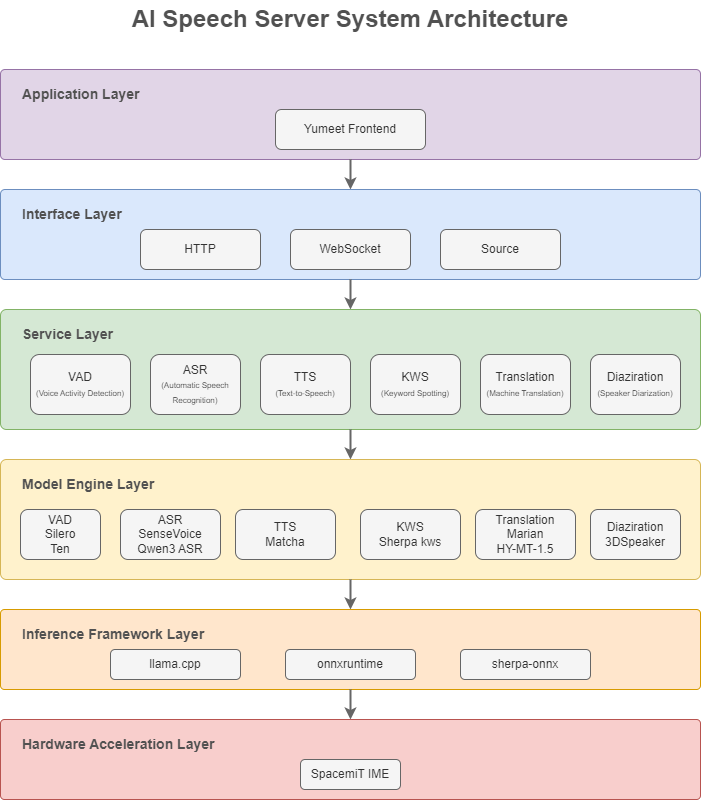

# yumeet

**yumeet** is a locally-run AI meeting assistant desktop application. All audio processing, transcription, translation, and summarization are performed on-device, enabling efficient meeting documentation while keeping sensitive data private.

The application is built on a full speech pipeline — VAD, ASR, speaker diarization, translation, and TTS — paired with LLM-based summarization. It supports real-time microphone recording, offline audio import, meeting archiving, and full-text search across records.

## ✨ Key Features

- **Real-time Speech Transcription**: Low-latency, on-device transcription via the integrated speech service.
- **Real-time Machine Translation**: Produces translated output alongside the transcription stream.
- **AI Meeting Summarization**: Automatically generates a structured meeting summary using an LLM.
- **Meeting Record Management**: Filter, search, rename, and delete past meeting records.
- **Local File Management**: Save raw audio and export text summaries to local storage.
- **Multi-form Deployment**: Runs as a browser-based web app or as a native Tauri desktop application.

## Platform Support

| Platform & OS              | Supported          |
|----------------------------|--------------------| 
| K1 Buildroot               | ❌ Not supported   |
| K1 OpenHarmony             | ❌ Not supported   |
| K1 Bianbu LXQT/GNOME       | ❌ Not supported   |
| K3 Buildroot               | ❌ Not supported   |
| K3 OpenHarmony             | ❌ Not supported   |
| K3 Bianbu LXQT/GNOME       | ✅ Supported       |

## Technical Architecture

### Application Stack

- **Frontend Framework**: Vue 3.4+ / TypeScript 5.4 / Vite 5.4
- **Desktop Shell**: Tauri 2 (Rust)
- **Audio Processing**: Web Audio API, PCM conversion
- **Markdown Rendering**: markdown-it + DOMPurify (XSS protection)
- **Local Storage**: File System Access API
- **Visual Effects**: Motion V, OGL

### Service Dependencies

- **Speech Service**:
  [Speech SDK](https://www.spacemit.com/community/document/info?lang=en&nodepath=ai/application_tools/speechsdk.md)
- **Large Language Model Service**:
  [LLM SDK](https://www.spacemit.com/community/document/info?lang=en&nodepath=ai/application_tools/llmsdk.md)

### System Architecture Diagram



### Workflow Overview

1. **Real-time Transcription**: Start transcription → Audio capture → Speech service processing → Live text output.
2. **Meeting Summarization**: End meeting → Read transcription → LLM generates summary → Auto-save.
3. **History Retrieval**: Enter keyword → Match title / tag / content → Navigate to record detail.

## 🚀 Installation

On first install, `sm-sdk` automatically downloads the required model package (~2 GB).

```bash
sudo apt update
sudo apt install yumeet llm-sdk sm-sdk
```

## Quick Start

### 1. Launch the Application

Open the system application menu, search for **yumeet**, and launch it.


### 2. Configure AI Services

On first use, confirm that the following services are configured correctly:

- **LLM Service**: Default model `Qwen3.5-2B`
- **Speech Service**: Default model `Qwen3-ASR-0.6B`
- **Translation Service**: Default model `HY-MT1.5-1.8B`


### 3. Configure Storage Paths

Two storage directories can be configured:

- **Meeting Records Directory**: Stores TXT, PDF, or Markdown files generated through **Download Summary**.
- **Meeting Audio Directory**: Stores backup audio files saved after a real-time transcription session ends.


## Transcription Features

### 1. Real-time Transcription (Microphone)

#### 1.1 Start a Meeting

Live transcription can be started from two places:

- Home page entry
- Meeting page entry


#### 1.2 Meeting Setup

After transcription begins, the **Meeting Setup** dialog is displayed.

- **Required field**: Meeting topic
- **Tags and participant entries**: After entering a value, click the `+` icon on the left to add it

Field descriptions:

- **Meeting Topic**: Displayed as the title of the meeting record
- **Meeting Tags**: Supports both primary and secondary tags; the primary tag is highlighted at the top of the record card
- **Participants**: Supports registration of multiple attendees


#### 1.3 Transcription in Progress

While recording, the interface shows:

- Live transcription and translation output
- A session timer with pause controls
- A display mode toggle to switch between views


#### 1.4 Generate a Meeting Summary

A summary can be triggered in two ways:

1. **During recording** — click **Generate Summary** at any time.

   

2. **After recording ends** — the summarization workflow starts automatically when you stop the session.

   

The following table shows which services are loaded at each trigger point:

- Clicking **Start Transcription** or **Import Audio** loads the speech and translation services
- Clicking **Generate Summary** or **Pause → End** loads the LLM service
- Clicking **Download Summary** on the **Meeting Details** page also invokes the LLM service


### 2. Import Audio (Offline Transcription)

#### 2.1 Start Import

Click **Import Audio** to open the file picker.

#### 2.2 Select a File

Supported audio formats include `wav`, `mp3`, and `m4a`.


#### 2.3 Processing

Once the file is imported, it enters the offline transcription pipeline.


> Offline transcription processes the entire file before displaying any output. Intermediate results are not shown during processing.

#### 2.4 Transcription Result

When processing completes, a meeting summary is generated automatically.


### 3. Search Within the Transcript

You can search for keywords within the current meeting session. Matching segments are highlighted inline.


## Meeting Management

### 1. Meeting Record List

The record list provides the following tools for navigating your meeting history:

- Filter by date range
- Filter by meeting tag
- Search by title or primary tag
- Open a detailed record page
- Rename or delete a record
- Paginate through large record sets


### 2. Detailed Meeting Record

The detail page shows the structured summary the LLM produced from the meeting transcript.


- Default collapse behavior:
  - **Original Transcript** is collapsed by default
  - Other summary sections are expanded by default
- The search box at the top of the page supports full-text highlighted search


## System and Settings

### 1. Storage Policy

yumeet manages two categories of local files:

- Original audio files from real-time transcription meetings
- Text files exported from detailed meeting records


Notes:

- Deleting a meeting record removes only the text record. The original audio file is unaffected.
- If audio retention is turned off, raw audio is discarded when a live session ends.

### 2. System Status

The System Status page shows current resource usage and lets you manually refresh the performance metrics.


- **Debug Check**: Only available when developer mode is enabled. Use `Ctrl+Shift+I` to open DevTools alongside it.
- **Performance Monitoring**: Click the refresh button in the upper-right corner to update the displayed metrics.

### 3. Other Settings


- **UI Settings**: Font scaling and animation toggle
- **AI Service Settings**: Adjust ports and service addresses for LLM-SDK, SM-SDK, and the translation service
- **License Management**: Upload, collapse, and view license content
- **Settings Search**: Filter and display matching settings by keyword