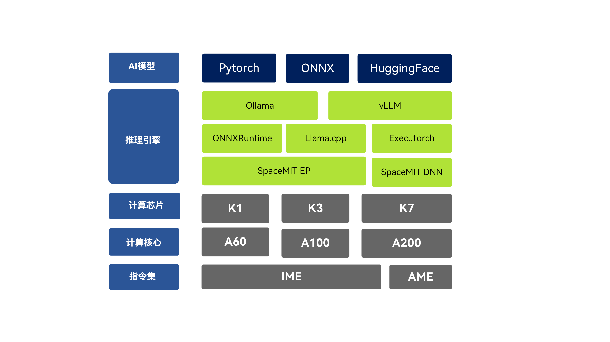

# AI 计算软件栈

## 软件栈框架

## 多层级交付

进迭时空 AI 计算软件栈提供多层级交付产物，以满足 AI 生态上的多类用户多样化的需求

## 端到端模型推理

- [OnnxRuntime](./onnxruntime.md)
  > 基于 ONNXRuntime 的 SpacemiT 推理引擎，通过使用`SpaceMITExecutionProvider`获得极致推理性能

- [XSlim](./xslim.md)
  > 模型量化精简工具链，支持多种量化格式与量化调优策略

- [Llama.cpp](./llama.cpp.md)
  > 轻量大模型推理引擎，完全开源并同步社区

- [vLLM](./vllm.md)
  > 热门的高性能大语言模型推理与服务框架，支持原生部署大模型

## AI 算子加速库

TBD

## AI 编程语言

- [Triton](./triton.md)
  > 提供Python交互的高性能AI算子编程体验

## 示例

- [QuickStart](./quick_start.md)
- [ModelZoo](./modelzoo.md)
