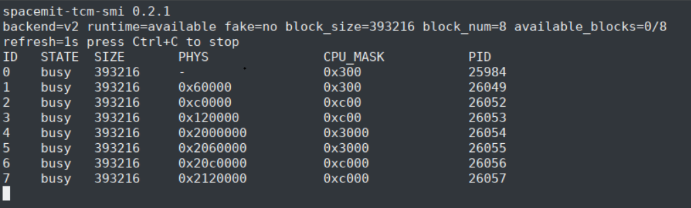
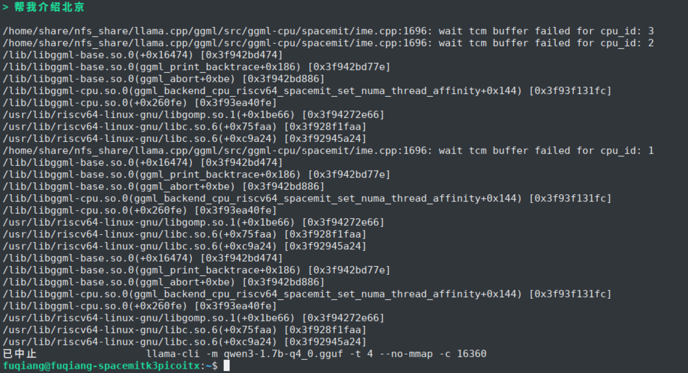
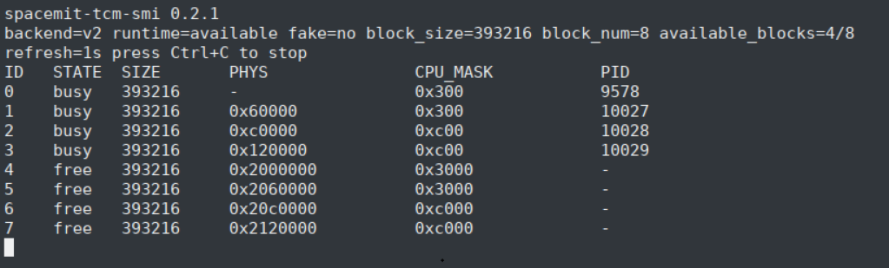

# Llama.cpp


> **llama.cpp** 是一个轻量级大模型推理框架，核心面向 GGUF/GGML 模型的本地推理场景。在 SpacemiT RISC-V 平台上，可以通过 RVV、IME 等硬件能力对 CPU 推理路径进行优化，并可选集成 SMT 视觉扩展以支持多模态场景。([https://github.com/ggml-org/llama.cpp](https://github.com/ggml-org/llama.cpp))

llama.cpp 主要用于在端侧设备上运行大语言模型和多模态模型，具有以下特点：

- 原生支持 GGUF 模型格式，适合部署量化后的 LLM。
- 可通过多线程 CPU 推理快速验证模型可用性与吞吐。
- 在 SpacemiT RISC-V 平台上可启用 RVV 以及 SpacemiT 专用优化开关，以获得更高性能。
- 在开启 SMT 扩展后，可与 SpacemiT ONNXRuntime 组件协同，支持视觉编码等多模态流程。

可在[spacemit-llama.cpp](https://github.com/spacemit-com/llama.cpp/releases)路径获得当前最新的发布库，以及订阅release通知，或在bainbu系统内通过包安装获得库资源

---

## 1. 平台支持情况

|      平台 & 系统       |       是否支持      |
|-----------------------|-----------------------|
| K1 Buildroot          | ✅ 支持             |
| K1 OpenHarmony5.0     | ❌ 不支持              |
| K3 Bianbu LXQT/GNOME  | ✅ 支持                |
| K3 Buildroot          | ✅ 支持             |
| K3 OpenHarmony5.0     | ❌ 不支持              |
| K3 Bianbu LXQT/GNOME  | ✅ 支持                |

## 2. 使用说明(以Bianbu LXQT/GNOME环境为例)

### 2.1. 安装

打开终端，执行如下命令安装llama.cpp

```bash
sudo apt update
sudo apt install llama.cpp-tools-spacemit
```

**注意**：一些旧平台或者旧固件没有llama.cpp-tools-spacemit包，可以尝试

```bash
sudo apt update
sudo apt install llama-server
```

### 2.2. 下载模型

目前支持5种量化格式的模型加速，下载gguf格式模型的时候，主要选择这几种量化格式的模型：
- Q4_K_M
- Q4_0
- Q4_1
- Q2_K
- Q3_K

根据芯片平台的算力下载合适参数的模型，K1平台推荐Qwen3-0.6B，下载方法如下：

```bash
wget https://www.modelscope.cn/models/unsloth/Qwen3-0.6B-GGUF/resolve/master/Qwen3-0.6B-Q4_0.gguf -P ~/
```

K3平台推荐Qwen3-30B-A3B，下载方法如下：

```bash
wget https://www.modelscope.cn/models/unsloth/Qwen3-30B-A3B-Instruct-2507-GGUF/resolve/master/Qwen3-30B-A3B-Instruct-2507-Q4_0.gguf -P ~/
```

### 2.3. 使用

有3种常见的使用方法
- llama-bench **(主要用于性能测试)**
- llama-cli
- llama-server

下面以K3平台为例，分别介绍

#### 2.3.1. llama-bench（主要用于性能测试）


```bash
llama-bench -m Qwen3-30B-A3B-Instruct-2507-Q4_0.gguf -t 8 -p 64 -n 64 -mmp 0 -fa 1
```
参数说明：
- **-t: 指定运行测试时使用的线程数量（K3:<=8,K1:<=4，如果需要并行跑多个推理，请参考第3章节）**
- -p: 指定‌提示词（Prompt）的长度‌，单位为 token
- -n: 指定输出生成长度
- -mmp: 是否启用 Multi-Modal Prompt 支持
- -fa: 是否启用 ‌Flash Attention‌ 功能

输出结果如下：


#### 2.3.2. llama-cli

```bash
llama-cli -m Qwen3-30B-A3B-Instruct-2507-Q4_0.gguf -t 8 --no-mmap -c 15360
```

参数说明：
- -m: 指定.gguf格式模型文件的路径
- **-t: 指定运行测试时使用的线程数量（K3:<=8,K1:<=4，如果需要并行跑多个推理，请参考第3章节）**
- --no-mmap: 禁用内存映射（memory mapping）功能
- -c: 设置‌上下文长度（context size）

输出结果如下：


#### 2.3.3. llama-server

启动后台llama-server服务：

```bash
llama-server -m Qwen3-30B-A3B-Instruct-2507-Q4_0.gguf -t 8 --host 127.0.0.1 --port 8080 --ctx-size 15360 --n-gpu-layers 0 --batch-size 512 --metrics --no-mmap &
```

参数说明：
- -m: 指定.gguf格式模型文件的路径
- **-t: 指定运行测试时使用的线程数量（K3:<=8,K1:<=4，如果需要并行跑多个推理，请参考第3章节）**
- --host: 指定服务器监听的 IP 地址
- --port: 设置服务器监听的端口号，默认为 8080
- --ctx-size: 控制模型上下文长度（以 token 为单位），影响模型处理长文本的能力
- --n-gpu-layers: 指定将模型的多少层卸载到 GPU 上运行以提升推理速度
- --batch-size: 控制一次处理的 token 数量，影响吞吐量和显存使用
- --metrics: 启用 Prometheus 格式的性能监控指标端点 /metrics，便于系统监控和性能分析
- --no-mmap: 禁用内存映射（memory mapping）功能
- -c: 设置‌上下文长度（context size）

##### 本地API请求

```bash
curl -X POST http://127.0.0.1:8080/v1/chat/completions \
  -H "Content-Type: application/json" \
  -d '{
        "model": "Qwen3-30B",
        "messages": [
          { "role": "user", "content": "介绍珠海？" }
        ]
      }'
```

输出结果如下：


##### 浏览器请求

在浏览器中搜索 `http://localhost:8080` 打开 llama 服务器，直接在浏览器中使用 llama.cpp


### 2.4. 多模态模型下载使用

因多模态模型的使用与标准的大语言模型有一些差异，这里单独进行说明。

#### 2.4.1. 模型下载

多模态模型需要进迭这边进行拆分才能够在llama.cpp中运行，拆分后的模型下载位置在：([https://archive.spacemit.com/spacemit-ai/model_zoo/vlm/](https://archive.spacemit.com/spacemit-ai/model_zoo/vlm/))，目前比较受欢迎的几个模型为：

- Qwen3.5-0.8B
- Qwen3.5-2B
- Qwen3.5-4B
- Qwen3-VL-30B-A3B
- fastvlm-0.5B

下面以上面部分模型为例，介绍使用方法。

#### 2.4.2. 模型准备

下载上面的模型并传递到K3设备中，并准备若干测试图片，图片准备224x224、384x384、512x512、768x768几种分辨率，.png和.jpg格式都可以，如下：


解压模型，以Qwen3.5-0.8B为例，解压后，内容如下：


目录结构说明如下：
- **config.json**: 模型配置文件，下面详细说明
- **qwen3_5vl_0.8b-text-q41.gguf**: VLM模型分离出来的大语言模型部分
- **qwen3_5vl_0.8b-vision-224-op23.fp16.onnx**: VLM模型分离出来的vision模型部分，输入224x224
- **qwen3_5vl_0.8b-vision-384-op23.fp16.onnx**: VLM模型分离出来的vision模型部分，输入384x384
- **qwen3_5vl_0.8b-vision-768-op23.fp16.onnx**: VLM模型分离出来的vision模型部分，输入768x768

config.json配置文件说明：

```bash
{
  "architectures": [
    "Qwen3_5ForConditionalGeneration"
  ],
  "vision_model": {
    "model_path": "./qwen3_5vl_0.8b-vision-384-op23.f16.onnx", //按照图片分辨率指定vision模型路径
    "input_size": 384,                                         //指定模型输入size，与上面的模型对应
    "spacemit_ep_intra_thread_num": 4,                         //并行推理线程数量
    "spacemit_ep_inter_thread_num": 1                          //并行session数量，一般为1
  },
  "text_model": {
    "model_path": "./qwen3_5vl_0.8b-text-q41.gguf",            //指定大语言模型路径
    "hidden_size": 1024
  }
}
```

#### 2.4.3. 模型使用（非Qwen3-vl-30B-A3B）

在Qwen3.5-0.8B目录下通过llama-server命令起service，命令如下：

```bash
llama-server -m qwen3_5vl_0.8b-text-q41.gguf --media-backend smt --smt-config-dir ./ -t 8 --host 0.0.0.0 --port 8080 --reasoning-budget 0 --reasoning off
```
参数说明：
- -m: 指定.gguf格式模型文件的路径
- --media-backend: 指定vision后端，默认为smt
- --smt-config-dir: 指定vision配置路径
- **-t: 指定运行测试时使用的线程数量（K3:<=8,K1:<=4，如果需要并行跑多个推理，请参考第3章节）**
- --host: 指定服务器监听的 IP 地址
- --port: 设置服务器监听的端口号，默认为 8080
- --reasoning-budget: 控制大模型‌思维链（reasoning）行为‌的参数
- --reasoning: 开关思考

这个过程中，有一个加载模型的步骤，比较耗时，模型越大越耗时，有如下打印，说明llama-server服务启动成功


打开浏览器，输入网址：127.0.0.1：8080，开始对话，如下：


llama-server的终端会打印出性能指标，如下：


#### 2.4.4. 模型使用（Qwen3-VL-30B-A3B）

通过设置 export SPACEMIT_EP_DENSE_ACCURACY_LEVEL=1 加速onnx模型的推理速度

在qwen30ba3b-mm-q4_1目录下通过llama-server起service，命令如下：

```bash
llama-server -m qwen3vl-30b-text-q4_1.gguf --media-backend smt --smt-config-dir ./ -ctk f16 -ctv f16 -t 8 -tb 8 -c 1024 --host 0.0.0.0 --port 8080 --reasoning-budget 0 --reasoning off
```

参数说明：
- -m: 指定.gguf格式模型文件的路径
- --media-backend: 指定vision后端，默认为smt
- --smt-config-dir: 指定vision配置路径
- -ctk: K cache的量化格式
- -ctv: V cache的量化格式
- **-t: 指定运行测试时使用的线程数量（K3:<=8,K1:<=4，如果需要并行跑多个推理，请参考第3章节）**
- -tb: 批处理（Batch Processing）‌‌时使用的 CPU 线程数
- -c: 上下文长度
- --host: 指定服务器监听的 IP 地址
- --port: 设置服务器监听的端口号，默认为 8080
- --reasoning-budget: 控制大模型‌思维链（reasoning）行为‌的参数
- --reasoning: 开关思考

打开浏览器，输入网址：127.0.0.1：8080，开始对话，如下：


llama-server的终端会打印出性能指标，如下：


## 3. 多推理并行（重要）

本小节以K3为例，讲解多推理并行的使用和限制，同时，引入一种监控推理资源的工具，spacemit-tcm-smi。

### 3.1. spacemit-tcm-smi

spacemit-tcm-smi是实时监控并清理推理资源的工具

#### 3.1.1. 安装

```bash
sudo apt update
sudo apt install spacemit-tcm
```

#### 3.1.2. 使用方法

- spacemit-tcm-smi -h：查看使用帮助
- spacemit-tcm-smi -i：实时查看系统的tcm状态
- spacemit-tcm-smi -c：清除系统的tcm状态，**注意：有时候前面的推理程序异常退出了，也会导致后面推理的异常，可以通过spacemit-tcm-smi -i查看tcm状态后使用这个命令进行清除**

K3有8个AI核心，最大可同时支持8线程推理，但需要分配好线程资源。下面分别对几种情况进行说明：

### 3.2. 单推理

对于单推理，直接 -t 8 占满资源即可，推理过程中，通过spacemit-tcm-smi -h查看推理资源状态如下：



这时候无法再同时运行新的推理，如果强行运行新的推理，2个推理都会发生异常，打印如下：



需要等到该推理完成，tcm状态全部变为free后（如下），才可以运行其他推理。


当然也可以强制关闭该推理或者通过 spacemit-tcm-smi -c 清掉tcm状态，强制将tcm状态置为free，开启新的推理。

### 3.3. 双路推理

#### 3.3.1. llama + llama
如果要进行双路llama推理，需要对每一路推理指定运行的AI核（8-15），如下所示：

一个终端执行：
```bash
export SPACEMIT_PERFER_CORE_ID="8,9,10,11" && llama-cli ...
```

这是查看tcm状态如下，有4个AI核在工作中。



另一个终端执行：
```bash
export SPACEMIT_PERFER_CORE_ID="12,13,14,15" && llama-cli ...
```

这时候，8个AI核全部开始工作。

这是以4+4的方式运行2路推理，当然也可以根据实际情况进行其他组合，例如2+6，1+7 ...

#### 3.3.2. llama + onnxruntime

与llama + llama类似，onnxruntime中也有类似的绑核操作，正确绑核，避免冲突即可，onnxruntime的绑核操作如下：

```bash
std::unordered_map<std::string, std::string> provider_options;
provider_options["SPACEMIT_EP_INTRA_THREAD_NUM"] = "4";
// 具体绑定核心
provider_options["SPACEMIT_EP_INTRA_THREAD_AFFINITY"] = "8;9;10;11";
```

#### 3.3.3. llama + llama多模态扩展

除了进行llama+llama中的绑核操作外，config.json文件中也要对onnxruntime进行绑核，如下：

```bash
#方式1 与之前的使用方式相同，例如在vision_model字段中添加
  "vision_model": {
    "model_path": "./xxx.onnx",
    "spacemit_ep_intra_thread_num": 4,
    "spacemit_ep_inter_thread_num": 1,
    "spacemit_ep_intra_thread_affinity": "8;9;10;11"
  }

#方式2(推荐) 添加ep_config字段，设置方式与ep完全一致：
 "ep_config": {
    "SPACEMIT_EP_INTRA_THREAD_NUM": "4",
    "SPACEMIT_EP_INTER_THREAD_NUM": "1",
    "SPACEMIT_EP_INTRA_THREAD_AFFINITY": "8;9;10;11"
  }
```

### 3.4. 多路推理

多路推理与双路推理类似，需要满足：

- 多路推理运行于不同核心
- 推理总路数不大于AI核心数（8）

可用的组合很多，举例如下：2+2+4，2+2+2+2，1+1+1+1+1+1+1+1 ...


## 4. K3本机构建

### 4.1. 安装依赖

```bash
sudo apt install cmake
```

### 4.2. 代码下载

```bash
git clone https://github.com/spacemit-com/llama.cpp.git
```

### 4.3. 编译安装

#### 4.3.1. 基础版本

SpacemiT RISC-V 平台构建时，建议开启 `GGML_CPU_RISCV64_SPACEMIT` 选项以启用相关优化。

```bash
cd llama.cpp

cmake -B build \
    -DCMAKE_BUILD_TYPE=Release \
    -DGGML_CPU_RISCV64_SPACEMIT=ON \
    -DGGML_CPU_REPACK=OFF \
    -DLLAMA_OPENSSL=OFF \
    -DGGML_RVV=ON \
    -DGGML_RV_ZVFH=ON \
    -DGGML_RV_ZFH=ON \
    -DGGML_RV_ZICBOP=ON \
    -DGGML_RV_ZIHINTPAUSE=ON \
    -DGGML_RV_ZBA=ON \
    -DCMAKE_TOOLCHAIN_FILE=${PWD}/cmake/riscv64-spacemit-linux-gnu-gcc.cmake \
    -DCMAKE_INSTALL_PREFIX=build/installed

cmake --build build --parallel $(nproc) --config Release

cd build
make install
```

#### 4.3.2. 多模态扩展版本

如果需要在 `llama-server` 或 `llama-mtmd-cli` 中启用 SpacemiT SMT 多模态扩展，编译需要依赖onnxruntime，额外准备一个 `SPACEMIT_ORT_DIR` 目录，目录中是已经构建好的onnxruntime，编译好的onnxruntime可以从([https://archive.spacemit.com/spacemit-ai/onnxruntime/](https://archive.spacemit.com/spacemit-ai/onnxruntime/))获取最新版本并解压。

构建时增加以下定义：

```bash
export SPACEMIT_ORT_DIR=/path/to/spacemit-ort
export LD_LIBRARY_PATH=${SPACEMIT_ORT_DIR}/lib:${LD_LIBRARY_PATH}

cd llama.cpp

cmake -B build \
    -DCMAKE_BUILD_TYPE=Release \
    -DGGML_CPU_RISCV64_SPACEMIT=ON \
    -DGGML_CPU_REPACK=ON \
    -DLLAMA_OPENSSL=OFF \
    -DGGML_RVV=ON \
    -DGGML_RV_ZVFH=ON \
    -DGGML_RV_ZFH=ON \
    -DGGML_RV_ZICBOP=ON \
    -DGGML_RV_ZIHINTPAUSE=ON \
    -DGGML_RV_ZBA=ON \
    -DCMAKE_TOOLCHAIN_FILE=${PWD}/cmake/riscv64-spacemit-linux-gnu-gcc.cmake \
    -DCMAKE_INSTALL_PREFIX=build/installed \
    -DLLAMA_SERVER_SMT_VISION=ON \
    -DSPACEMIT_ORT_DIR=${SPACEMIT_ORT_DIR}

cmake --build build --parallel $(nproc) --config Release

cd build
make install
```

## 6. [模型性能数据](./modelzoo.md)
> 通过llama-bench测试获得