# SpacemiT AI Lab

**SpacemiT AI Lab** 是一个基于 Web 的 AI 评估平台。用户通过网页申请云 K3 实例，无需任何硬件准备，即可在线体验 SpacemiT K3 AI CPU 上的模型推理效果与真实性能数据，实现 **<big>零配置、即开即用</big>** 的评估体验。

K3 设备本地同样内置 AI Lab 桌面应用，支持下载模型后在本地直接运行体验。

## ✨ 核心能力

- **云上真机体验**：申请云 K3 实例，网页直接调用真实硬件进行推理，实时返回结果与性能数据
- **视觉模型体验**：目标检测、图像分割、姿态估计、图像分类
- **大语言模型对话**：智能问答、文本生成，流式输出
- **视觉语言(VLM)模型**：图片理解与问答，上传图片后用自然语言提问，流式返回分析结果
- **语音识别（ASR）**：音频转文字、实时录音识别
- **语音合成（TTS）**：文字转语音播放
- **语音活动检测（VAD）**：语音片段检测与切分
- **模型性能看板**：查看各模型在 K3 真实硬件上的性能指标（FPS / RTF / token/s）

## 平台支持情况

| 平台 & 系统          | 是否支持 |
| -------------------- | -------- |
| K1 Buildroot         | ❌ 不支持 |
| K1 OpenHarmony       | ❌ 不支持 |
| K1 Bianbu LXQT/GNOME | ❌ 不支持 |
| K3 Buildroot         | ❌ 不支持 |
| K3 OpenHarmony       | ❌ 不支持 |
| K3 Bianbu LXQT/GNOME | ✅ 支持   |

## 技术架构

### 系统架构图

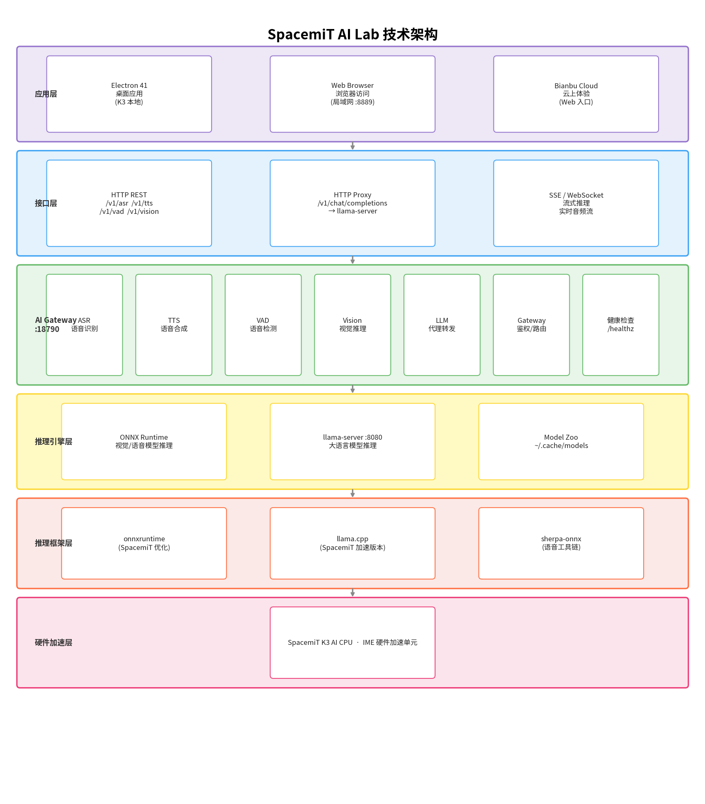

### 应用技术栈

- **桌面框架**：Electron 41（RISC-V 优化版本，K3 本地应用）
- **前端技术**：原生 JavaScript + HTML5 + CSS3
- **后端服务**：SpacemiT AI Gateway（端口 18790）
- **模型推理**：ONNX Runtime（视觉/语音模型）+ llama.cpp（大语言模型 / 视觉语言(VLM)模型，SpacemiT 加速版本）

### 依赖服务

- **AI Gateway**：统一推理网关，通过 HTTP/WebSocket 提供 ASR / TTS / VAD / Vision / LLM / VLM 域 API（`/v1/asr`、`/v1/tts`、`/v1/vad`、`/v1/vision`、`/v1/chat/completions`、`/v1/vlm/chat/completions`）
- **llama-server**：独立 LLM / VLM 数据面服务，由 AI Gateway 代理转发推理请求
- **模型数据源**：从 SpacemiT Model Zoo 获取最新模型信息与性能数据

### 工作流程

1. **云上体验流程**

   Bianbu Cloud → 官网入口 → AI Lab 主页（↓ 也可直接查看官方性能数据）→ 在线体验模型推理 → 查看实时性能数据

2. **本地体验流程**

   启动 AI Lab 本地应用 → 本地 APP 页面（↓ 也可直接查看官方性能数据）→ 下载模型 → 试用模型 → 体验模型推理 → 查看实时性能数据

3. **局域网分享流程**

   启动应用 → 复制分享链接 → 其他设备浏览器访问

## 🚀 安装（K3 本地应用）

### 系统要求

- **操作系统**：Bianbu 4.0 rc4 之后的 LXQT 或 GNOME
- **硬件平台**：SpacemiT K3 RISC-V 设备
- **内存要求**：建议 8 GB 及以上
- **存储空间**：至少 10 GB 可用空间（用于模型下载）

### 安装步骤

```bash
sudo apt update
sudo apt install spacemit-ailab spacemit-ai-gateway
```

安装完成后会自动配置 systemd 服务并创建桌面快捷方式。

### 验证安装

```bash
# 检查 AI Gateway 服务
systemctl status spacemit-ai-gateway

# 检查服务端口
curl -s localhost:18790/healthz
```

## 快速开始

### 1) 云上体验（推荐）

访问云平台，无需任何硬件准备：

1. 打开 https://www.spacemit.com/ ，点击"体验中心"，选择"AI 体验"，进入SpacemiT AI Lab云平台首页
   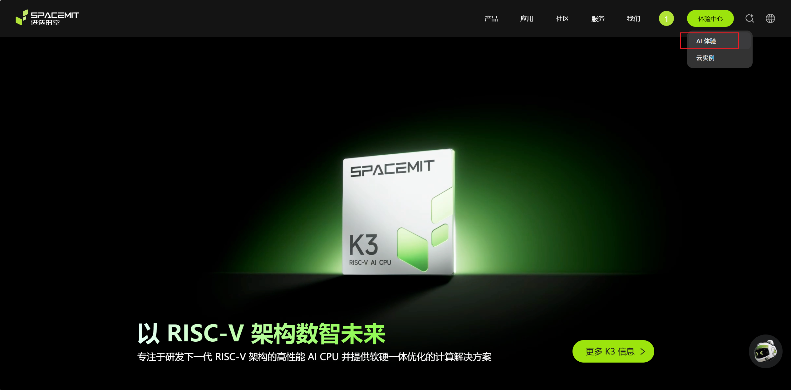

2. 点击"立即体验"，等待系统分配云 K3 实例（< 3 秒）
3. 实例就绪后自动跳转到模型中心页面，即可开始体验

> **注意**：每次体验时长最长 **2 小时**，超时或关闭页面后实例自动回收。

### 2) K3 本地应用启动

在系统菜单中搜索 **ai lab** 并启动。
   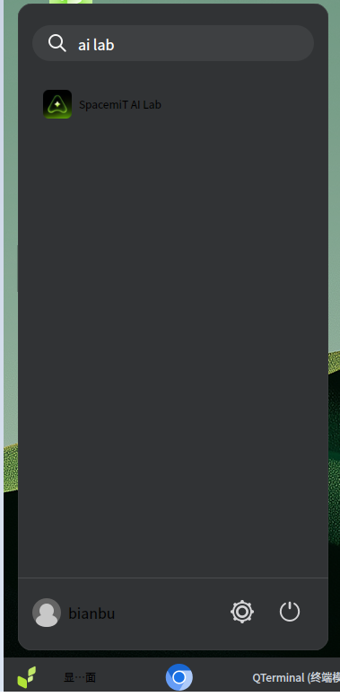

### 3) 界面概览

应用启动后显示模型中心主页，包含：

- **顶部导航栏**：局域网分享链接及复制按钮、开机自启开关、语言切换按钮
- **实例状态栏**：云上体验时显示剩余可用时间
- **模型分类标签**：热门、大语言、语音、视觉、视觉语言(VLM)模型
- **模型卡片网格**：展示各类 AI 模型及下载/体验状态
- **性能数据看板**：各模型在 K3 真实硬件上的性能指标

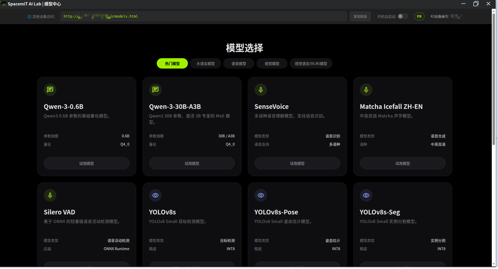

## 功能使用

### 云实例管理

#### 1) 申请体验实例

在云平台首页查看当前可用实例数量，点击"立即体验"按钮，获取专属 K3 实例。

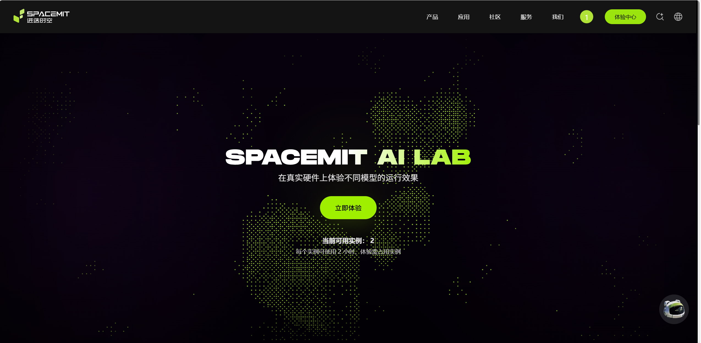

#### 2) 实例使用时间

进入模型中心后，顶部状态栏显示剩余体验时间（最长 2 小时）。时间即将耗尽时会提前提醒。

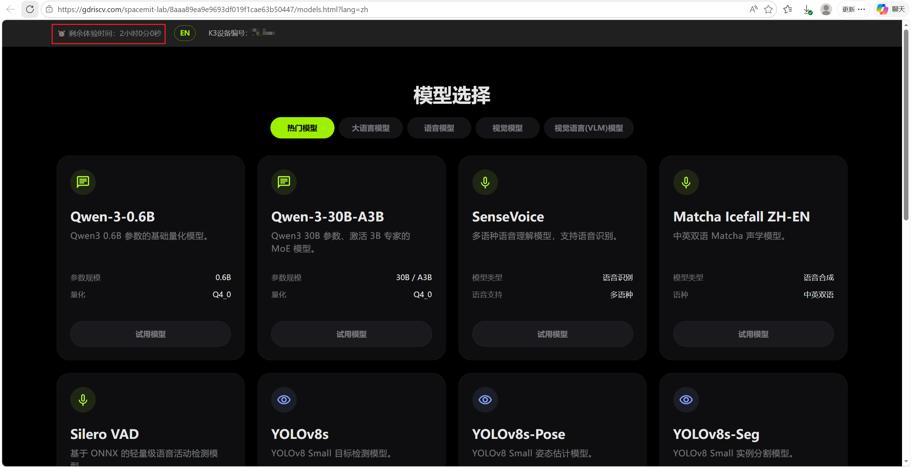


#### 3) 释放实例

- **自动释放**：2 小时到期后或关闭模型中心页面时自动回收

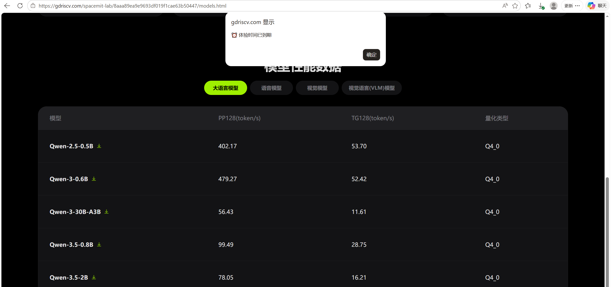

> **隐私保护说明**：实例释放时，应用自动清除本次会话产生的所有用户数据，包括 LLM 对话历史、上传的图片、录音文件及音频临时文件，数据仅在内存中处理，**不会在本地持久化保存**。

### 模型中心

#### 1) 分类浏览

点击顶部分类标签快速筛选：

- **热门**：最受欢迎的模型
- **视觉**：目标检测、图像分割、姿态估计、图像分类等
- **大语言模型**：对话、文本生成
- **视觉语言(VLM)模型**：图片理解与问答
- **语音**：ASR 语音识别、TTS 语音合成、VAD 语音检测

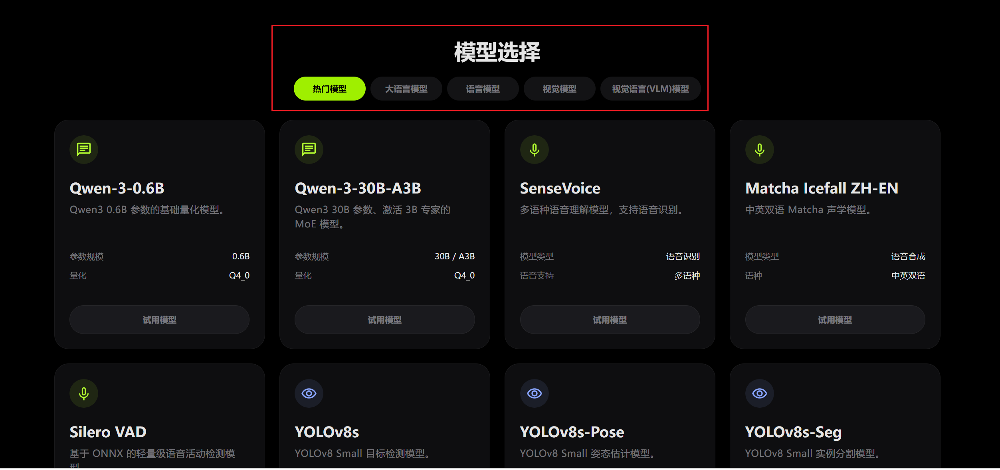

#### 2) 模型卡片信息

每个模型卡片显示：

- 模型名称与任务类型
- 输入规格（尺寸/格式）
- 部署精度（INT8、FP16 等）
- 下载状态：**未下载**（显示"下载模型"按钮）/ **下载中**（显示进度）/ **已下载**（显示"试用模型"按钮）

### 模型下载

- 点击模型卡片上的"下载模型"按钮开始下载
- 所有模型存储于 `~/.cache/models/`（按类别分目录）

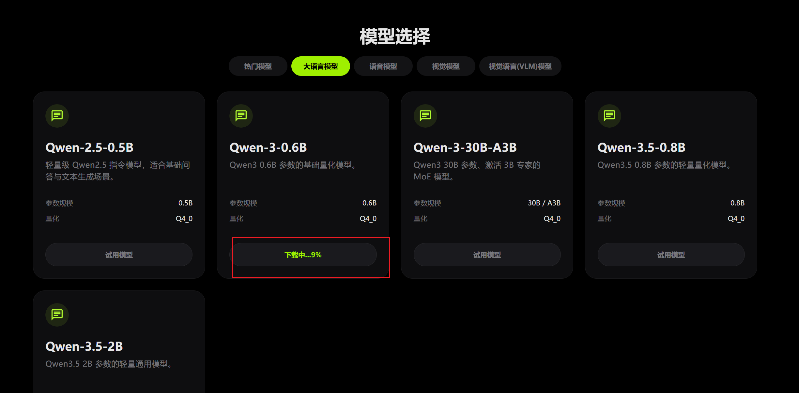

### 视觉模型体验

1. 在模型列表中找到视觉模型（如 YOLOv8n、YOLOv11s），点击"试用模型"
2. 在左侧边栏点击示例图片，或点击"上传图片"选择本地文件
3. 对于目标检测模型，可调整**置信度阈值**（默认 0.35）和 **IoU 阈值**（默认 0.45）
4. 推理完成后查看标注结果（检测框 / 关键点 / 分割区域）及性能指标

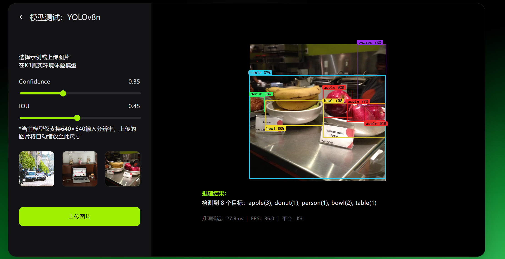

**支持的视觉任务：**

| 任务类型 | 代表模型                                                 |
| -------- | -------------------------------------------------------- |
| 目标检测 | YOLOv8n/s/m、YOLOv11n/s/m 、YOLOv5-Gesture、YOLOv5n-Face |
| 图像分割 | YOLOv8n/s/m-seg 系列                                     |
| 姿态估计 | YOLOv8n/s/m-pose 系列                                    |
| 图像分类 | ResNet50                                                 |

### 大语言模型对话

1. 找到大语言模型（如 Qwen-3-0.6B），点击"试用模型"
2. 在底部输入框输入问题，支持添加文档链接，按回车发送
3. AI 流式返回回复
4. 点击消息右侧复制按钮可复制回复内容

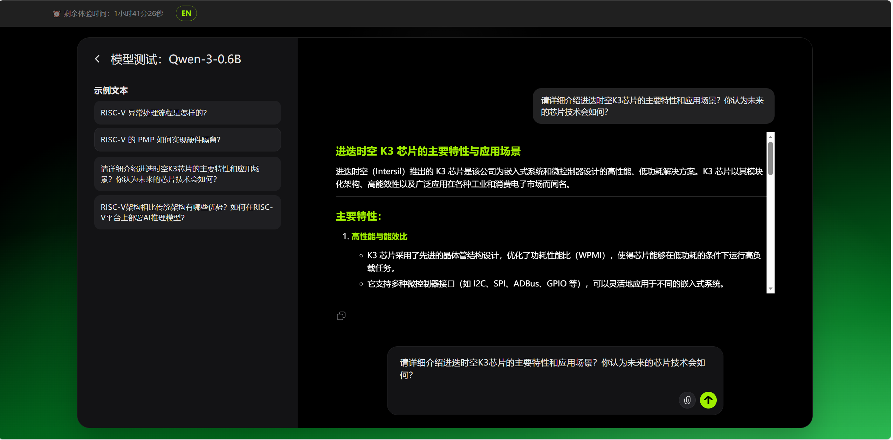

**支持的 LLM 模型：** Qwen2.5、Qwen3、Qwen3.5 系列等

### 视觉语言(VLM)模型体验

视觉语言(VLM)模型能够同时理解图像与文字，用户上传一张图片后，用自然语言提问，模型即可返回对图像内容的分析与描述。

1. 在模型列表中找到 VLM 模型（如 FastVLM-0.5B），点击"试用模型"
2. 在左侧边栏选择图片来源：
   - **示例图**：直接点击左侧内置示例图片
   - **上传图片**：点击上传按钮，从本地选择图片（最多可预览 3 张，点击缩略图切换当前使用图片）
3. 在文字提问框中输入问题（最多 200 字），例如"请描述这张图片的内容"
4. 点击"开始视觉理解"，等待模型处理（右侧显示"模型处理中"动画）
5. 推理完成后，右侧显示：
   - 输入图片缩略图
   - 流式渲染的 Markdown 格式回答（打字机效果）
   - 性能指标：**延迟 / 首字延迟 / tokens/s**

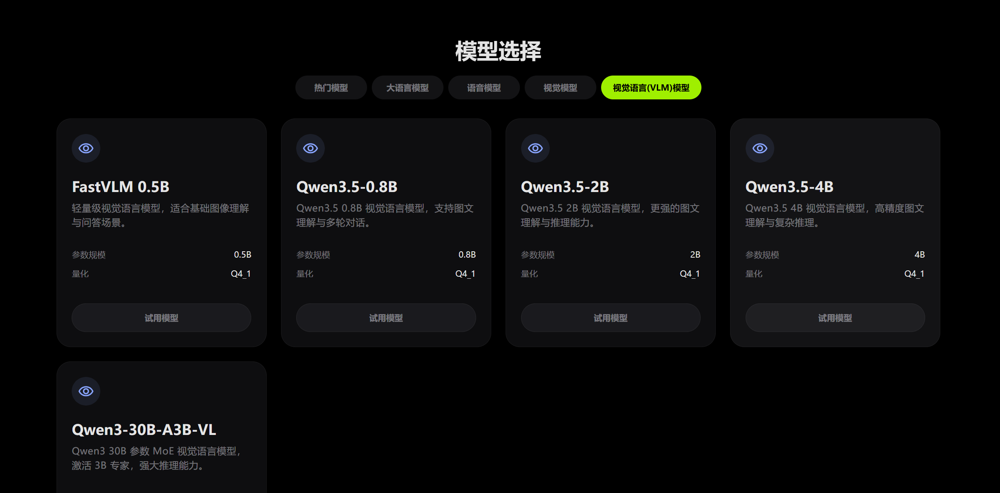


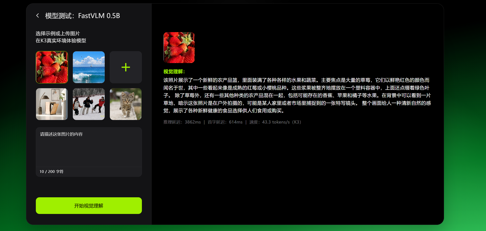

**支持的 VLM 模型：**

| 模型                    | 参数量    | 大小     | 特点                             |
| ----------------------- | --------- | -------- | -------------------------------- |
| FastVLM-MM-0.5B (Q4_1)  | 0.5B      | ~766 MB  | 体积最小，响应最快，适合快速验证 |
| Qwen3.5-VL-0.8B         | 0.8B      | ~932 MB  | 综合性能均衡                     |
| Qwen3.5-VL-2B           | 2B        | ~2.6 GB  | 理解能力较强                     |
| Qwen3.5-VL-4B           | 4B        | ~3.9 GB  | 高精度图像理解                   |
| Qwen3-VL-30B-A3B (Q4_1) | 30B (MoE) | ~17.6 GB | 旗舰模型，理解能力最强           |

> **注意事项：**
> - 当前每次推理仅支持单张图片
> - 每次提问最多 200 个字符
> - 切换页面时模型自动卸载以释放内存

### 语音识别（ASR）

1. 找到 ASR 模型（如 SenseVoice），点击"试用模型"
2. 选择体验方式：
   - **示例音频**：点击左侧示例直接识别
   - **上传音频**：支持 WAV格式
   - **实时录音**：点击"开始录音" → 说话 → "停止录音"，自动转写
3. 识别结果显示转写文本及处理耗时

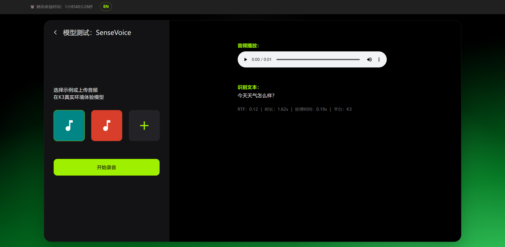

### 语音合成（TTS）

1. 找到 TTS 模型（如 Matcha Icefall EN-US、Matcha Icefall ZH-Baker、Matcha Icefall ZH-EN），点击"试用模型"
2. 在文本框输入内容（最多 500 字）
3. 根据模型选择中文或英文
4. 点击"生成音频"，等待合成完成后自动播放

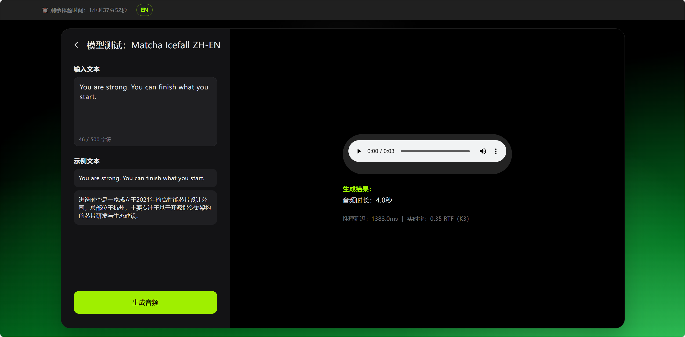

### 语音活动检测（VAD）

1. 找到 VAD 模型（Silero VAD），点击"试用模型"
2. 录音或上传音频文件
3. 检测结果以可视化形式展示语音活动段及时间边界

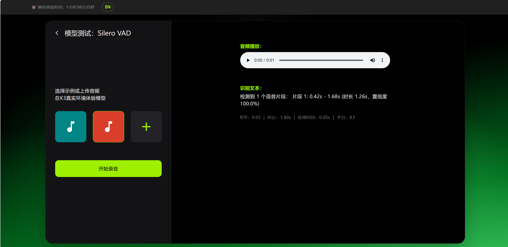

### 模型性能看板

在主页下方查看所有模型在 K3 上的性能指标：

- 点击分类标签筛选大语言 / 语音 / 视觉 / 视觉语言(VLM)模型
- 指标说明：

  | 指标            | 全称              | 含义                                                                 |
  | --------------- | ----------------- | -------------------------------------------------------------------- |
  | PP128 (token/s) | Prompt Processing | 模型处理输入提示词的速度，以首批 128 个 token 为基准，数值越高越好   |
  | TG128 (token/s) | Token Generation  | 模型逐步生成输出文本的速度，以后续 128 个 token 为基准，数值越高越好 |
  | RTF             | Real-Time Factor  | 实时率，处理时长与音频时长之比，RTF < 1 表示可实时处理，数值越低越好 |
  | FPS             | Frames Per Second | 视觉模型每秒处理的图像帧数，数值越高越好                             |
  | 量化类型        | Quantization      | 模型压缩精度，如 Q4_0、Q8_0、INT8、FP16，精度越低体积越小、速度越快  |

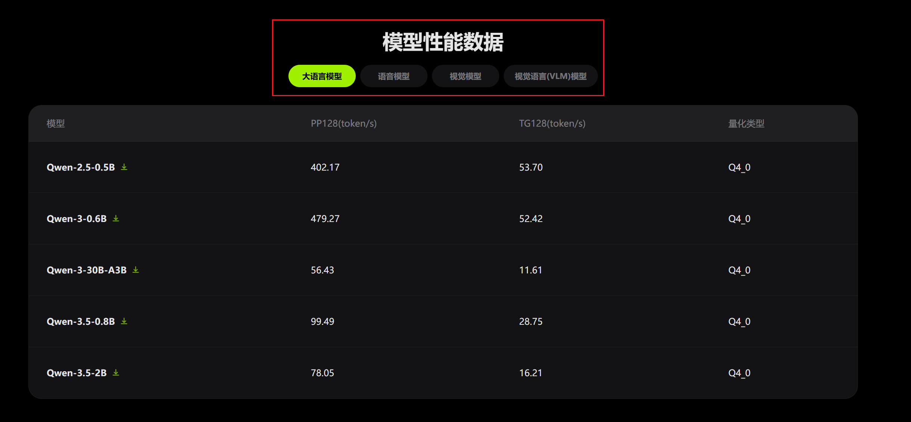

支持模型下载到当前设备：

- 点击模型列的"下载"图标按钮开始下载
- 所有模型存储于浏览器下载目录地址

## 高级功能

### 开机自启动

点击顶部"开机自启动"开关，系统启动时自动运行 AI Lab，方便局域网内其他设备随时访问。

### 语言切换

点击顶部右上角语言按钮（EN / 中文），切换界面语言。

### 局域网分享

应用启动后自动开启局域网分享：

1. 查看顶部显示的访问地址
2. 同一局域网内的其他设备浏览器访问该地址，无需安装应用

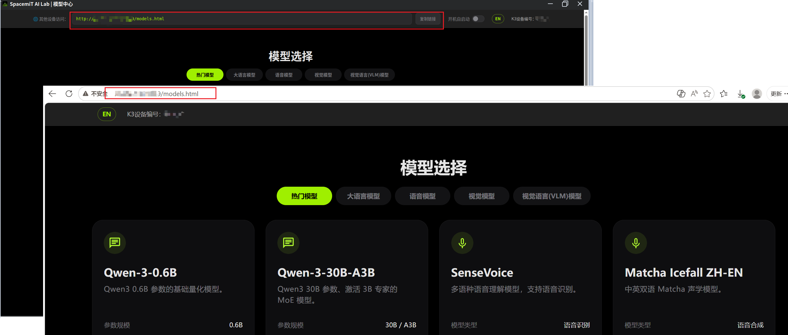

## 常见问题

### 应用无法启动？

```bash
# 检查 AI Gateway 服务状态
systemctl status spacemit-ai-gateway

# 重启服务
sudo systemctl restart spacemit-ai-gateway

# 检查端口占用
netstat -tulpn | grep 18790
```

### 模型下载失败？

- 检查网络连接是否正常
- 确认磁盘剩余空间充足：`df -h`
- 删除不需要的模型文件后重试

### 推理速度较慢？

- 选择较小参数量的模型（如 YOLOv8n 而非 YOLOv8m，FastVLM-0.5B 而非 Qwen3.5-VL-4B）
- 关闭其他占用资源的应用
- 同一时间只运行一个推理任务

### VLM 图片理解结果不准确？

- 尝试更换更大参数量的 VLM 模型（如从 FastVLM-0.5B 换为 Qwen3.5-VL-2B）
- 优化提问描述，提供更具体的问题
- 确保上传图片清晰，分辨率不过低

### 局域网分享无法访问？

- 确认访问设备与 K3 在同一局域网
- 检查防火墙是否开放 8889 端口

### 如何查看日志？

```bash
# 查看 AI Gateway 日志
journalctl -u spacemit-ai-gateway -f
```

### 如何卸载应用？

```bash
sudo apt remove spacemit-ailab spacemit-ai-gateway
# 同时删除下载的模型（可选）
rm -rf ~/.cache/models/
```

## 支持的模型

| 类型 | 代表模型                                    | 格式                |
| ---- | ------------------------------------------- | ------------------- |
| LLM  | Qwen2.5/3/3.5、                             | GGUF                |
| 视觉 | YOLOv5/v8/v11 系列、ResNet50                | ONNX                |
| VLM  | FastVLM-0.5B、Qwen3.5系列、Qwen3-30B-A3B-VL | GGUF（tar.gz 打包） |
| ASR  | SenseVoice、Qwen3-ASR                       | tar.gz              |
| TTS  | Matcha-TTS（中文/英文）                     | tar.gz              |
| VAD  | Silero VAD                                  | tar.gz              |

## 技术支持

- **官方文档**：https://www.spacemit.com/community/document
- **开发者社区**：https://www.spacemit.com/community
- **问题反馈**：通过社区论坛或 GitLab Issues 提交
