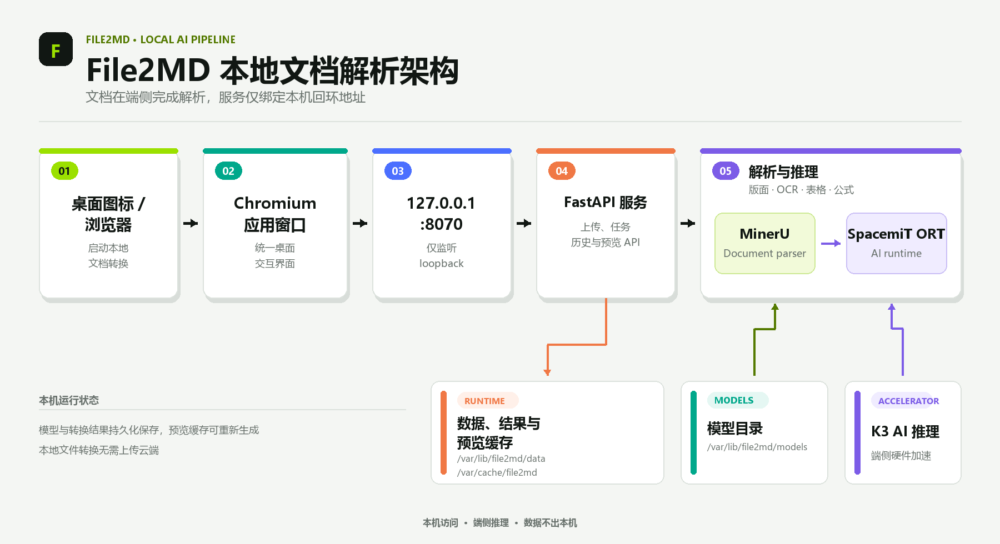
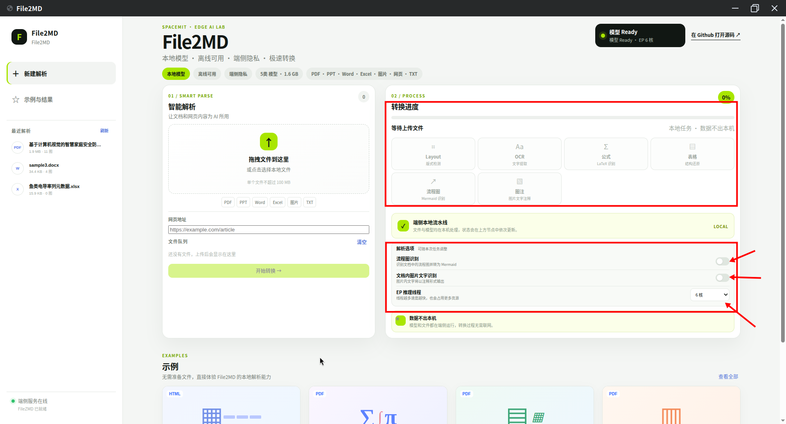

# File2MD

**File2MD** 是面向 SpacemiT K3 Bianbu 平台的本地文档转 Markdown 桌面应用。它可以解析 PDF、Office 文档、图片、文本文件和网页 URL，将版面、正文、表格、公式、流程图与图片等内容整理为便于阅读和再次编辑的 Markdown。

File2MD 的界面采用 Web 技术实现，但日常使用方式与桌面应用一致：点击系统中的 File2MD 图标后，应用会打开一个独立的 Chromium app 窗口，并连接仅监听本机的 `127.0.0.1:8070` 服务。本地文件的解析和模型推理均在设备端完成，不需要将文档上传到云端。

## 核心能力

- **多类型输入**：支持 PDF、PPT/PPTX、DOC/DOCX、XLS/XLSX、TXT 及常用图片格式
- **网页转换**：输入网页 URL 后提取内容并转换为 Markdown
- **批量处理**：支持拖拽文件、多文件选择和转换队列
- **过程可见**：展示模型就绪状态以及版面分析、OCR、公式、表格、流程图、图像描述等处理进度
- **原文对照**：在结果页面并排查看原文件与生成的 Markdown
- **丰富渲染**：支持 KaTeX 公式、Mermaid 流程图、表格和图片显示
- **灵活使用结果**：可在预览与源码视图之间切换、复制 Markdown，并下载包含 `.md` 与 `images/` 的 ZIP 文件
- **历史记录**：保存转换任务；本地文件任务可稍后重新打开原文和转换结果，URL 任务可重新查看转换结果

## 平台支持

| 平台 & 系统 | 是否支持 |
| --- | --- |
| K1 Buildroot | ❌ 不支持 |
| K1 OpenHarmony | ❌ 不支持 |
| K1 Bianbu LXQT/GNOME | ❌ 不支持 |
| K3 Buildroot | ❌ 不支持 |
| K3 OpenHarmony | ❌ 不支持 |
| K3 Bianbu LXQT/GNOME | ✅ 支持 |

## 技术架构

### 应用技术栈

- **桌面入口**：系统应用图标与 `file2md-launcher`
- **用户界面**：静态 HTML、CSS 和 JavaScript，通过 Chromium app 窗口呈现
- **后端服务**：Python 3.14、FastAPI 与 Uvicorn，默认监听 `127.0.0.1:8070`
- **文档解析**：MinerU 0.1.0
- **AI 推理运行时**：`python3-spacemit-ort >= 2.0.6`，利用 K3 端侧 AI 能力执行模型推理
- **Office 预览**：LibreOffice headless
- **PDF 预览**：PDFium
- **Markdown 渲染**：Marked、DOMPurify、KaTeX 与 Mermaid

### 系统架构图



### 处理流程

1. **提交任务**：通过文件选择、拖拽或网页 URL 创建转换任务。
2. **输入预处理**：PDF 与图片直接进入解析流程；Office 文档由 LibreOffice headless 转换为可解析和预览的中间格式。
3. **内容识别**：MinerU 调用端侧模型完成版面分析、OCR、公式和表格等处理；启用相应选项时，还会识别流程图或生成图像描述。
4. **结果生成**：后端整理 Markdown、图片资源、原文件预览和任务状态。
5. **查看与导出**：前端显示原文和 Markdown，用户可以复制源码或下载 ZIP 结果包。

## 安装

在 K3 Bianbu LXQT/GNOME 环境中执行：

```bash
sudo apt update
sudo apt install file2md
```

`apt` 会一并解析 File2MD 的系统依赖，其中 AI 推理运行时要求 `python3-spacemit-ort` 版本不低于 2.0.6。首次安装还会下载并校验约 1.6 GB 的模型包，请确保网络连接稳定并预留足够的磁盘空间。

## 快速开始

### 1. 启动应用

打开系统应用菜单，在搜索框中输入 **file2md**，然后点击搜索结果中的 **File2MD** 图标。应用窗口打开后会自动连接本机服务并检查模型状态。


### 2. 添加文件或网页

首页左侧是输入区，可以通过以下两种方式创建任务：

- **本地文件**：把文件拖入“拖拽文件到这里”区域，也可以点击该区域打开文件选择器。支持一次添加一个或多个文件。
- **网页 URL**：在“网页地址”输入框中粘贴要转换的网页地址。

添加的内容会显示在“文件队列”中。确认队列无误后，点击下方的 **开始转换**，任务才会进入解析流程。


URL 转换需要设备能够访问目标网站；本地文档转换本身不依赖外部网络。

> 当前 URL 任务不会保存网页的原始 HTML。因此转换结果会保留在历史记录中，但重新打开历史任务时不能还原原网页预览。

### 3. 查看处理阶段并设置解析选项

右侧“转换进度”区域上方的六个状态框对应一次任务可能经过的处理阶段：

1. **Layout（版面检测）**：分析页面中的标题、正文、图片、表格等区域及其阅读顺序。
2. **OCR（文字提取）**：识别页面或图片中的文字。
3. **公式（LaTeX 识别）**：识别数学公式并生成可在 Markdown 中渲染的公式内容。
4. **表格（结构还原）**：识别表格的行列关系并还原结构。
5. **流程图（Mermaid 识别）**：启用流程图识别后，将识别到的流程图转换为 Mermaid 表达。
6. **图注（图片文字注释）**：启用文档内图片文字识别后，识别图片中的文字，并以注释形式输出到转换结果中。

任务运行时可以通过这些状态框和顶部进度条查看当前处理阶段。

六个阶段下方是本次任务的解析选项：

- **流程图识别**：控制是否识别文档中的流程图并转换为 Mermaid。
- **文档内图片文字识别**：控制是否识别图片中的文字，并以注释形式写入结果。
- **EP 推理线程**：选择模型推理使用的线程数。线程越多，通常也会占用更多处理器与内存资源，应根据设备负载和文档规模调整；截图中的 **6 核** 是当前任务的示例设置，不是固定要求。

这些选项可以按任务调整，再开始转换。



## 支持的输入格式

| 类型 | 支持的格式 |
| --- | --- |
| PDF | `.pdf` |
| 演示文稿 | `.ppt`、`.pptx` |
| 文字文档 | `.doc`、`.docx`、`.txt` |
| 电子表格 | `.xls`、`.xlsx` |
| 图片 | `.png`、`.jpg`、`.jpeg`、`.jp2`、`.webp`、`.gif`、`.bmp`、`.tiff` |
| 网络内容 | 网页 URL |

## 查看和管理结果

转换完成后，结果页面提供原文与 Markdown 的对照视图。PDF、图片和经预处理的 Office 文档均可在原文区域查看；Markdown 区域可以渲染标题、列表、表格、图片、KaTeX 公式和 Mermaid 流程图。

结果页各区域的用途如下：

- **左侧历史列表**：显示最近转换任务。点击其中一项可以重新打开该任务的 Markdown 和导出结果；本地文件任务还可重新查看原文件。
- **原文件区域**：用于对照转换前的文档内容。
- **Markdown 结果区域**：通过“预览”和“源码”页签，分别查看渲染结果与原始 Markdown 文本。
- **右上角推理耗时**：显示当前任务的模型推理用时，便于了解本次转换的处理开销。
- **复制 Markdown**：右下角的该按钮会把完整 Markdown 放入剪贴板，便于粘贴到其他编辑器。
- **下载结果包 `.zip`**：右下角的绿色按钮用于下载结果包，其中包含 `.md` 文件；任务产生图片资源时还会包含 `images/` 目录。


## 使用内置示例

页面下方提供内置示例，无需准备或上传自己的文件即可体验 File2MD。示例覆盖网页内容、公式识别、表格与图片处理以及文档结构保留等典型场景。点击示例卡片可以查看对应效果；点击示例区域右上角的 **查看全部** 可以浏览全部内置示例。


## 运行目录

File2MD 将程序、配置、模型、任务数据和缓存分开存放：

| 路径 | 用途 |
| --- | --- |
| `/opt/file2md/frontend/` | 前端静态资源 |
| `/opt/file2md/backend-venv/` | File2MD 独立 Python 后端环境 |
| `/etc/file2md/` | 系统级配置 |
| `/var/lib/file2md/models/` | 模型文件 |
| `/var/lib/file2md/data/jobs/` | 转换任务元数据 |
| `/var/lib/file2md/data/originals/` | 任务原文件与预览所需内容 |
| `/var/lib/file2md/data/outputs/` | Markdown、图片及导出结果 |
| `/var/cache/file2md/` | 可重新生成的运行缓存 |

这些目录由安装过程和服务按需创建。应用源码与运行依赖不会借用其他项目的虚拟环境，转换数据也不会写入源码目录。

## 服务检查与故障排查

File2MD 由 `file2md.service` 管理。应用无法打开、任务长时间没有进度或预览失败时，可以依次检查服务状态、日志和监听端口：

```bash
systemctl status file2md.service
journalctl -u file2md.service -f
ss -ltn | grep 8070
```

正常情况下，端口检查应显示服务仅监听 `127.0.0.1:8070`。该地址只供当前设备上的桌面窗口或浏览器访问，不会默认向局域网开放。

### 常见情况

- **首次启动等待较久**：确认模型下载与校验已经完成，并在界面中等待模型状态变为就绪。
- **网页 URL 转换失败**：确认设备可以访问目标网站，必要时查看服务日志中的网络错误。
- **Office 文件无法预览**：检查 `file2md.service` 日志中是否有 LibreOffice 转换错误。
- **任务转换失败**：先保留输入文件和日志，再通过 `journalctl -u file2md.service` 查看具体失败阶段。
