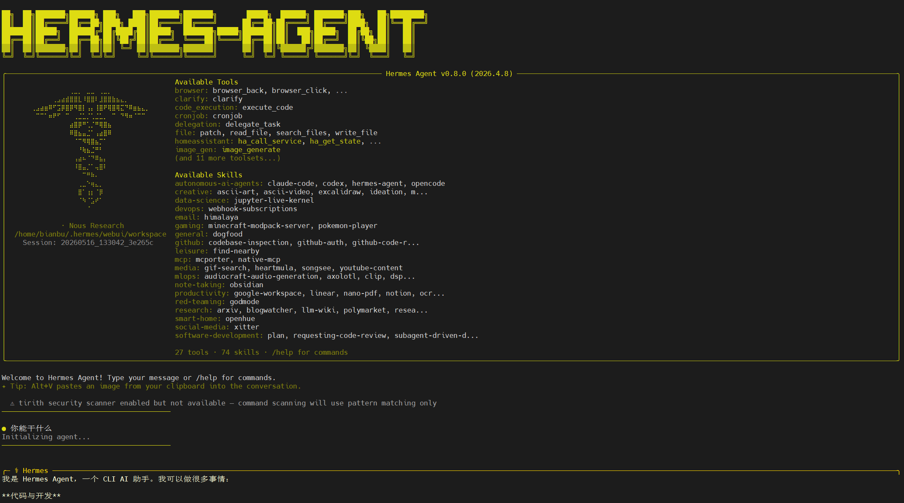

<!--
 * Copyright 2022-2023 SPACEMIT. All rights reserved.
 * Use of this source code is governed by a BSD-style license
 * that can be found in the LICENSE file.
 * 
 * @Author: David(qiang.fu@spacemit.com)
 * @Date: 2026-05-12 20:12:39
 * @LastEditTime: 2026-05-16 00:00:00
 * @FilePath: \doc\docs-ai\zh\solutions\aicomputer_solution\hermes.md
 * @Description: 
-->
sidebar_position: 8

# Hermes Agent(云端算力)

**Hermes Agent** 是一个开源的 AI 智能体框架，支持多种 LLM provider，具备工具调用、定时任务、MCP 协议、Web 访问等能力，可在终端 CLI 或即时通讯平台（Telegram、Discord 等）中使用。

## 平台支持情况

| 平台 & 系统           | 是否支持  |
| --------------------- | --------- |
| K1 Buildroot          | ❌ 不支持 |
| K1 OpenHarmony        | ❌ 不支持 |
| K1 Bianbu LXQT/GNOME  | ✅ 支持   |
| K3 Buildroot          | ❌ 不支持 |
| K3 OpenHarmony        | ❌ 不支持 |
| K3 Bianbu LXQT/GNOME  | ✅ 支持   |

## 安装

### 方式一：apt 安装（推荐）

在 Bianbu OS 上直接通过 apt 安装：

```bash
sudo apt update
sudo apt install hermes-agent
```

安装完成后即可直接运行 `hermes` 命令，无需额外配置环境。


### 方式二：源码安装（开发者）

适用于需要修改代码或参与开发的场景。

#### 前置条件

- Python 3.11+（uv 会自动下载）
- `libffi8`（运行库，系统自带）
- `libffi-dev` 头文件（需手动提取，见下文）

#### 1. 下载源码

```bash
git clone https://github.com/NousResearch/hermes-agent.git
cd hermes-agent
```

#### 2. 安装 uv

```bash
curl -LsSf https://astral.sh/uv/install.sh | sh
source ~/.bashrc
```

#### 3. 提取 libffi-dev 头文件

riscv64 上编译 `cffi` / `cryptography` 需要 `ffi.h`，系统只有运行库没有头文件。使用 `apt-get download` 下载 `.deb` 包（不安装、不需要 sudo），再用 `dpkg-deb -x` 解压提取头文件：

```bash
apt-get download libffi-dev
mkdir -p /tmp/libffi-dev
dpkg-deb -x libffi-dev_*.deb /tmp/libffi-dev
```

> `/tmp/libffi-dev` 重启后会消失，重新安装依赖时需重新执行此步骤。已安装的 venv 不受影响。

#### 4. 创建虚拟环境并安装依赖

```bash
cd hermes-agent

export PKG_CONFIG_PATH="/tmp/libffi-dev/usr/lib/riscv64-linux-gnu/pkgconfig:$PKG_CONFIG_PATH"
export C_INCLUDE_PATH="/tmp/libffi-dev/usr/include/riscv64-linux-gnu:$C_INCLUDE_PATH"
export CPATH="/tmp/libffi-dev/usr/include/riscv64-linux-gnu:$CPATH"
export LIBRARY_PATH="/tmp/libffi-dev/usr/lib/riscv64-linux-gnu:$LIBRARY_PATH"

uv venv venv --python 3.11
source venv/bin/activate

uv pip install -e ".[cron,cli,dev,mcp,web]"
```

> `voice` 和 `messaging` extra 在 riscv64 上有限制，详见[不可用功能](#不可用功能)。

## 配置

### 1. 配置 API Key

编辑 `~/.hermes/.env`（首次运行后自动生成，或手动创建），以 MiniMax 国内端点为例：

```env
MINIMAX_CN_API_KEY=your_key_here
MINIMAX_CN_BASE_URL=https://api.minimaxi.com/v1
```

源码安装方式也可直接编辑项目目录下的 `.env`：

```bash
cp .env.example .env
```

### 2. 配置模型

编辑 `~/.hermes/config.yaml`（首次运行后自动生成，或手动创建）：

```yaml
model:
  default: MiniMax-M2.7-highspeed
  provider: custom
  base_url: https://api.minimaxi.com/v1
  api_mode: chat_completions

custom_providers:
- name: minimax-cn
  base_url: https://api.minimaxi.com/v1
  api_key: your_key_here
  api_mode: chat_completions
  model: MiniMax-M2.7-highspeed
```

> MiniMax API 只接受纯模型名（如 `MiniMax-M2.7-highspeed`），不接受带 provider 前缀的格式（如 `minimax-cn/MiniMax-M2.7-highspeed`）。

## 启动

**apt 安装方式**，直接运行：

```bash
hermes
```

**源码安装方式**，每次新开终端需先激活虚拟环境：

```bash
cd hermes-agent
source venv/bin/activate
./hermes
```

## 支持的 LLM Provider

在 `.env` 中填入对应 key 即可切换 provider：

| Provider          | 环境变量               |
| ----------------- | ---------------------- |
| OpenRouter        | `OPENROUTER_API_KEY`   |
| Google Gemini     | `GOOGLE_API_KEY`       |
| Kimi / Moonshot   | `KIMI_API_KEY`         |
| MiniMax（国际）   | `MINIMAX_API_KEY`      |
| MiniMax（国内）   | `MINIMAX_CN_API_KEY`   |
| GLM / z.ai        | `GLM_API_KEY`          |
| Hugging Face      | `HF_TOKEN`             |

## 不可用功能

受 riscv64 平台限制，以下功能暂不可用：

| 功能                        | 原因                                                             |
| --------------------------- | ---------------------------------------------------------------- |
| `voice`（语音识别）         | `ctranslate2` 无 riscv64 wheel，`faster-whisper` 依赖它无法安装 |
| 本地 STT（语音转文字）      | 同上                                                             |
| `messaging` Discord 加密    | `pynacl` 依赖 `cffi` 编译，安装时因 libffi 头文件问题跳过       |

### Messaging 功能（可选）

`messaging` 功能可将 Hermes Agent 接入即时通讯平台（Telegram、Discord、Slack、WhatsApp、Signal、Matrix），配置好对应平台的 bot token 后，即可在这些 app 里直接与 agent 对话。

如需在源码安装中启用，在设置好 libffi 环境变量后单独安装：

```bash
export PKG_CONFIG_PATH="/tmp/libffi-dev/usr/lib/riscv64-linux-gnu/pkgconfig:$PKG_CONFIG_PATH"
export LIBRARY_PATH="/tmp/libffi-dev/usr/lib/riscv64-linux-gnu:$LIBRARY_PATH"
export CPATH="/tmp/libffi-dev/usr/include/riscv64-linux-gnu:$CPATH"
source venv/bin/activate
uv pip install -e ".[messaging]"
```

启动 messaging gateway：

```bash
./hermes gateway
```
