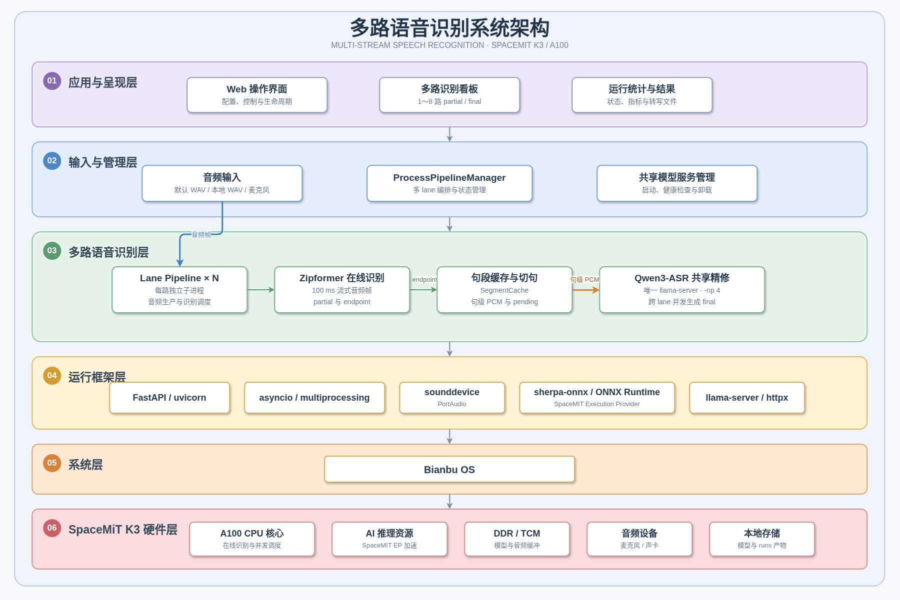
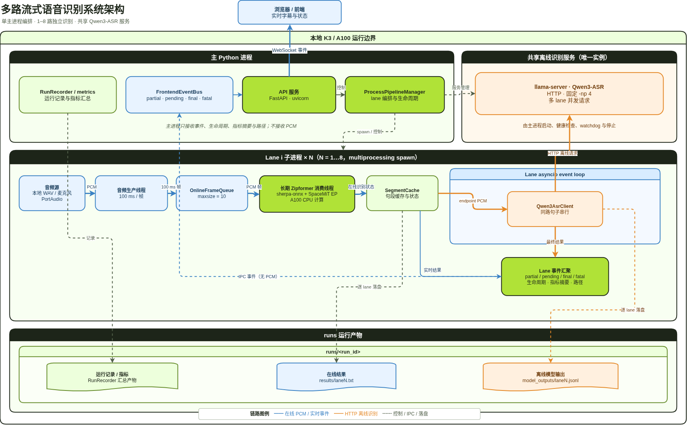
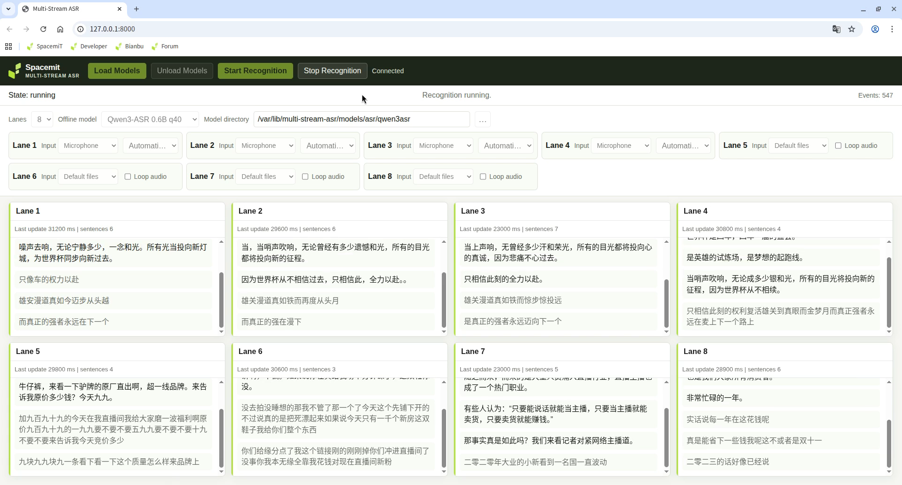

sidebar_position: 12

# 多路语音识别（Multi-Stream ASR）

**多路语音识别（Multi-Stream ASR）** 是一个面向 SpacemiT K3/A100 RISC-V 平台的本地实时语音识别应用。应用可同时处理 1～8 路音频，采用「在线 Zipformer + 离线 Qwen3-ASR」两级识别：Zipformer 负责低延迟的在线临时文本，Qwen3-ASR 负责逐句生成最终转写结果。所有音频与推理均在设备本地完成，适用于智能客服、会议转写、语音质检等多路并发语音场景。

## 产品特点

- **1～8 路任意并发**：支持 1 到 8 之间的任意整数路数，每一路称为一个 lane，独立读取音频与识别
- **两级识别**：在线 Zipformer 实时输出临时文本，离线 Qwen3-ASR 逐句生成最终文本
- **进程级隔离**：每路运行在独立子进程中，任一路异常不影响其他路
- **共享离线服务**：所有 lane 共用唯一一个 `llama-server` 承载 Qwen3-ASR 连续批处理
- **多种输入**：支持内置示例 WAV、本地 WAV 文件、麦克风采集，文件输入可循环播放
- **双形态运行**：提供 Web 界面与 Headless 命令行两种使用方式
- **结果落盘**：转写文本、逐句模型输出、运行指标均保存到 `runs/` 目录
- **本地运行**：模型与识别结果无需上传云端

## 平台支持

| 平台 & 系统 | 支持情况 |
| --- | --- |
| K1 Buildroot | ❌ 不支持 |
| K1 OpenHarmony | ❌ 不支持 |
| K1 Bianbu LXQt/GNOME | ❌ 不支持 |
| K3 Buildroot | ❌ 不支持 |
| K3 OpenHarmony | ❌ 不支持 |
| K3 Bianbu LXQt/GNOME | ✅ 支持 |

## 技术架构

### 核心技术栈

- **在线识别（Online）**
  - sherpa-onnx 流式 Zipformer（中英双语，`sherpa-onnx-streaming-zipformer-bilingual-zh-en-2023-02-20`）
  - 经 SpaceMiT Execution Provider 加速
  - 实时产生 partial 文本，并负责 endpoint 切句判断
- **离线识别（Offline）**
  - Qwen3-ASR 0.6B（q40）或 1.7B（q4km）
  - 由系统安装的 `llama-server` 以连续批处理方式提供 HTTP 服务
- **Web 服务**
  - FastAPI + uvicorn
  - WebSocket 向前端实时广播 partial / pending / final 等事件
- **音频输入**
  - sounddevice / PortAudio 采集麦克风，16 kHz 单声道 float32，按 100 ms 一帧切分
  - 本地 WAV 与麦克风统一走每路音频生产线程
- **并发与进程**
  - `multiprocessing`（spawn 上下文）创建 lane 子进程
  - asyncio event loop 承载主控与各 lane 的异步调度

### 主要框架

| 框架 / 组件 | 作用 |
| --- | --- |
| sherpa-onnx | 在线 Zipformer 流式识别的封装，经 SpaceMiT EP 加速 |
| Zipformer（streaming） | 在线识别模型，产生 partial 文本与 endpoint 切句 |
| Qwen3-ASR（0.6B / 1.7B） | 离线最终转写模型，逐句生成 final 文本 |
| llama-server（llama.cpp） | 承载共享 Qwen3-ASR 的连续批处理 HTTP 服务 |
| FastAPI + uvicorn | Web 服务、REST 接口与 WebSocket 事件广播 |
| asyncio + multiprocessing | 主控与各 lane 的并发调度与进程隔离 |
| sounddevice / PortAudio | 麦克风设备发现与音频采集 |
| httpx / pydantic / numpy | HTTP 客户端、数据校验与音频数值处理 |

### 系统架构图



系统由「1 个主控进程 + N 个 lane 子进程 + 1 个共享 `llama-server` 进程」组成。主控只负责模型装载、生命周期协调、事件汇总与 WebSocket 广播；音频读取、Zipformer 在线识别、Qwen 离线请求和结果落盘全部留在各自 lane 内，因此主控处理控制事件的快慢不会反向阻塞每路 100 ms 的音频生产。

### 工作流程



每一路音频按以下顺序流转：

1. 音频源以 100 ms 一帧写入本路队列
2. Zipformer 消费帧，实时产生在线临时文本 `partial`
3. Zipformer 判定一句话结束（endpoint）时，从缓存中取出本句 PCM
4. 该句 PCM 提交给共享 `llama-server`（Qwen3-ASR）
5. 服务返回最终文本 `final`，写入 `results/lane<N>.txt`

识别过程中的几个关键术语：

| 术语 | 含义 |
| --- | --- |
| partial | Zipformer 针对正在输入的语音产生的在线临时文本 |
| endpoint | Zipformer 判定一句话结束的时刻，触发离线转写 |
| pending | 已切句、已提交或准备提交 Qwen 请求，但尚未返回最终文本 |
| final | Qwen3-ASR 返回的最终文本，是该句应交付的识别结果 |

> 💡 **提示**：在线文本用于快速反馈，最终文本由 Qwen3-ASR 生成，两者不是同一份结果。一句话尚未结束时，持续出现 partial 而没有 final 是正常现象。

### 进程与线程模型

设识别路数为 `N`（`1 <= N <= 8`，默认 `N = 4`）：

- 1 个主 Python 进程，运行主 event loop 与 `ProcessPipelineManager`
- `N` 个 lane 子进程，由 `multiprocessing` spawn 创建
- 1 个共享 `llama-server` 进程，由主进程启动、监控与停止
- 每个 lane 有 1 个音频生产线程和 1 个 Zipformer 消费线程

共享服务固定并发槽 `-np 4`，编码器 2 线程（亲和 `8;9`），解码器 6 线程（核 `10,11,12,13,14,15`）。任一路 Zipformer 加载失败会触发全局停止；卸载时主进程先停 lane，确认全部退出后才停止共享服务。

## 安装

### 方式一：安装 Bianbu DEB（推荐）

在 K3 Bianbu 4.0 LXQt/GNOME 系统上，通过软件源安装：

```bash
sudo apt update
sudo apt install multi-stream-asr
```

如果已经下载了本地 DEB 文件，则在文件所在目录安装：

```bash
sudo apt install ./multi-stream-asr_*.deb
```

DEB 会完成以下部署：

- 将应用及其 Python 3.13 独立运行环境安装到 `/opt/multi-stream-asr/multi-stream-asr`
- 安装 `spacemit-onnxruntime`、`llama.cpp-tools-spacemit`、`sm-sdk`、PortAudio 等系统依赖
- 下载包含 batched encoder frontend 的 Qwen3-ASR 0.6B 和 1.7B 模型，保存到 `/var/lib/multi-stream-asr/models/asr`
- 使用 `sm-sdk` 安装在 `/var/lib/sm-sdk/models/asr` 下的在线 Zipformer 模型
- 注册 `multi-stream-asr.service` systemd 服务与桌面启动图标

安装阶段需要下载模型，耗时取决于网络和存储速度。如果模型下载、校验或解压中断，检查网络和磁盘空间后重新安装：

```bash
sudo apt install --reinstall multi-stream-asr
```

在桌面系统中，安装脚本会让服务以检测到的桌面用户运行，使应用能够访问该用户的 PipeWire/PulseAudio 会话和麦克风设备；未检测到桌面用户时使用专用的 `multi-stream-asr` 系统用户。

### 方式二：从源码一键配置

在仓库根目录执行：

```bash
scripts/setup.sh
```

脚本会依次完成：

- 通过 apt 安装 Python 3.13、Python venv、PortAudio 与基础工具
- 创建 `.venv313` 虚拟环境并安装项目依赖与 sherpa-onnx
- 下载并校验 Zipformer、Qwen3-ASR 0.6B、Qwen3-ASR 1.7B 三套模型到 `models/asr`

下载使用 Python 标准库，不依赖 curl。已校验完成的压缩包保留在 `models/.downloads`，网络中断后重跑会跳过已完成的下载，只补缺失或损坏的部分。

常用参数：

| 参数 | 说明 |
| --- | --- |
| `--skip-apt` | 系统包已安装时跳过 apt 步骤 |
| `--skip-python` | 只安装或校验模型，跳过 Python 环境 |
| `--models-dir PATH` | 指定模型安装目录 |

> ⚠️ **源码方式的两处前置条件**：
>
> 1. 运行时必需的 batched 编码器前端（`*.dynq.batched.onnx`）**不会**由 `scripts/setup.sh` 提供。脚本只下载静态的 `*.dynq.onnx` 前端，batched 前端是本地、被 git 忽略的前置文件，需要人工放入对应模型目录。
> 2. K3/RISC-V 主机必须系统级安装 continuous-batching `llama-server`，可执行文件需能通过 `PATH` 解析，依赖库需能通过系统动态链接器解析。项目不内置运行时，也不修改 `LD_LIBRARY_PATH`。

上述文件和运行时由 Bianbu DEB 及其依赖自动部署，使用 DEB 时无需执行 `scripts/setup.sh` 或创建源码虚拟环境。

### 方式三：从源码手动安装（远程 / 开发者）

```bash
python3.13 -m venv .venv313
. .venv313/bin/activate
export PIP_INDEX_URL="${PIP_INDEX_URL:-https://mirrors.aliyun.com/pypi/simple/}"
export PIP_EXTRA_INDEX_URL="${PIP_EXTRA_INDEX_URL:-}"
export SPACEMIT_PIP_INDEX_URL="${SPACEMIT_PIP_INDEX_URL:-https://git.spacemit.com/api/v4/projects/81/packages/pypi/simple}"
python -m pip install -U pip
python -m pip install -e ".[dev]"
python -m pip install sounddevice
python -m pip install --no-cache-dir --only-binary=:all: --no-deps sherpa-onnx \
  --index-url "$SPACEMIT_PIP_INDEX_URL"
```

## 快速开始

### Bianbu DEB 启动

从桌面或应用菜单双击“多路语音识别”，启动器会确保 systemd 服务运行，等待页面就绪并打开 `http://127.0.0.1:8000/`。

也可以通过终端管理服务：

```bash
sudo systemctl start multi-stream-asr
systemctl status multi-stream-asr --no-pager
```

随后在本机访问 `http://127.0.0.1:8000/`，或从同一局域网中的其他设备访问 `http://<K3设备IP>:8000/`。服务日志可通过以下命令查看：

```bash
journalctl -u multi-stream-asr -f
```

### 源码方式启动 Web 服务

```bash
. .venv313/bin/activate
python -m multi_stream_asr.main --host 0.0.0.0 --port 8000
```

浏览器打开 `http://<设备IP>:8000/`。初次使用可先离线打开仓库内的 `docs/web-ui-tutorial.html`，它无需后端即可在页面内模拟完整的“配置 → 加载 → 识别 → 卸载”流程。

### 源码方式进行 Headless 验证

进入虚拟环境后，先用 fake 模式验证进程与流水线是否正常，再跑真实模式：

```bash
. .venv313/bin/activate
pytest -v
python -m multi_stream_asr.main --headless --fake --lanes 1
python -m multi_stream_asr.main --headless --fake --lanes 4
python -m multi_stream_asr.main --headless --lanes 4
```

`--fake` 模式不加载真实模型，也不启动共享服务，用于快速验证多路流水线；默认路数为 4，Headless 模式接受 1～8 之间的任意整数。

默认输入是打包在 `src/multi_stream_asr/assets/wav16k` 下的示例 WAV；可用 `--input-dir PATH` 指定其他存放 16 kHz 单声道 WAV 的目录。

## 功能使用（操作手册）

DEB 与源码方式使用同一套 Web 界面和操作流程。DEB 已自动准备模型与系统 `llama-server`；源码运行前需按前述说明准备相应文件和运行时。以下按页面从上到下的顺序说明。

### 1. 选择路数

在未加载模型时，从 1～8 之间选择任意整数作为识别路数。

> 💡 路数和模型选择在模型加载后保持固定，直到卸载模型才能修改。

### 2. 选择模型并设置模型目录

从两个离线模型中选择其一：

| 模型 ID | 必需文件 | DEB 默认目录 | 源码默认目录 |
| --- | --- | --- | --- |
| `qwen3-asr-0.6b-q40` | `Qwen3-ASR-0.6B-text-q40.gguf`、`Qwen3-ASR-0.6B-encoder-frontend.dynq.batched.onnx`、`Qwen3-ASR-0.6B-encoder-backend.dynq.onnx` | `/var/lib/multi-stream-asr/models/asr/qwen3asr` | `models/asr/qwen3asr` |
| `qwen3-asr-1.7b-q4km` | `Qwen3-ASR-1.7B-text-q4km.gguf`、`Qwen3-ASR-1.7B-encoder-frontend.dynq.batched.onnx`、`Qwen3-ASR-1.7B-encoder-backend.dynq.onnx` | `/var/lib/multi-stream-asr/models/asr/qwen3asr-1.7b` | `models/asr/qwen3asr-1.7b` |

模型目录从服务主机上可读的路径中选择。页面会在发送加载请求前校验全部必需文件，服务端会再次校验；缺失文件时服务保持未加载，并在配置错误区域显示缺失路径。

### 3. 配置每路输入

每路 lane 可在识别停止时独立配置输入，三种方式：

- **默认 WAV**：循环使用打包的示例文件
- **本地 WAV**：指定本机路径，必须为 16 kHz、单声道、PCM WAV
- **麦克风**：从发现的设备中选择，或保持自动分配；采集为 16 kHz 单声道 float32，按 100 ms 出帧

文件输入可勾选循环播放（`loop_audio`）。点「开始」时，管理器会原子地提交全部 lane 配置，并在创建运行前逐一解析、校验默认或显式 WAV，任一失败即整体拒绝，不会产生半套运行结果。

### 4. 加载模型

点击「加载模型」。主控会先启动共享 `llama-server` 并等待健康检查通过，再并行创建所有 lane，最后用固定 WAV 并行预热每路 Zipformer。期间 Web 状态显示 `Warming up Zipformer...`。

> ⚠️ 全部 lane 完成预热前，服务不会进入 loaded 状态，也不会启动任何音频生产。

### 5. 开始识别

点击「开始识别」后，每路开始读取音频、输出 partial，并在每句结束时提交离线转写、返回 final。


### 6. 查看结果与停止 / 卸载

识别结果区实时显示每路的 partial（在线临时文本）与 final（最终文本）。识别完成后：

- 点击「停止识别」结束本次运行
- 点击「卸载模型」释放模型与共享服务



## 命令行使用

DEB 中的命令入口为 `/opt/multi-stream-asr/multi-stream-asr/bin/multi-stream-asr`；源码方式的入口为 `python -m multi_stream_asr.main`。两者接受相同参数，未指定 `--headless` 时默认进入 Web 模式：

```bash
# Bianbu DEB
/opt/multi-stream-asr/multi-stream-asr/bin/multi-stream-asr --host 0.0.0.0 --port 8000

# 源码
python -m multi_stream_asr.main --host 0.0.0.0 --port 8000
```

| 参数 | 说明 |
| --- | --- |
| `--headless` | 进入 Headless 模式，加载、识别、卸载后退出 |
| `--lanes <num>` | 识别路数，默认 4，范围 1～8 |
| `--input-dir <path>` | 指定 16 kHz 单声道 WAV 输入目录 |
| `--host <ip>` | Web 服务监听地址，默认 `127.0.0.1` |
| `--port <num>` | Web 服务端口，默认 `8000` |
| `--fake` | 假模式，不加载真实模型、不启动共享服务，仅限与 `--headless` 一起使用 |
| `--verbose` | 开启逐记录详细指标落盘 |

## 高级设置

### 模型目录环境变量

DEB 的 systemd 服务已设置下列环境变量并指向系统模型目录；源码运行时也可设置它们以覆盖源码树内的默认路径：

| 环境变量 | 作用 |
| --- | --- |
| `MULTI_STREAM_ASR_ONLINE_MODEL_DIR` | 在线 Zipformer 模型目录 |
| `MULTI_STREAM_ASR_OFFLINE_MODEL_DIR` | 0.6B 离线模型目录 |
| `MULTI_STREAM_ASR_OFFLINE_MODEL_DIR_1_7B` | 1.7B 离线模型目录 |

DEB 的在线模型目录为 `/var/lib/sm-sdk/models/asr/sherpa-onnx-streaming-zipformer-bilingual-zh-en-2023-02-20`，离线模型目录见上表。未设置环境变量时，源码树内默认目录分别为 `models/asr/sherpa-onnx-streaming-zipformer-bilingual-zh-en-2023-02-20`、`models/asr/qwen3asr`、`models/asr/qwen3asr-1.7b`。

### 切句参数（EndpointConfig）

| 参数 | 默认值 | 说明 |
| --- | --- | --- |
| `rule1_min_trailing_silence` | 1.0 | 规则 1 的最小句尾静音时长（秒） |
| `rule2_min_trailing_silence` | 0.5 | 规则 2 的最小句尾静音时长（秒） |
| `rule3_min_utterance_length` | 10.0 | 规则 3 的最长语句时长（秒） |
| `cut_margin_seconds` | 0.1 | 切句回退余量（秒） |

### 共享服务参数（SharedQwenConfig）

共享 `llama-server` 固定关键参数，独立于配置路数 `N`：

- 并发槽 `-np 4`，最多同时处理 4 个离线请求，超出部分在服务队列等待
- 编码器 2 线程、亲和 `8;9`；解码器核 `10,11,12,13,14,15`、线程 6
- `-c 8192`、`-b 2048`、`-ub 512`、`-t 6`、`-tb 6`、`--threads-http 24`
- `--warmup --no-jinja --chat-template chatml`

共享服务健康端点为 `http://127.0.0.1:8090/health`，默认端口 8090；PID 写入 `/tmp/multi-stream-asr/shared-qwen/llama-server.pid`，日志写入 `/tmp/multi-stream-asr/shared-qwen/llama-server.log`。

### 输入格式约束

本地 WAV 输入必须为 16 kHz、单声道、PCM。可在不启动模型时先校验：

```bash
python - <<'PY'
from pathlib import Path
from multi_stream_asr.audio.local_file import validate_wav_16k_mono_pcm

print(validate_wav_16k_mono_pcm(Path('/absolute/path/to/input.wav')))
PY
```

## 运行产物与性能指标

每次运行写入独立目录：Headless 模式为 `runs/headless-*`，Web 触发的记录为 `runs/web-*`。DEB 服务的 `runs/` 位于 `/var/lib/multi-stream-asr/runs`，源码运行时位于当前工作目录下。

| 文件 | 说明 |
| --- | --- |
| `results/lane<N>.txt` | 每路最终完整识别结果 |
| `model_outputs/lane<N>.jsonl` | 每句模型输出（模型、音频时长、RTF、路 ID、句 ID、结果六字段） |
| `config.json` | 本次运行配置 |
| `metrics.json` | 全局及逐路指标摘要 |

`--verbose` 开启且该路未循环播放时，额外写入 `metrics_detail/{frame_latency,event_loop_lag,rtf,shared_timing}/lane<N>.jsonl` 逐记录详情。

目标指标：在线帧延迟 `online_frame_latency.average_ms` 约 50 ms；离线实时率 `offline_rtf.average` ≤ 0.4。

## 常见问题

### 启动后共享服务未就绪，或一直停在加载阶段？

先确认 Python 3.13、系统 `llama-server` 可通过 `PATH` 解析且可执行，选中模型的 GGUF、frontend ONNX、backend ONNX 均存在，然后检查健康端点：

```bash
command -v llama-server
test -x "$(command -v llama-server)"
ldd "$(command -v llama-server)"
curl --fail http://127.0.0.1:8090/health
```

健康检查失败时查看共享服务日志尾部：

```bash
tail -n 80 /tmp/multi-stream-asr/shared-qwen/llama-server.log
```

`ldd` 输出不得包含 `not found`；若有缺失，先修系统安装与动态链接器配置，不要通过项目目录或手工设置 `LD_LIBRARY_PATH` 绕过。

### 某一路没有结果，其他路正常？

核对路数为 1～8 中的整数且输入覆盖该路，并确认该路已完成模型加载与预热。若所有路都未进入识别，回到共享服务与全局装载阶段排查。

### 有在线文本，但一直没有最终文本？

Qwen 只在 endpoint 到达或文件/停止触发尾部收尾后才接收一句音频。连续讲话未达到 endpoint 时，暂时没有 final 是正常的；停止输入或让该句结束即可观察收尾。

### 明明一句话结束了，还是没有 final？

再次检查共享服务 `/health`，确认本句不是空 PCM，并确认该路 Qwen 请求未因服务不可用、HTTP 失败或无效响应被拒绝。

### 停止后迟迟不结束？

每个 lane 必须先完成本路尚未完成的离线请求尾部才会结束。若所有 lane 同时受阻，优先检查共享服务可用性；若只有一条受阻，回到该路的 endpoint / Qwen 请求路径。

### 只想单独验证共享 Qwen 服务？

可用脚本直接启动、健康检查并停止共享服务，发送单条请求：

```bash
python scripts/smoke_shared_qwen.py /path/to/16k-mono.wav --seconds 10 --model-id qwen3-asr-0.6b-q40
python scripts/smoke_shared_qwen.py /path/to/16k-mono.wav --seconds 10 --model-id qwen3-asr-1.7b-q4km
```
