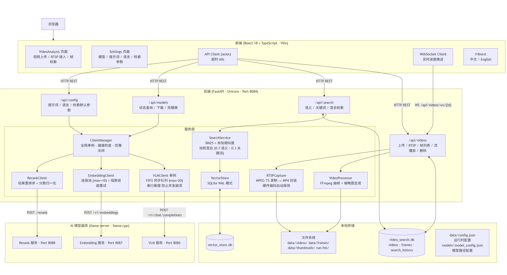
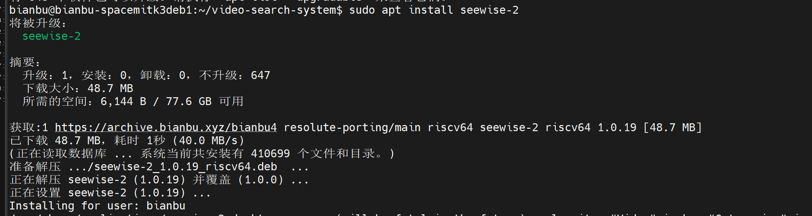
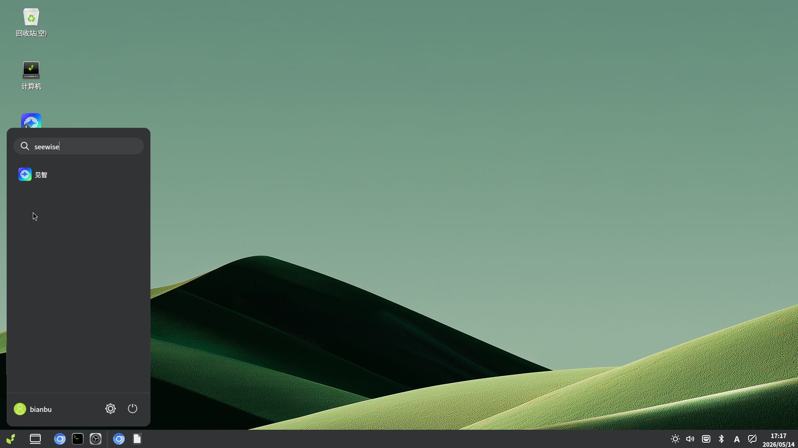
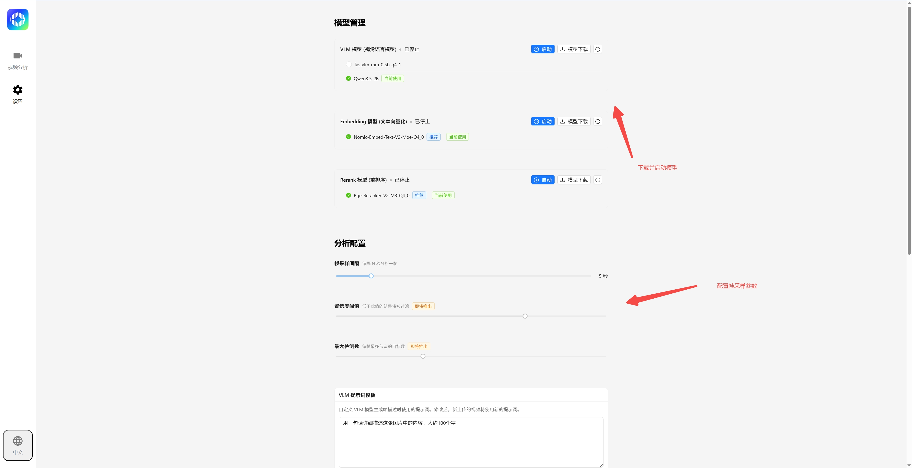

<!--
 * Copyright 2022-2023 SPACEMIT. All rights reserved.
 * Use of this source code is governed by a BSD-style license
 * that can be found in the LICENSE file.
 * 
 * @Author: David(qiang.fu@spacemit.com)
 * @Date: 2026-05-12 20:12:39
 * @LastEditTime: 2026-05-13 14:10:52
 * @FilePath: \doc\docs-ai\zh\solutions\aicomputer_solution\seewise.md
 * @Description: 
-->
sidebar_position: 3

# 见智(Seewise)

**Seewise** 是一款智能视频搜索引擎，支持上传本地视频或连接 RTSP 摄像头，自动分析视频内容，让你用自然语言快速找到想要的视频片段。

## 产品特点

- **智能视频理解**：自动分析视频帧内容，用自然语言描述每一帧
- **多种搜索方式**：支持语义搜索、关键词搜索、混合搜索
- **灵活的视频源**：本地视频上传或 RTSP 实时流接入
- **实时处理反馈**：处理进度实时显示在界面上
- **中英文支持**：支持中英文界面和多语言搜索提示词

## 平台支持情况


| 平台 & 系统          | 是否支持  |
| -------------------- | --------- |
| K1 Buildroot         | ❌ 不支持 |
| K1 OpenHarmony       | ❌ 不支持 |
| K1 Bianbu LXQT/GNOME | ❌ 不支持 |
| K3 Buildroot         | ❌ 不支持 |
| K3 OpenHarmony       | ❌ 不支持 |
| K3 Bianbu LXQT/GNOME | ✅ 支持   |

## 技术架构

Seewise 采用客户端-服务器架构，分为三层：

**前端层**：现代化网页界面，支持视频上传、搜索、实时进度显示

**应用服务层**：处理视频处理、搜索、数据管理等业务逻辑

**AI 模型层**：图像分析、文本向量化、搜索结果重排序

### 系统架构图



## 安装与部署

### Debian 包安装

- 推荐生产环境使用 apt 安装本地包：
  ```bash
  sudo apt update
  sudo apt install seewise-2
  ```
- 若发生依赖问题，可先修复：
  ```bash
  sudo apt-get install -f
  ```



- 安装后会自动创建并启用 `seewise-2.service`
- 默认运行用户：`bianbu`
- 默认根目录：`~/.seewise-2`

> 运行依赖：`llama.cpp-tools-spacemit`、`spacemit-onnxruntime`、`python3-spacemit-ort`等。

### 快速启动

- 网页访问：
  安装完成后可通过网页访问对应服务：http://<板子ip>:8084
- 桌面访问：
  点击左下角菜单搜索seewise或见智，点击图标跳转到对应网页。如下图



## 模型下载与参数配置

### 模型下载

- 生产环境优先使用 Seewise Web UI 的“设置”下载模型。
- 默认模型目录：

  - VLM：`~/.seewise-2/models/vlm/fastvlm-mm-0.5b-q4_1/`
  - Embedding：`~/.seewise-2/models/embedding/`
  - Rerank：`~/.seewise-2/models/rerank/`
- 建议优先选择推荐模型。
  

### 参数配置

- 参数配置主要包含抽帧及检索参数的配置
- 抽帧参数配置：抽帧参数配置抽帧间隔，决定多长时间抽一帧
- 检索参数配置：决定检索策略，是否开启rerank等


### llama.cpp 与硬件加速

- 模型服务依赖 `llama-server`（来自 llama.cpp）
- VLM 服务采用 `--vision-backend smt` 和 `--smt-config-dir` 指定视觉模型目录

## 视频上传与 RTSP 检索流程

### 本地视频上传流程

1. 在前端页面选择“上传视频”
2. 后端保存到 `data/videos/`
3. 后端调用 FFmpeg 抽帧，生成 `data/frames/` 和 `data/thumbnails/`
4. VLM 生成帧级语义描述
5. Embedding 服务生成向量并写入向量索引
6. 搜索功能可直接检索已处理的视频帧

### RTSP 实时流处理流程

1. 在前端输入 RTSP 地址并开始连接
2. 后端使用 `RTSPCapture` 录制流并封装成 MP4
3. 继续调用 FFmpeg 抽帧并生成缩略图
4. 实时通过 WebSocket 向前端推送处理进度
5. 完成后帧数据写入数据库和向量索引


### 搜索流程

1. 点击上传视频或连接rtsp视频流后等待一段处理时间
2. 视频播放器右下角出现视频处理中且右侧搜索框下方不断产生新的关键帧预览
3. 点击搜索框输入自然语言文本，回车搜索相关内容
   （注：配合设置页面的检索配置使用）


## 日志与缓存查看 / 清理

### 日志位置

- 后端日志：`~/.seewise-2/logs/backend.log`
- 前端日志：`~/.seewise-2/logs/frontend.log`
- 模型日志：`~/.seewise-2/logs/vlm.log`、`~/.seewise-2/logs/embedding.log`、`~/.seewise-2/logs/rerank.log`
- systemd 方式：`journalctl -u seewise-2.service -f`

### 缓存与数据目录

- 视频文件：`~/.seewise-2/data/videos/`
- 抽帧图片：`~/.seewise-2/data/frames/`
- 缩略图：`~/.seewise-2/data/thumbnails/`
- SQLite 数据库：`~/.seewise-2/data/video_search.db`
- 向量索引：`~/.seewise-2/data/vector_store.db`

1. 先停止服务：`sudo systemctl stop seewise-2.service`
2. 备份或删除缓存目录：
   ```bash
   rm -rf ~/.seewise-2/data/videos/*
   rm -rf ~/.seewise-2/data/frames/*
   rm -rf ~/.seewise-2/data/thumbnails/*
   rm -f ~/.seewise-2/data/video_search.db
   rm -f ~/.seewise-2/data/vector_store.db
   ```
3. 如果要重新下载模型：删除模型目录后重新执行模型下载流程。

## 常见问题 FAQ

### Q: 安装后服务无法启动？

A: 首先检查 `systemctl status seewise-2.service`；如果是依赖问题，确认 `llama.cpp-tools-spacemit`、`spacemit-onnxruntime`、`python3-spacemit-ort` 已安装。

### Q: 模型无法下载或模型服务未启动？

A: 检查日志 `~/.seewise-2/logs/vlm_8071.log` / `embedding_8072.log` / `rerank_8073.log`，确认问题原因。

### Q: RTSP 连接失败？

A: 请确认 RTSP URL、网络连通性和摄像头状态；RTSP 录制失败时可参考后端日志并检查端口是否被占用。

### Q: 上传视频失败或处理慢？

A: 单个文件最大 500MB；处理量大时需要较长时间；建议先确认 `data/videos/` 和 `data/frames/` 磁盘空间。

### Q: 搜索结果不准确？

A: 试试切换检索模式（语义 / 关键词 / 混合）和开启 Rerank；如果模型权重有问题，重新下载模型并重启模型服务。

### Q: 需要清理缓存后重新开始？

A: 先停止服务，再删除 `~/.seewise-2/data/video_search.db`、`~/.seewise-2/data/vector_store.db` 和 `data/frames/`、`data/thumbnails/`、`~/.seewise-2/data/videos/`。
